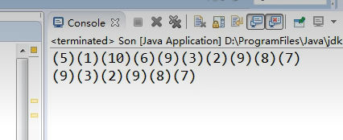
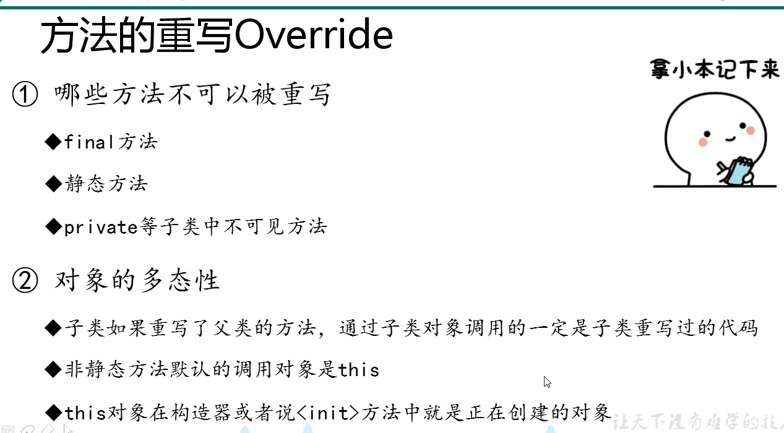
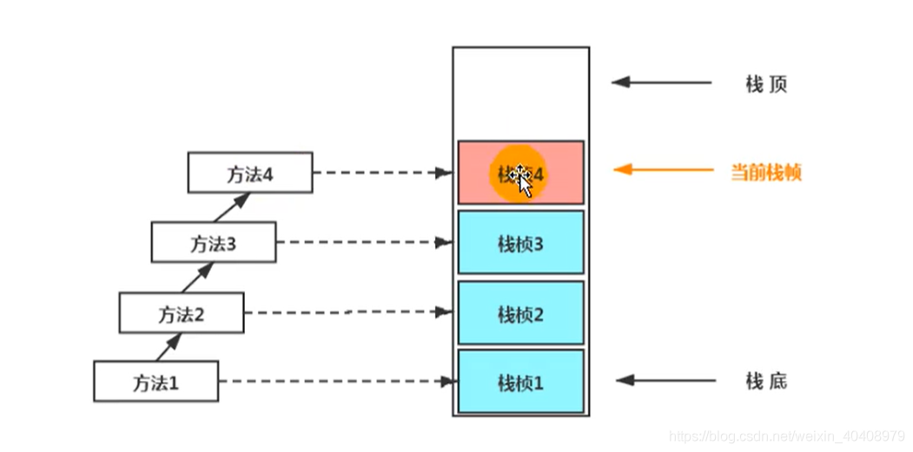
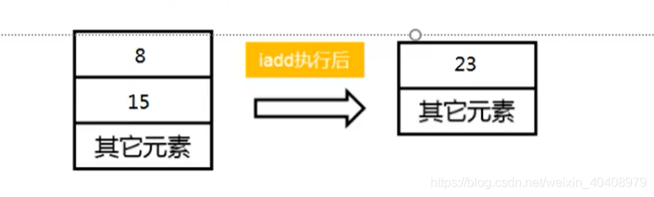
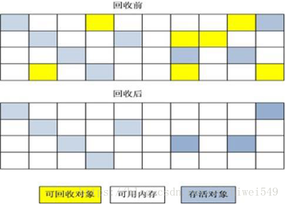
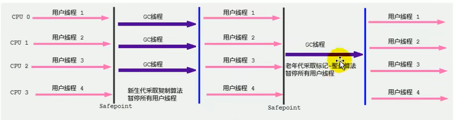
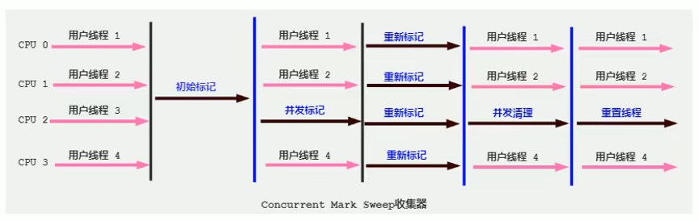
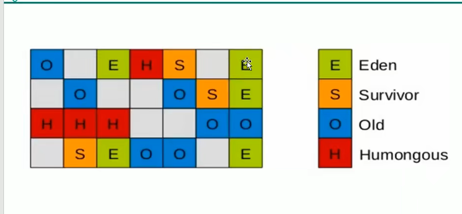

## **Class字节码文件**

 		是一个[二进制](https://so.csdn.net/so/search?q=二进制&spm=1001.2101.3001.7020)文件，包含了JAVA程序执行的字节码，包含的信息有版本、访问标志、常量池、当前类、超级类、接口、字段、方法、属性等，中间没有任何分隔符，文件开头有一个特殊标志，用16进制表示为0xcafebabe。

## 类的实例化顺序

**比如父类静态数据，构造函数，字段，子类静态数据，构造函数，字段，他们的执行顺序**

先静态、先父后子。

先静态：父静态 > 子静态

优先级：父类静态代码块–>子类静态代码块–>父类代码块–>父类[构造方法](https://so.csdn.net/so/search?q=构造方法&spm=1001.2101.3001.7020)–>子类代码块—>子类构造方法

**一个类的实例化过程：**

**1、** 父类中的static代码块，当前类的static（这是类初始化，这个main所在的也会初始化）

**2、** 顺序执行父类的普通代码块(还有非静态变量)（下面是实例初始化）

**3、** 父类的构造函数

**4、** 子类普通代码块(还有非静态变量)

**5、** 子类（当前类）的构造函数，按顺序执行。

**6、** 子类方法的执行，、

> 例子




解释




## jvm 常用配置参数

> 分配堆内存s

| -Xms | 最小堆 |
| ---- | ------ |
| -Xmx | 最大堆 |

> 栈

| -Xss | 栈大小 |
| ---- | ------ |
|      |        |

## 如何判断一个类是无用的类

方法区主要回收的是无用的类，那么如何判断一个类是无用的类的呢？

> 类需要同时满足下面3个条件才能算是 “无用的类” ：

该类所有的实例都已经被回收，也就是 Java 堆中不存在该类的任何实例。
加载该类的 ClassLoader 已经被回收。
该类对应的 java.lang.Class 对象没有在任何地方被引用，无法在任何地方通过反射访问该类的方法

## 逃逸分析

是对象只在当前函数范围内使用，因而改为在栈上申请空间，因为栈是用完就释放掉，不用等gc，缓解了gc的压力。测试可以用一个while循环创建对象来查看

## JVM的GC ROOTS有哪几个地方呢？

a. java[虚拟机](https://so.csdn.net/so/search?q=虚拟机&spm=1001.2101.3001.7020)栈中的引用的对象。
b.方法区中的类静态属性引用的对象。 （一般指被[static](https://so.csdn.net/so/search?q=static&spm=1001.2101.3001.7020)修饰的对象，加载类的时候就加载到内存中。）
c.方法区中的常量引用的对象。
d.本地方法栈中的JNI（[native](https://so.csdn.net/so/search?q=native&spm=1001.2101.3001.7020)方法）引用的对象

##  GC日志的real、user、sys是什么意思？

real:指的是从开始到结束所花费的时间。比如进程在等待I/O完成，这个阻塞时间也会被计算在内。
user：指的是进程在用户态（User Mode）所花费的时间，只统计本进程所使用的时间，注意是指多核。
sys：指的是进程在核心态（Kernel Mode）花费的CPU时间量，指的是内核中的系统调用所花费的时间，只统计本进程所使用的时间。

> real time > sys + user time 的情况

一般的GC事件中，real time是小于sys+user time的，因为一般是多个线程并发的去做GC，所以real time是要小于sys+user time的。比如说：user+sys是2秒，如果是有5个GC线程并发的做垃圾回收，那么real time差不多是2000/5=400ms左右。 但是，有时候会见到real time大于sys+user time的情况

> 原因

 IO负载繁重

当服务器的IO负载非常重的时候（网络、磁盘访问、用户交互），real time就会变大。应用做GC日志打印的时候，也需要访问磁盘。当磁盘的负载非常重的时候，GC事件就有可能被阻塞，这会导致real time变长。 注意：就算不是你的应用导致的磁盘负载重，如果服务器上其他的应用导致的磁盘负载重也会导致real time变长。 可以用如下命令来监控服务器的磁盘负载情况：

CPU不够用

如果服务器上跑了很多进程，你的应用很不幸没有得到足够的CPU时间，它就需要很多的等待。当你的进程在等待的时候，real time显然就比sys+user时间长了。

## safepoint是什么？

## g1什么时候引发full gc

young GC触发时机：young区不够用

full GC触发时机: 没有足够的Region

## 垃圾回收器之串行、吞吐量优先、响应时间优先的的垃圾回收器

> 串行

单线程
堆内存较小，适合个人电脑

> 吞吐量优先

多线程
堆内存较大，多核cpu
让单位时间内，STW 的时间最短 0.2 0.2 = 0.4

> 响应时间优先

多线程
堆内存较大，多核cpu
尽可能让单次 STW 的时间最短 0.1 0.1 0.1 0.1 0.1 = 0.5

> 解释

```bash
接下来我们来学习垃圾回收器，垃圾回收器我们可以把它分为这三类，第一类叫串行的垃圾回收器，第二类叫吞吐量优先的垃圾回收器，第三类叫响应时间优先的垃圾回收器。下面就解释一下，第一个串行的垃圾回收器，这个从名字上也能猜出来，它的底层是一个单线程的垃圾回收器，也就是说，它在垃圾回收发生时，其他的线程都暂停，这时候一个单线程的垃圾回收器就登场了，它一个线程来完成垃圾回收，显然它的适用场景是堆内存较小的时候，而且cpu的核数多了也没用，因为只有一个线程，适合个人电脑这就好比我们有一个居民楼，有一个保洁工人来打扫卫生，一个保洁工人就类似于这种单线程的垃圾回收器，如果楼层比较矮，小三层，那保洁工人可能一天就能把卫生打扫完了，但是如果楼层特别的高，是一个三十几层的高层建筑，那一个保洁工人来打扫，这个工作量可能是非常大的，干好几天都干不完。这是串行垃圾回收器它的适用场景。它适合堆内存小，个人电脑也就是cpu个数少的这么一个工作环境。而下两种吞吐量优先和响应时间优先的这两种垃圾回收器，它们都是多线程的，多线程的好处，还拿刚才那个例子作比喻，这个楼层很高，但是我可以多找几个保洁工人啊，它们每个人打扫一层或者几层，人多力量大，肯定还是可以在规定时间内完成垃圾回收的任务。所以后两种垃圾回收器都适合堆内存较大的场景，并且一般它需要多核的cpu来支持，为什么非要说多核cpu呢，虽然有多个线程，但是假设只有一个cpu，那么工作的时候也是多个线程轮流去争抢这单核cpu的时间片，其实这个效率还不如单线程呢，举个例子，就好比虽然有多个保洁工人来打扫卫生，但是扫帚只有一把，那要打扫卫生必须轮流使用这把扫帚，这个效率显然跟一个人来打扫是一样的，所以后两种垃圾回收器它们的工作适用场景是堆内存很大，但是有一个要求，就是必须是多核cpu才能充分发挥它俩的威力，显然多核cpu都是服务器电脑，所以它们都适合工作在服务器上。后两种吞吐量优先跟响应时间优先它们都是多线程的，那它俩之间又有什么区别呢。我们先说响应时间优先，响应时间优先它就是注重的是让垃圾回收时它的 Stop The World 的时间尽可能的短，我们都知道垃圾回收时它要把其他的线程暂停下来，等打扫完垃圾了，其他线程才能恢复运行，这段时间我们把它叫做 STW，就是世界暂停，这个世界暂停时间显然是越短越好了，那响应时间优先的垃圾回收器它要考虑的就是尽可能的让这个暂停时间变短，尽可能让 STW 的时间最短，这是它的一个目标。那么吞吐量优先呢，它的目标就不太一样，吞吐量优先是指我要在单位时间内让我的垃圾回收所占用的 STW 的时间最短，让单位时间内 STW 的时间最短。吞吐量优先和响应时间优先都是 STW 最短，那么它俩有什么区别呢，这个线程优先它是让单次的 STW 时间最短，举个例子，比如说，单位时间内触发了很多次垃圾回收，每一次垃圾回收都只花了 0.1s，假设1小时内发生了5次垃圾回收，每次都是0.1，那么它们加起来最后等于0.5s，也就是一小时内花费了0.5s，但是每次都很短，这是响应时间优先它的目标。但是吞吐量优先则不同，它可能单次的垃圾回收时间花费的较长，比如说1次花了0.2s，但是在一个小时内它只发生了两次垃圾回收，所以它的总时间来讲只有0.4s，从这一点上来讲，它似乎在总时间上又要优于响应时间优先，所谓的吞吐量就是指垃圾回收的时间占程序运行时间的占比，垃圾回收时间占比越低，那么就指吞吐量越高，这是吞吐量它的一个含义。

```

> 都要哪些

对于吞吐量优先的场景，就只有一种选择，就是使用 PS 组合（Parallel Scavenge+Parallel Old ）。
 对于响应时间优先的场景，在 JDK1.8 的话优先 G1，其次是 CMS 垃圾回收器，另外还有PN、ZGC、Shenandoah。

## jdk1.8新特性

1.[Lambda](https://so.csdn.net/so/search?q=Lambda&spm=1001.2101.3001.7020)表达式

2.函数式接口

3.方法引用

等

## 类的主动使用和被动使用

主动

主动使用，又分为七种情况：

创建类的实例

* 访问某个类或接口的静态变量，或者对该静态变量赋值

* 调用类的静态方法

* 反射（ 比如：Class.forName(“cn.sxt.Test”) )

* 初始化一个类的子类

* Java虚拟机启动时被标明为启动类的类

* JDK7开始提供的动态语言支持：java.lang.invoke.MethodHandle实例的解析结果REF_getStatic、REF putStatic、REF_invokeStatic句柄对应的类没有初始化，则初始化

  除了以上七种情况，其他使用Java类的方式都被看作是对类的被动使用，都不会导致类的初始化，即不会执行初始化阶段（不会调用 clinit( ) 方法和 init( ) 方法）

  > 被动

  子类引用父类的静态字段，不会导致子类初始化

  引用常量不会触发此类或接口的初始化。因为常量在链接阶段就已经被显式赋值了

  

## 局部变量、成员变量、类变量

栈，堆，方法区

## i++和++i


## 栈帧都有哪些数据？

JVM的运行是基于栈的，和C语言的栈类似，它的大多数数据都是在堆里面的，只有少部分运行时的数据存在于栈上。

在JVM中，每个线程栈里面的元素，就叫`栈帧`。

栈帧包含：局部变量表、操作数栈、动态连接、返回地址等。

> 栈结构




> 栈帧的内部结构


### 局部变量表

> 组成

最基本的存储单元是Slot（变量槽）

- 局部变量表中存放编译期可知的各种基本数据类型（8种），引用类型（reference），returnAddress类型的变量
- 在局部变量表里，32位以内的类型只占用一个Slot（包括returnAddress类型），64位的类型（long和double）占用两个slot
- 由于局部变量表是建立在线程的栈上，是线程的私有数据，因此**不存在数据安全问题**
- **局部变量表所需的容量大小是在编译期确定下来的**，并保存在方法的Code属性的maxmum variables数据项中。在方法运行期间是不会改变局部变量表大小的。

### 操作数栈

每一个独立的栈帧中除了包含局部变量表之外，还包含一个后进先出（Last-in-first-out）的操作数栈，也可以称之为表达式栈（Expression Stack）
操作数栈，在方法执行过程中，根据字节码指令，往栈中写入数据或提取数据，即入栈（push）/出栈（pop）
某些字节码指令将值压入操作数栈，其余的字节码指令将操作数取出栈。
比如：执行复制、交换、求和等操作



图解：将8和15出栈，执行求和操作后再将结果进栈操作。

### 动态链接

每个栈帧内部都包含一个指向运行时常量池中该栈帧所属方法的引用。包含这个引用的目的就是为了支持当前方法的代码能够实现动态链接（Dynamic Linking）.比如：invokedynamic指令
在java源文件被编译到字节码文件中时，所有的变量和方法引用都作为符号引用（Symbolic Reference）保存在class文件的常量池里。比如：描述一个方法调用了另外的其他方法时，就是通过常量池中指向方法的符号引用来表示的，那么动态链接的作用就是为了将这些符号引用转换为调用方法的直接引用

> 1.举例栈溢出的情况

答：StackOverflowError，通过-Xss设置大小，
1.局部数组过大。当函数内部的数组过大时，有可能导致堆栈溢出。
2.递归调用层次太多。递归函数在运行时会执行压栈操作，当压栈次数太多时，也会导致堆栈溢出。
3.指针或数组越界。这种情况最常见，例如进行字符串拷贝，或处理用户输入等等。

> 2.调整栈大小，就能保证不出现栈溢出吗？

答：不能，如果说一个执行6000次递归就结束的程序，在可执行递归5000次的内存空间中会出现StackOverflowError，而在调整为可递归7000次的内存空间时就不会出现StackOverflowError。 如果程序是类似死递归情况无论怎样调整栈大小，都会出现溢出现象，对于这种情况，调整栈的大小理论上只能说是出现异常的时间晚一些而已’

> 3.分配栈内存越大越好吗

不是，理论上好像会在一定时间或单位时间内减少StackOverflowError的概率，避免出现StackOverflowError过早，但是避免不了出现StackOverflowError。对栈空间来说是好事，但是这样会导致可执行的线程数减少，对其他内存结构也是有影响的

> 4.垃圾回收是否会设计到虚拟机栈

不涉及，虚拟机栈会出现StackOverflowError，但是不会出现GC，因为只有进栈出栈，出栈的过程就相当于GC（程序计数器不会Error和GC，堆会GC和ERROR，方法区也会出现GC和ERROR）

## 标记清除算法

标记-清除”算法，如它的名字一样，算法分为“标记”和“清除”两个阶段：首先标记出所有需要回收的对象，在标记完成后统一回收掉所有被标记的对象。之所以说它是最基础的收集算法，是因为后续的收集算法都是基于这种思路并对其缺点进行改进而得到的。
    它的主要缺点有两个：
        （1）效率问题：标记和清除过程的效率都不高；
        （2）空间问题：标记清除之后会产生大量不连续的内存碎片，空间碎片太多可能会导致，碎片过多会导致大对象无法分配到足够的连续内存，从而不得不提前触发GC，甚至Stop The World。


## 复制算法（Copying）

   为解决效率问题，“复制”收集算法出现了。它将可用内存按容量划分为大小相等的两块，每次只使用其中的一块。当这一块的内存用完了，就将还存活着的对象复制到另外一块上面，然后再把已使用过的内存空间一次清理掉。
    这样使得每次都是对其中的一块进行内存回收，内存分配时也就不用考虑内存碎片等复杂情况，只要移动堆顶指针，按顺序分配内存即可，实现简单，运行高效。
   它的主要缺点有两个：
        （1）效率问题：在对象存活率较高时，复制操作次数多，效率降低；
        （2）空间问题：內存缩小了一半；需要額外空间做分配担保(老年代)

> **From Survivor**, **To Survivor**使用的就是复制算法。老年代不使用这种算法，


## 标记-整理(Mark-Compact)

  复制收集算法在对象存活率较高时就要执行较多的复制操作，效率将会变低。更关键的是，如果不想浪费50%的空间，就需要有额外的空间进行分配担保，以应对被使用的内存中所有对象都100%存活的极端情况，所以在老年代一般不能直接选用这种算法。    
    根据老年代的特点，有人提出了另外一种“标记-整理”（Mark-Compact）算法，标记过程仍然与“标记-清除”算法一样，但后续步骤不是直接对可回收对象进行清理，而是让所有存活的对象都向一端移动，然后直接清理掉端边界以外的内存


## 分代收集算法（Generational Collection）

 GC分代的基本假设：绝大部分对象的生命周期都非常短暂，存活时间短。
   “分代收集”算法，把Java堆分为新生代和老年代，这样就可以根据各个年代的特点采用最适当的收集算法。在新生代中，每次垃圾收集时都发现有大批对象死去，只有少量存活，那就选用复制算法，只需要付出少量存活对象的复制成本就可以完成收集。而老年代中因为对象存活率高、没有额外空间对它进行分配担保，就必须使用“标记-清理”或“标记-整理”算法来进行回收。

## 你知道哪些垃圾收集器？

> serial

串行回收

新生代

采用复制算法

Serial是一个单线程的收集器，Serial的特点是它在进行垃圾收集时，必须“**Stop the World**”，意思就是当这个垃圾收集器开始工作时，必须停止其他所有的工作线程。听起来似乎很不靠谱，但是对于限定单个CPU的场景下，这种方式简单而高效。对于简单的桌面应用，分配给虚拟机的内存不会很大，对于一两百兆的新生代，Serial的垃圾收集时间可以控制在一百毫秒以内，对于用户来说基本上是无影响的。

> serial old

采用标记-压缩算法

老年代


> ParNew

并行回收

ParNew垃圾收集器是Serial的多线程版本，**使用多条线程进行垃圾收集**。除此之外，和Serial基本相同，ParNew在多线程收集垃圾时依旧需要**“Stop the World”**。ParNew可以使用-XX:ParallelGCThreads参数来限制垃圾收集的线程数量。

ParNew收集器在新生代使用**复制算法**

> Parallel Old

Parallel Scavenge收集器的老年版本，多线程收集器，**采用标记-整理算法**，也是吞吐量优先。



> Parallel Scavenge

Parallel Scavenge也是新生代收集器，也同样是多线程的收集器，但是和ParNew不同，Parallel Scavenge收集器**关注的是一个可控制的吞吐量**（Throughput）。所谓吞吐量指的是CPU用于运行代码的时间和CPU总消耗的时间比例。

**吞吐量=运行代码的时间 /（运行代码的时间+垃圾收集时间）**

理论上吞吐量越高，用户就越不能感受到停顿时间。

Parallel Scavenge提供了两个参数用来控制吞吐量： **-XX:MaxGCPauseMillis**和**-XX:GCTimeRatio**

**-XX:MaxGCPauseMillis**设置内存回收花费时间最高毫秒值，但是不要一味地认为只要把值设置很小，垃圾回收就更快了。**这个停顿时间是以牺牲吞吐量和新生代空间换来的。**

**-XX:GCTimeRatio**表示垃圾收集时间占总时间的比例，（1~100），也就是吞吐量的倒数。默认这个值是99，就是允许最大百分之1的垃圾手机时间（1/(1+99)）。

还有一个参数**-XX:+UseAdaptiveSizePolicy**，打开这个参数后，就不需要自己设置新生代大小、晋升老年代对象年龄等参数，因此Parallel Scavenge收集器也被叫做吞吐量优先垃圾收集器。

Parallel Scavenge采用**复制算法。**

> cms

主要特点：低延迟

尽可能缩短垃圾收集时候用户线程的停顿时间

采用的标记-清除算法

老年代垃圾回收器



**1、初始标记：标记GC Roots可以直接关联到的对象，速度很快（stop the world）**

**2、并发标记：根搜索算法的过程**

**3、重新标记：为了修正并发标记期间，因程序运行导致标记产生变动的对象。（stop the world）**

**4、并发清除：清除垃圾**

它的优点就是**并发收集、并发清除、低停顿**。

但是它有三个显著的缺点：

1、**对CPU资源十分敏感**，因为并发标记和并发清除都是和程序同时运行，因此会占用CPU导致应用程序变慢。

2、**无法处理浮动垃圾**，浮动垃圾就是在并发清除过程中新生成的垃圾，这部分垃圾CMS无法在本次被清理，可能出现Concurrent Mode Failed报错，因此需要预留一定的内存空间，无法等到老年代快被占满时再清除。默认情况下，CMS在老年代使用了68%后就会被激活。可以设置-XX:CMSInitiatingOccupancyFraction设置这个值。

3、**产生空间碎片**，由于采用的是标记-清除算法，那就无法避免会产生空间碎片的问题，这会给分配大对象带来困难。

> G1

区域化分代式

同时兼顾新生和老年代



划分为一个个region，region内部采用复制算法，整体是标记压缩算法。没有碎片化。

只选取部分region进行内存回收，这样缩短了回收范围，减少了停顿。

后天有一个优先列表，优先回收大的（这个也根据自己给的限制时间内选择较大的）

 