## 定义

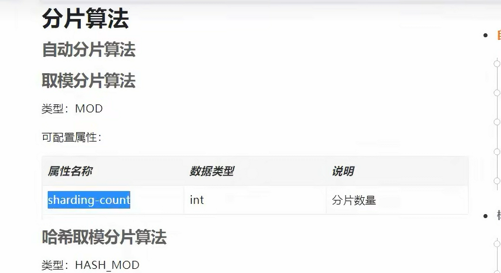

添加事务后均是主库，在没添加事务的时候插入是主，查询是从

## 主从复制

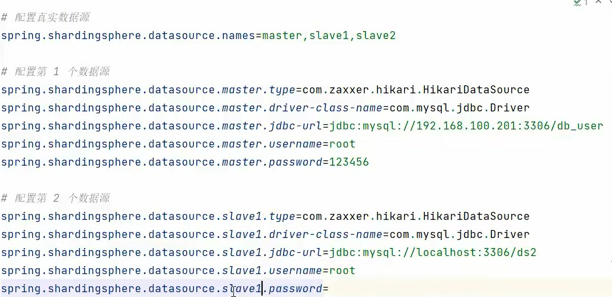

springboot只需要在配置文件里配置一下，这里配置数据源

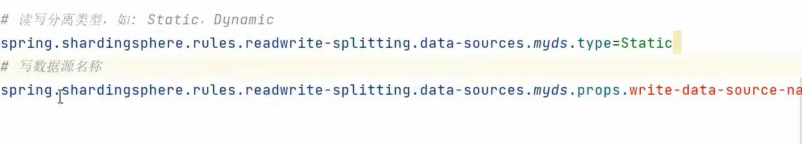

只需要配置一下，哪个数据源是读得，那个是写的

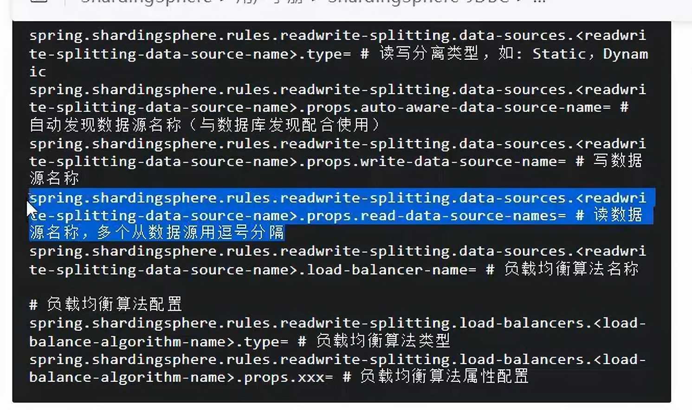

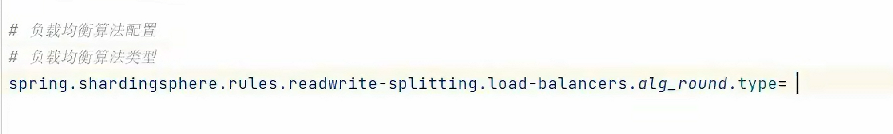

配置负载均衡

## 记录

docker

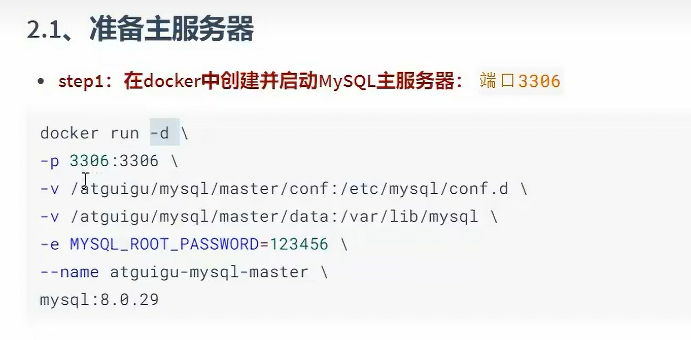

这是映射到主机

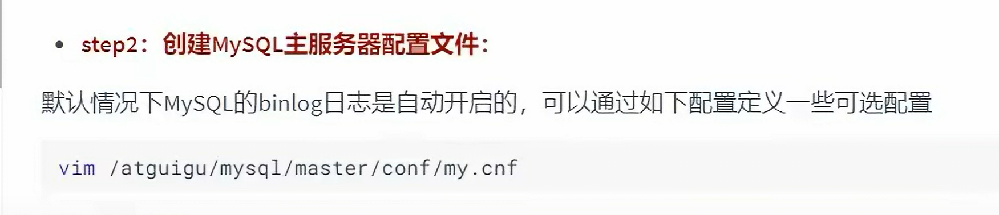

修改my。cof

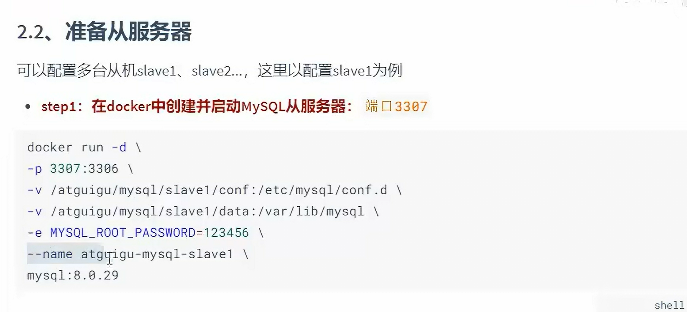

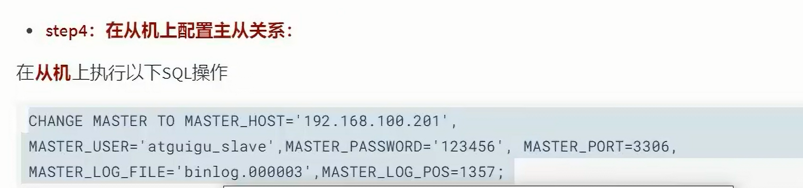

## 主键生成策略

雪花

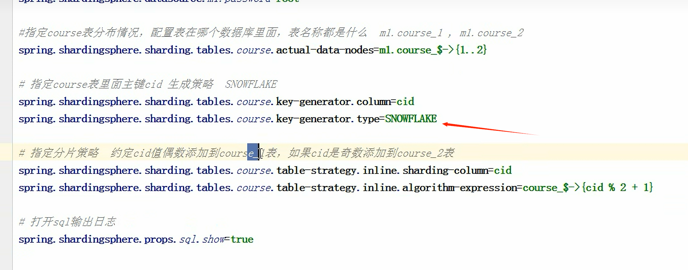

## 水平分库分表策略

如上图所示，定义好数据库的放置，这里是通过userid，偶数放在1号库，奇数放在2号库。定义完成后再定义每个库中表的策略，这里是根据cid进行划分，偶数放在1号表，奇数放在2号表。

## 公共表

> 何为公共表

不长变的，经常需要做关联工作，比如地表沉降系统中的传感器节点信息表。（要在每个库中创建同样一张表）

这里也是通过shardingsphere做的，在papertie里设置公共表，如下

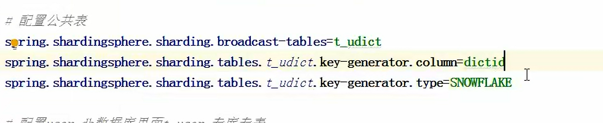

这样的话，插入和删除都是对每个数据的公共表同时操作。

## 读写分离

1. 修改这个文件

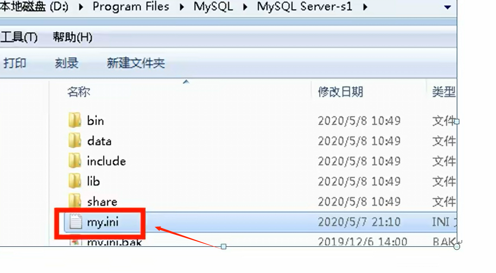

2. 改端口号

3. 修改文件路径（存数据的）

## 分布式事务

> TCC

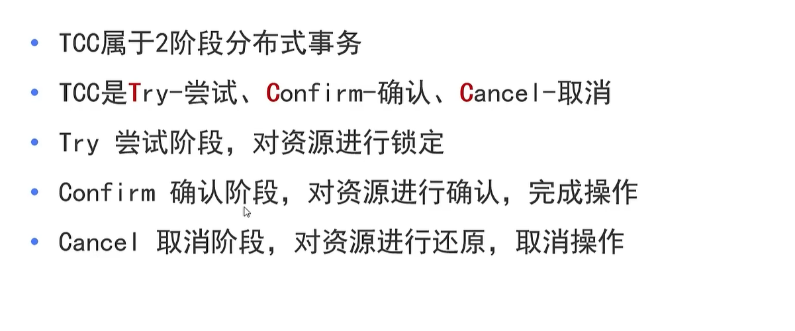

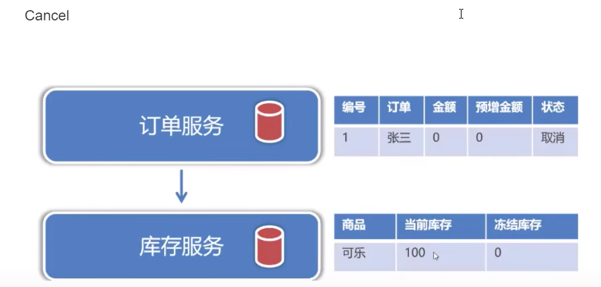

分布式事务可以通过TCC来解决，分别是上面三个单词的缩写。使用TCC需要给表加上冗余列，例如上述订单表和库存表，需要在订单表中添加预增金额和状态，库存服务里需要添加冻结库存。

在执行TCC时候，Try是对资源进行锁定，在这一步预增金额这里设置一下（比如买10瓶水，一瓶水3块钱，这里的预增金额就设置为30，把状态改为初始），库存表也是这样（因为要取，所以库存要减少，这里是冻结库存设置为10，因为要取10瓶水）。

Confirm进行提交，这里如果提交成果，就把上面的预增金额和冻结库存给真正处理。状态设置为完成。

cancel取消，取消的话放弃预设金额和冻结库存，状态码设置为取消。

## 分布式ID

可以使用UUID和雪花算法，但一般使用的是雪花算法。

> 原因

 UUID 生成的是一个无序的字符串（影响查询效率）

### 雪花算法（SnowFlake）

雪花算法的原理就是生成一个的 64 位比特位的 long 类型的唯一 id。

* 最高 1 位固定值 0，因为生成的 id 是正整数，如果是 1 就是负数了。
* 接下来 41 位存储毫秒级时间戳，2^41/(1000*60*60*24*365)=69，大概可以使用 69 年。
* 再接下 10 位存储机器码，包括 5 位 datacenterId 和 5 位 workerId。最多可以部署 2^10=1024 台机器。
* 最后 12 位存储序列号。同一毫秒时间戳时，通过这个递增的序列号来区分。即对于同一台机器而言，同一毫秒时间戳下，可以生成 2^12=4096 个不重复 id。
* 可以将雪花算法作为一个单独的服务进行部署，然后需要全局唯一 id 的系统，请求雪花算法服务获取 id 即可。

对于每一个雪花算法服务，需要先指定 10 位的机器码，这个根据自身业务进行设定即可。例如机房号+机器号，机器号+服务号，或者是其他可区别标识的 10 位比特位的整数值都行。

> 具体网址

https://blog.csdn.net/jiaomubai/article/details/124385324?spm=1001.2014.3001.5506

## 分页查询

分库分表后分页查询比较麻烦，比如差10条，一般从第一张表里查10条，再从第二章表里查10条，然后再排序获取。

## 跨库join

> 方案一

shardingsphere支持夸库join查询

> 方案二

先查一个字段，从这里获得关联的第二个字段，再通过第二个字段查

> 方案三

增加冗余列，把链接这个直接作为冗余字段存储

## 主从复制的问题

使用shardingsphere进行主从复制，默认是查走从，插找主，但是主和从节点的数据同步是需要一些时间的，如果我们查最新插入的数据可能会导致查不到（因为数据还没有同步过去）

以地表沉降系统为例，查询最新的数据可能会导致查不到，原因如上。

> 方案一

可以设置查询最新的消息都走主库

> 方案二

在插入数据的时候同时插入缓存一个标志，比如设置60秒过期（根据业务定，差不多可以主从同步的时间），再查的时候先判断这个缓存还有没，如果有则查主，如果没有（说明已经主从辅助完成了）查从。

## 项目

在形变模块，为了提升查询速度，对数据库进行了分库分表工作，对表进行了水平拆分，拆分了三个表。用到了数据库中间件shardingshere，采用了mod进行分片（利用传感器id），分布式id采用雪花策略，这样可以把同一个传感器的数据分到同一个表里，查询的时候就不需要查多张表了，提升速度。另外，项目里面有根据时间进行查询的，根据上面的分片策略可以实现，但需要到多张表中查寻，这样性能会低。我的解决方法采用看冗余数据，在通过时间进行范围分片。另外，做了主从复制，共搭建了两个从节点（在mini中配置），这里出现了一个问题，最新的数据有一部分查不到，原因是（通过shardingshere配置了查走从，其他走主。可能从还没有同步过来数据），解决方案是在插入数据的时候在redis中查如一个缓存，类似标志位，设置60秒（主从时间够就行），查的时候判断这个缓存还在吗，如果不在了就说明同步完成，查从。否则查主。

