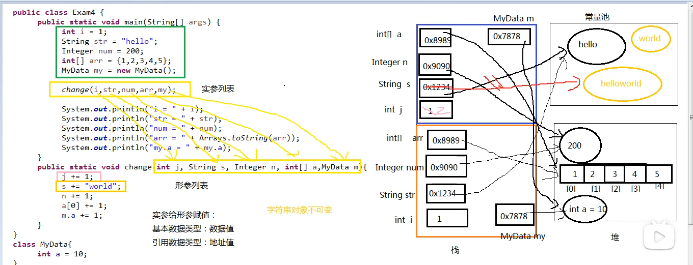
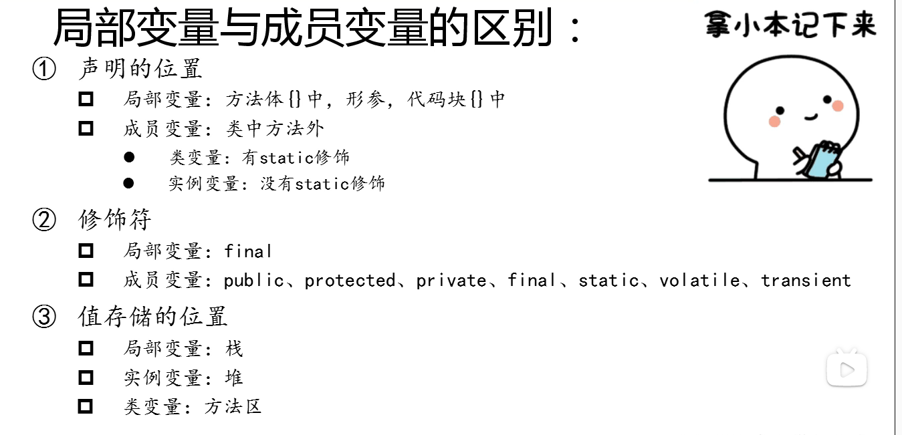
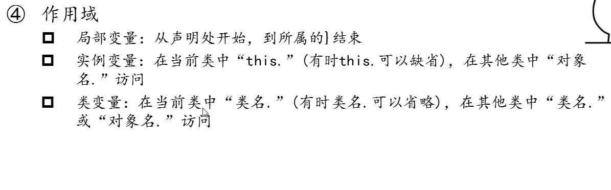
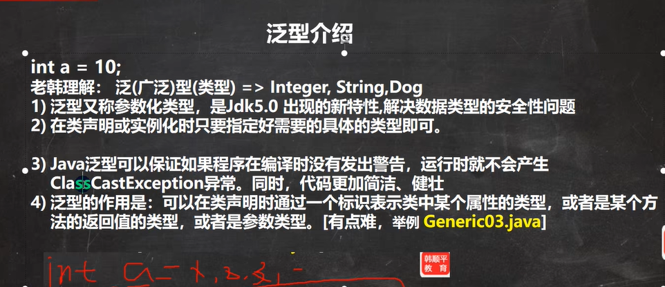
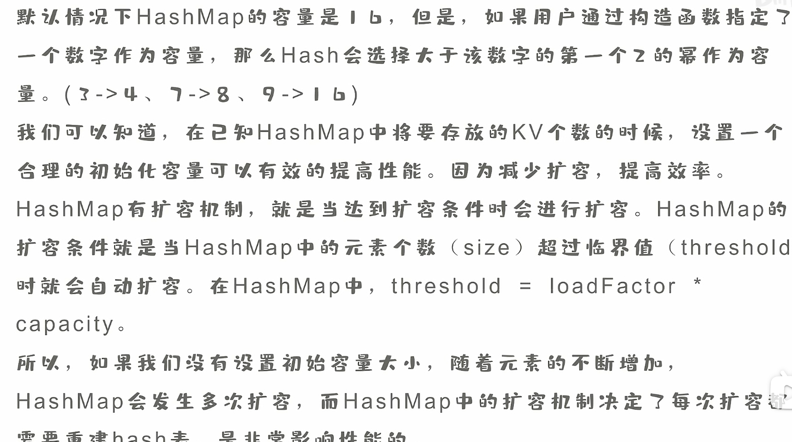
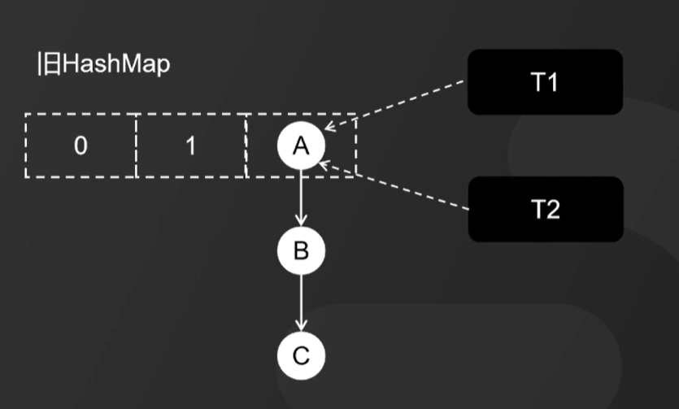
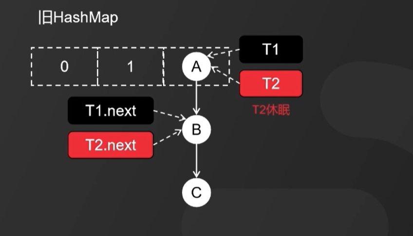
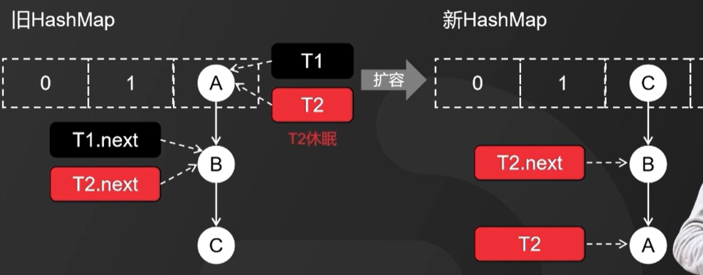
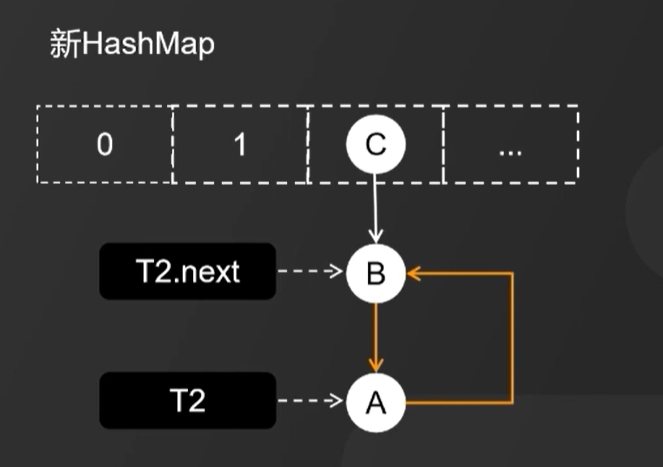
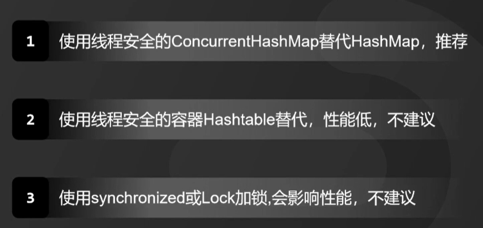

## Java 中 sleep 方法和 wait 方法的区别？

​	虽然两者都是用来暂停当前运行的线程，但是 sleep() 实际上只是短暂停顿，因为它不会释放锁，而 wait() 意味着条件等待，这就是为什么该方法要释放锁，因为只有这样，其他等待的线程才能在满足条件时获取到该锁。

1. sleep()是Thread类中的方法，而wait()则是[Object类](https://so.csdn.net/so/search?q=Object类&spm=1001.2101.3001.7020)中的方法。

## 程序计数器(线程私有)

一块较小的内存空间, 是当前线程所执行的字节码的行号指示器，每条线程都要有一个独立的程序计数器，这类内存也称为“线程私有” 的内存。

正在执行 java 方法的话，计数器记录的是虚拟机字节码指令的地址（当前指令的地址） 。如果还是 Native 方法，则为空。

这个内存区域是唯一一个在虚拟机中没有规定任何 OutOfMemoryError 情况的区域。

## 迭代器 Iterator 是什么？

首先说一下迭代器模式，它是 Java 中常用的设计模式之一。用于顺序访问集合对象的元素，无需知道集合对象的底层实现。

 Iterator 是可以遍历集合的对象，为各种容器提供了公共的操作接口，隔离对容器的遍历操作和底层实现，从而解耦。

缺点是增加新的集合类需要对应增加新的迭代器类，迭代器类与集合类成对增加。

```java
调用 it.next() 会返回迭代器的下一个元素，并且更新迭代器的状态。

调用 it.hasNext() 用于检测集合中是否还有元素。

调用 it.remove() 将迭代器返回的元素删除。
```

```java
// 引入 ArrayList 和 Iterator 类
import java.util.ArrayList;
import java.util.Iterator;

public class RunoobTest {
    public static void main(String[] args) {

        // 创建集合
        ArrayList<String> sites = new ArrayList<String>();
        sites.add("Google");
        sites.add("Runoob");
        sites.add("Taobao");
        sites.add("Zhihu");

        // 获取迭代器
        Iterator<String> it = sites.iterator();

        // 输出集合中的第一个元素
        System.out.println(it.next());
    }
}
```

## 线程的 sleep()方法和 yield()方法有什么区别？

**1、** sleep()方法给其他线程运行机会时不考虑线程的优先级，因此会给低优先级的线程以运行的机会；yield()方法只会给相同优先级或更高优先级的线程以运行的机会；

**2、** 线程执行 sleep()方法后转入阻塞（blocked）状态，而执行 yield()方法后转入就绪（ready）状态；

**3、** sleep()方法声明抛出 InterruptedException，而 yield()方法没有声明任何异常；

**4、** sleep()方法比 yield()方法（跟操作系统 CPU 调度相关）具有更好的可移植性，通常不建议使用yield()方法来控制并发线程的执行。

## volatile关键字的作用和原理

> volatile关键字的作用

1、保证可见性；
2、防止指令重排；
3、但是不保证[原子性](https://so.csdn.net/so/search?q=原子性&spm=1001.2101.3001.7020)；

> 可见性是什么？

在JMM（java memory [model](https://so.csdn.net/so/search?q=model&spm=1001.2101.3001.7020)）java内存模型中，其他线程从主内存空间把值拷贝到自己的工作空间，线程修改之后的值会返回给主内存，主内存会通知其他线程，此为可见性。

> 指令重排

CPU为了执行效率会[并发](https://so.csdn.net/so/search?q=并发&spm=1001.2101.3001.7020)执行操作指令，volatile可以使指令一个一个的执行。

> 为什么不保证原子性

```java
//自定义的类
public static class MyTest {
  //类的内部成员变量num
  public volatile int num = 0;

  public void numPlusPlus() {
    num++;
  }
}
```

比如说，在多个线程同时执行num++时候，他们都是把num值copy到自己的工作内存中，++后再写回主内存。问题出现了这里，比如说A线程刚要写回内存时候，被抢占挂起了，然后B线程写进去了，然后通知所有线程修改了。但是这个时间太短了，所以A也写进来了，把刚刚的覆盖了。

> 如何解决原子性问题

1、通过synchronized关键字。(不建议，因为volatile自身就是轻量级的，可以说是乞丐版本的synchronized，加这个太重了)
2、通过使用AtomicXX，不加锁,采用[CAS](https://so.csdn.net/so/search?q=CAS&spm=1001.2101.3001.7020)（compareAndSet）解决。其本质是使用UnSafe本地方法（CPU原语）。
3、使用LongAdder:最快（在线程多的情况下，使用分段锁）1、通过synchronized关键字。

## Java 中能创建 volatile 数组吗？

可以创建volatile数组，但是volatile只保证对数组的引用可见，即如果是改变引用只向的数组，将受到volatile的保护，但是对多个线程想要去改变数组里面的元素，volatile不能保证。

## java equals于==

> 什么时候不同

对于[字符串](https://so.csdn.net/so/search?q=字符串&spm=1001.2101.3001.7020)变量来说，使用“==”和“equals()”方法比较字符串时，其比较方法不同。

“==”比较两个变量本身的值，即两个对象在[内存](https://so.csdn.net/so/search?q=内存&spm=1001.2101.3001.7020)中的首地址。

“equals()”比较字符串中所包含的内容是否相同。

> 注意

```java
String s1,s2,s3 = "abc", s4 ="abc" ;

s1 = new String("abc");

s2 = new String("abc");
```

s1==s2  是 false   //两个变量的内存地址不一样，也就是说它们指向的对象不 一样，故不相等。

s1.equals(s2) 是 true  //两个变量的所包含的内容是abc，故相等。

（上述的是因为string重写了equals方法，比较的是值）

> 重点1

如果：          StringBuffer s1 = new StringBuffer("a");

StringBuffer s2 = new StringBuffer("a");

结果：           s1.equals(s2)  //是false

解释：StringBuffer类中**没有重新定义equals这个方法**，因此这个方法就来自Object类，

而Object类中的equals方法是用来比较“地址”的，所以等于false

> 重点2

对于s3和s4来说，有一点不一样要引起注意，由于s3和s4是两个字符

串常量所生成的变量，其中所存放的内存地址是相等的，

所以s3==s4是true(即使没有s3=s4这样一个赋值语句)

> 重点3

对于非字符串变量来说，"=="和"equals"方法的作用是相同的都是用来比较其

对象在堆内存的首地址，即用来比较两个引用变量是否指向同一个对象。

## 如何判断对象是否是垃圾？

**引用计数：**在对象中添加一个引用计数器，如果被引用计数器加 1，引用失效时计数器减 1，如果计数器为 0 则被标记为垃圾。原理简单，效率高，但是在 Java 中很少使用，因为存在对象间循环引用的问题，导致计数器无法清零。

**可达性分析：**主流语言的内存管理都使用可达性分析判断对象是否存活。基本思路是通过一系列称为 GC Roots 的根对象作为起始节点集，从这些节点开始，根据引用关系向下搜索，搜索过程走过的路径称为引用链，如果某个对象到 GC Roots 没有任何引用链相连，则会被标记为垃圾。可作为 GC Roots 的对象包括虚拟机栈和本地方法栈中引用的对象、类静态属性引用的对象、常量引用的对象。

## 线程四种创建方式？

> 创建线程的四种方式

**继承Thread类**（Thread 类本质上是实现了 Runnable 接口的一个实例，代表一个线程的实例。启动线程的唯一方法就是通过Thread 类的 start()实例方法。start()方法是一个 native 方法，它将启动一个新线程，并执行 run()方法）,**实现Runnable接口**,**实现Callable接口**,**线程池**。

> 线程池的好处

第一：降低资源消耗。通过重复利用已创建的线程降低线程创建和销毁造成的消耗。
第二：提高响应速度。当任务到达时，任务可以不需要等到线程创建就能立即执行。
第三：提高线程的可管理性。线程是稀缺资源，如果无限制的创建，不仅会消耗系统资源， 还会降低系统的稳定性，使用线程池可以进行统一的分配，调优和监控

## 形成死锁的四个必要条件是什么

1、互斥条件：一个资源每次只能被一个进程使用；

2、请求与保持条件：一个进程因请求资源而阻塞时，对已获得的资源保持不放；

3、不剥夺条件:进程已获得的资源，在末使用完之前，不能强行剥夺；

4、循环等待条件:若干进程之间形成一种头尾相接的循环等待资源关系；

## 什么是IoC和DI？

IoC(控制反转) 、DI(依赖注入)

> ioc

IOC—Inversion of Control，即“[控制反转](https://so.csdn.net/so/search?q=控制反转&spm=1001.2101.3001.7020)”，不是什么技术，而是一种设计思想。它能指导我们如何设计出松耦合、更优良的程序。传统应用程序都是由我们在类内部主动创建依赖对象，从而导致类与类之间高耦合，难于测试；有了IOC容器后，把创建和查找依赖对象的控制权交给了容器，由容器进行注入组合对象，所以对象与对象之间是松散耦合，这样也方便测试，利于功能复用，更重要的是使得程序的整个体系结构变得非常灵活。

> di

 DI—Dependency Injection，即“[依赖注入](https://so.csdn.net/so/search?q=依赖注入&spm=1001.2101.3001.7020)”：是组件之间依赖关系由容器在运行期决定，形象的说，即由容器动态的将某个依赖关系注入到组件之中。依赖注入的目的并非为软件系统带来更多功能，而是为了提升组件重用的频率，并为系统搭建一个灵活、可扩展的平台。通过依赖注入机制，我们只需要通过简单的配置，而无需任何代码就可指定目标需要的资源，完成自身的业务逻辑，而不需要关心具体的资源来自何处，由谁实现。

> 两者关系

在平时的Java应用开发中，我们要实现某一个功能或者说是完成某个业务逻辑时至少需要两个或以上的对象来协作完成，在没有使用Spring的时候，每个对象在需要使用他的合作对象或者依赖对象时，自己均要使用像new object() 这样的语法来将合作对象创建出来，这个合作对象是由自己主动创建出来的，***\*创建合作对象的主动权在自己手上，自己需要哪个合作对象，就主动去创建，创建合作对象的主动权和创建时机是由自己把控的，而这样就会使得对象间的耦合度高了，A对象需要使用合作对象B来共同完成一件事，A要使用B，那么A就对B产生了依赖，也就是A和B之间存在一种耦合关系，并且是紧密耦合在一起\****，而使用了Spring之后就不一样了，创建合作对象B的工作是由Spring来做的，Spring创建好B对象，然后存储到一个容器里面，当A对象需要使用B对象时，Spring就从存放对象的那个容器里面取出A要使用的那个B对象，然后交给A对象使用，至于Spring是如何创建那个对象，以及什么时候创建好对象的，A对象不需要关心这些细节问题(你是什么时候生的，怎么生出来的我可不关心，能帮我干活就行)，A得到Spring给我们的对象B之后，两个人一起协作完成要完成的工作即可。

　　所以控制反转IOC(Inversion of Control)是说创建对象的控制权进行转移，以前创建对象的主动权和创建时机是由自己把控的，而现在这种权力转移到第三方，比如转移交给了IOC容器，它就是一个专门用来创建对象的工厂，你要什么对象，它就给你什么对象，有了 IOC容器，依赖关系就变了，原先的依赖关系就没了，它们都依赖IOC容器了，通过IOC容器来建立它们之间的关系。
　　DI(依赖注入)其实就是IOC的另外一种说法，DI是由Martin Fowler 在2004年初的一篇论文中首次提出的。他总结道：控制的什么被反转了？就是获得依赖对象的方式反转了。

## Java的内存模型是什么？（JMM是什么？）

JMM 是[Java内存模型](https://so.csdn.net/so/search?q=Java内存模型&spm=1001.2101.3001.7020)（ Java Memory Model），简称JMM。它本身只是一个抽象的概念，并不真实存在，它描述的是一种规则或规范。通过这组规范，定义了程序中对各个变量（包括实例字段，静态字段和构成数组对象的元素）的访问方式。

 计算机在执行程序时，每条指令都是在CPU中执行的。而执行指令的过程中，势必涉及到数据的读取和写入。由于程序运行过程中的临时数据是存放在主存（物理内存）当中的，这时就存在一个问题，由于CPU执行速度很快，而从内存读取数据和向内存写入数据的过程，跟CPU执行指令的速度比起来要慢的多（硬盘 < 内存 <缓存cache < CPU）。因此如果任何时候对数据的操作都要通过和内存的交互来进行，会大大降低指令执行的速度。因此在CPU里面就有了高速缓存。也就是当程序在运行过程中，会将运算需要的数据从主存复制一份到CPU的高速缓存当中，那么CPU进行计算时，就可以直接从它的高速缓存中读取数据或向其写入数据了。当运算结束之后，再将高速缓存中的数据刷新到主存当中。

> 三大特性

1.原子性
一个或多个操作，要么全部执行（执行的过程是不会被任何因素打断的），要么全部不执行。

2.可见性
只要有一个线程对共享变量的值做了修改，其他线程都将马上收到通知，立即获得最新值。

3.有序性
 有序性可以总结为：在本线程内观察，所有的操作都是有序的；而在一个线程内观察另一个线程，所有操作都是无序的。前半句指 as-if-serial 语义：线程内似表现为串行，后半句是指：“指令重排序现象”和“工作内存与主内存同步延迟现象”。处理器为了提高程序的运行效率，提高并行效率，可能会对代码进行优化。编译器认为，重排序后的代码执行效率更优。这样一来，代码的执行顺序就未必是编写代码时候的顺序了，在多线程的情况下就可能会出错。

## java类型转换规则

自动转换规则

1. 布尔型不参与转换

2. 转换规则（总）： byte/char/short -> int -> long -> float -> double

3. 转换规则（详）
   3.1 操作数之一为double，则另一个操作数先被转化为double，再参与算术运算；
   3.2 操作数均不为double，当操作数之一为float，则另一操作数先被转换为float，再参与运算；
   3.3 操作数均不为double或float，当操作数之一为long，则另一操作数先被转换为long，再参与算术运算；
   3.4 操作数均不为double、float或long，则操作数先被转换为int，再参与运算。

4. 特殊：
   4.1 如采用+=、*=等缩略形式的运算符，系统会自动强制将运算结果转换为目标变量的类型。
   4.2 当运算符为自动递增运算符（++）或自动递减运算符（--）时，如果操作数为byte，short或char类型不发生改变；

   >Java的char能否存汉字
   >当然可以 Java的char类型占两个字节，存的是Uicode码，其中就包含了汉字。怎么将 byte 转换为 String？

## 怎么将 byte 转换为 String？

一、String转化为byte[]

```java
    //Convert to byte[]
    byte[] bytes = string.getBytes();

    System.out.println("bytes输出是："+bytes);
```


二、byte[]转化为string        

```java
    String s = new String(bytes);
   //Check converted string against original String
    System.out.println("Decoded String : " + s);
```

## 什么是隐式转换，什么是显式转换

显示转换就是类型强转，把一个大类型的数据强制赋值给小类型的数据；隐式转换就是大范围的变量能够接受小范围的数据；隐式转换和显式转换其实就是自动类型转换和强制类型转换。

## Char类型能不能转成int类型？能不能转化成string类型，能不能转成double类型

Char类型可以隐式转成int,double类型，但是不能隐式转换成string（不能自动转换，一个是值类型，一个是引用类型 ）；如果char类型转成byte，short类型的时候，需要强转。

## notify() 和 notifyAll() 有什么区别？

notify()只能唤醒一个wait()线程,然而notifyAll()可以唤醒多个wait()线程;

## Java 中的 LinkedList 是单向链表还是双向链表？

双向列表

## 接口特征

接口的特征有：1、接口使用interface关键字修饰；2、接口不可以实例化；3、实现类一定要实现接口的所有方法（抽象类除外）；4、实现类可以实现多个接口；5、接口中的常量都是静态常量

*接口中*只能有static、final*变量*,不能有其他*变量*。

## 什么是过滤器？怎么创建一个过滤器

个人理解，拦截并处理（可能是增强等等）

> 如何创建过滤器


主要是实现过滤器接口，重写dofilter

## Java中各种数据默认值

**1、** Byte,short,int,long默认是都是0

**2、** Boolean默认值是false

**3、** Char类型的默认值是’’

**4、** Float与double类型的默认是0.0

**5、** 对象类型的默认值是null

## synchronized 和 Lock 有什么区别？

**1、** 首先synchronized是Java内置关键字，在JVM层面，Lock是个Java类；

**2、** synchronized 可以给类、方法、代码块加锁；而 lock 只能给代码块加锁。

**3、** synchronized 不需要手动获取锁和释放锁，使用简单，发生异常会自动释放锁，不会造成死锁；而 lock 需要自己加锁和释放锁，如果使用不当没有 unLock()去释放锁就会造成死锁。

**4、** 通过 Lock 可以知道有没有成功获取锁，而 synchronized 却无法办到。

5、 synchronized只支持非公平锁,lock支持非公平锁和公平锁;

## synchronized原理


## 什么是Vector

Vector与ArrayList一样，也是通过数组实现的，不同的是它支持线程的同步，即某一时刻只有一个线程能够写Vector，避免多线程同时写而引起的不一致性，但实现同步需要很高的花费，访问它比访问ArrayList慢很多

ArrayList是最常用的List实现类，内部是通过数组实现的，它允许对元素进行快速随机访问。当从ArrayList的中间位置插入或者删除元素时，需要对数组进行复制、移动、代价比较高。因此，它适合随机查找和遍历，不适合插入和删除。ArrayList的缺点是每个元素之间不能有间隔。

## 抽象类必须要有抽象方法吗？

不必须

1.如果一个类使用了[abstract](https://so.csdn.net/so/search?q=abstract&spm=1001.2101.3001.7020)关键字修饰，那么这个类就是一个抽象类。

2.抽象类可以没有[抽象方法](https://so.csdn.net/so/search?q=抽象方法&spm=1001.2101.3001.7020)

3.一个类如果包含抽象方法，那么这个类必须是抽象类，否则编译就会报错。

4.最关键的一点就是如果一个类是抽象类，那么这个类是不能被实例化的。

> 抽象类有构造方法吗

可以有构造方法。构造方法的作用有两个，一个是初始化变量，另外一个是实例化对象，抽象类不能实例化，还可以做另外一个作用。

## 能将 int 强制转换为 byte 类型的变量吗？如果该值大于 byte 类型的范围，将会出现什么现象？

我们可以做强制转换，但是 Java 中 int 是 32 位的，而 byte 是 8 位的，所以，如果强制转化， int 类型
的高 24 位将会被丢弃，因为 byte 类型的范围是从 -128 到 127

## 接口和抽象类的区别是什么？

1、抽象类可以有构造方法，接口中不能有构造方法。
2、接口的方法默认是 public，所有方法在接口中不能有实现，而抽象类可以有非抽象的方法。
3、接口中除了 static、final 变量，不能有其他变量，而抽象类中则不一定。
4、一个类可以实现多个接口，但只能继承一个抽象类。接口自己本身可以通过 extends 关键字扩展多个接口。
5、接口方法默认修饰符是 public，抽象方法可以有 public、protected 和 default 这些修饰符（不能使用 private 关键字修饰！）。
6、从设计层面来说，抽象是对类的抽象，是一种模板设计，而接口是对行为的抽象，是一种行为的规范。

## 如何合理配置线程池大小

1、CPU密集型
特点：更多的CPU在做计算，一直在工作，等待时间很少
推荐：线程数少一点
一般：CPU内核数+1

2、IO密集型
特点：更多的时候线程在等待响应
推荐：线程数多一些
一般：CPU内核数 * 2 或者（线程等待时间与线程CPU时间之比 + 1） * CPU数目

3、混合型
特点：啥任务都有
推荐：将CPU密集和IO密集的操作分成2个线程池去执行
一般：2个线程池

## 直接缓冲区和非直接缓冲区的区别 

1.直接缓冲区是建立在系统的物理内存的，而非直接缓冲区是建立在jvm内存，jvm内存是有上限的，所以速度会很慢

2使用直接缓冲区会对你的物理内存有一定的影响。而非直接缓冲区不会，但是会慢。

## 如何决定使用 HashMap 还是TreeMap？

HashMap基于散列桶（数组和链表）实现；TreeMap基于红黑树实现。
HashMap不支持排序；TreeMap默认是按照Key值升序排序的，可指定排序的比较器，主要用于存入元素时对元素进行自动排序。
HashMap大多数情况下有更好的性能，尤其是读数据。在没有排序要求的情况下，使用HashMap。
两个都是非线程安全

## ArrayList的优缺点

> ArrayList的优点如下：

  ArrayList底层以数组实现，是一种随机访问模式。ArrayList实现了RandomAccess接口，因此查找的时候非常快；
  ArrayList在顺序添加一个元素的时候非常方便；
  ArrayList 比较适合顺序添加、随机访问的场景；

> ArrayList的缺点如下：

  删除元素的时候，需要做一次元素复制操作。如果要复制的元素很多，那么就会比较耗费性能；
  插入元素的时候，也需要做一次元素复制操作，缺点同上；

## 构造方法能不能重写？能不能重载？

不能重写但是可以重载，因为构造方法不能被继承。如果在子类的构造方法中，没有使用关键字super调用父类的某个构造方法，那么默认有super();语句,即调用父类不带参数的构造方法。如果类里定义一个或多个构造方法，那么java不提供默认的构造方法(不带参数的构造方法)。

## 被引用的对象就一定能存活吗？

不一定，看 Reference 类型，弱引用在 GC 时会被回收，软引用在内存不足的时候，即 OOM 前会被回收，但如果没有在 Reference Chain 中的对象就一定会被回收

## 常见异常

> java.lang.NullPointerException(空指针异常)

> java.lang.IllegalArgumentException( 方法的参数错误)

比如g.setColor(int red,int green,int blue)这个方法中的三个值，如果有超过２５５的也会出现这个异常，因此一旦发现这个异常，我们要做的，就是赶紧去检查一下方法调用中的参数传递是不是出现了错误。

> java.lang.ArithmeticException 数学运算异常

当算术运算中出现了除以零这样的运算就会出这样的异常。

> java.lang.ClassCastException数据类型转换异常

当试图将对某个对象强制执行向下转型，但该对象又不可转换又不可转换为其子类的实例时将引发该异常，如下列代码。

```java
                         Object obj = new Integer(0);

                         String str = obj;
```

> java.lang.NoSuchMethodException方法不存在异常

当程序试图通过来创建对象，访问(修改或读取)某个方法，但是该方法不存在就会引发异常

> java.lang.OutOfMemoryException内存不足错误

当可用内存不足以让Java虚拟机分配给一个对象时抛出该错误

## 抽象的（abstract）方法是否可同时是静态的（static）,是否可同时是本地方法（native），是否可同时被synchronized修饰？

都不能。抽象方法需要子类重写，而**静态的方法是无法被重写**的，因此二者是矛盾的。本地方法是由本地代码（如C代码）实现的方法，而抽象方法是没有实现的，也是矛盾的。synchronized和方法的实现细节有关，抽象方法不涉及实现细节，因此也是相互矛盾的。

## 如何停止一个正在运行的线程？

* 使用退出标志，使线程正常退出，也就是当run方法完成后线程终止

* 使用stop方法强行终止，但是不推荐这个方法，因为stop和suspend及resume一样都是过期作废的方法

* 使用interrupt方法中断线程

## 线程池都有哪些状态？

线程池的5种状态：RUNNING、SHUTDOWN、STOP、TIDYING、TERMINATED。

RUNNING：运行状态，线程池创建好之后就会进入此状态，如果不手动调用关闭方法，那么线程池在整个程序运行期间都是此状态。

SHUTDOWN：关闭状态，不再接受新任务提交，但是会将已保存在任务队列中的任务处理完。

STOP：停止状态，不再接受新任务提交，并且会中断当前正在执行的任务、放弃任务队列中已有的任务。

TIDYING：整理状态，所有的任务都执行完毕后（也包括任务队列中的任务执行完），当前线程池中的活动线程数降为 0 时的状态。到此状态之后，会调用线程池的 terminated() 方法。

TERMINATED：销毁状态，当执行完线程池的 terminated() 方法之后就会变为此状态。

## 线程的五种状态


1.新建状态（New）：

创建一个新的线程对象。

2.就绪状态（Runnable）:

线程创建对象后，其他线程调用start()方法，该线程处于就绪状态，资源已经准备就绪，等待CPU资源。

3.运行状态（Running）：

处于就绪状态的线程获取到CPU资源后进入运行状态。

4.阻塞状态（Blocked）：

阻塞状态是线程由于某些原因放弃CPU使用，暂时停止运行。

（1）等待阻塞：线程调用start（）方法，JVM会把这个线程放入等待池中，该线程需要其他线程调用notify()或notifyAll()方法才能被唤醒。

（2）同步阻塞：运行的线程在获取对象的同步锁时，若该同步锁被其他线程占用，则JVM会把该线程放入锁池中。

（3）其他阻塞：运行的线程执行sleep()或join()方法，或者发出了I/O请求时，JVM会把该线程置为阻塞状态。当sleep()状态超时、join()等待线程终止或者超时、或者I/O处理完毕时，线程重新转入就绪状态。

5.终止状态（Terminated）：

线程run（）方法运行完毕，该线程结束。

## 怎么检测一个线程是否拥有锁？

在java.lang.Thread中有一个方法叫holdsLock()，它返回true如果当且仅当当前线程拥有某个具体对象的锁。

## Java 中用到的线程调度算法是什么？

**有两种调度模型：分时调度模型和抢占式（java默认使用）调度模型。**

- **分时调度模型：** 平均分配每个线程占用的 CPU 的时间片。
- **抢占式调度模型：** 让优先级高的线程占用CPU，如果线程优先级相同，那么就随机选择一个线程。

## session和cookie的区别

## 对象都是优先分配在年轻代上的吗？

不是

平时代码创建出来的对象，一般分为两种：

​    一种是短期存活的，分配在Java[堆内存](https://so.csdn.net/so/search?q=堆内存&spm=1001.2101.3001.7020)之后，迅速使用完就会被垃圾回收，会分配到年轻代里。

​    另一种是长期存活的，需要一直生存在Java堆内存里，让程序后续不停地去使用，会分配到老年代里。

## JAVA如何判断两个类是否相等？

 两个类是否相等，取决于他们是否由统一个[类加载](https://so.csdn.net/so/search?q=类加载&spm=1001.2101.3001.7020)器来加载。如果他们来自不同的类加载器，哪么就算这两个类来自同一Class文件，他们也是不相等的。

同一个加载器，那么要判断两个类是否相等我们则可以简单的通过他们的Class对象是否是同一个对象即可。

## Integer和int的区别

1、类型不同:Integer是对象类型,int是基本数据类型。Integer是int的包装类。

2、Integer变量需要实例化之后才能使用，int则不需要。

3、Integer的默认值是null,int的默认值是0

4、Integer是对象的引用，当new一个Integer对象时，实际上是生成一个指针指向这个对象；而int则是直接存储数据

> 注意

对于非new生成的Integer对象，进行比较时，如果两个变量的值在区间-128到127之间，则比较结果为true；

如果两个变量的值不在这个区间，则比较结果为false。

## Java线程唤醒与阻塞的常用方法

> sleep() 方法

　　sleep(毫秒)，指定以毫秒为单位的时间，使线程在该时间内进入线程阻塞状态，期间得不到cpu的时间片，等到时间过去了，线程重新进入可执行状态。(暂停线程，不会释放锁)

> yield() 方法：

　　会使得线程放弃当前分得的cpu时间片，但此时线程仍然处于可执行状态，随时可以再次分得cpu时间片。yield()方法只能使同优先级的线程有执行的机会。调用 yield()的效果等价于调度程序认为该线程已执行了足够的时间从而转到另一个线程。(暂停当前正在执行的线程，并执行其他线程，且让出的时间不可知)

> wait() 和 notify() 方法

两个方法搭配使用，wait()使线程进入阻塞状态，调用notify()时，线程进入可执行状态。wait()内可加或不加参数，加参数时是以毫秒为单位，当到了指定时间或调用notify()方法时，进入可执行状态。(属于Object类，而不属于Thread类，wait()会先释放锁住的对象，然后再执行等待的动作。由于wait()所等待的对象必须先锁住，因此，它只能用在同步化程序段或者同步化方法内，否则，会抛出异常IllegalMonitorStateException.)

## 如果对象的引用被置为null，垃圾收集器是否会立即释放对象占用的内存？

**1、** 不会，在下一个垃圾回调周期中，这个对象将是被可回收的。

**2、** 也就是说并不会立即被垃圾收集器立刻回收，而是在下一次垃圾回收时才会释放其占用的内存。

## 频繁fullGc

 是不是频繁创建了大对象(也有可能eden区设置过小)(大对象直接分配在老年代中，导致老年代空间不足--->从而频繁gc)

是不是老年代的空间设置过小了(Minor GC几个对象就大于老年代的剩余空间了)

## 为什么HashTable是线程安全的？

HashMap是线程不安全的

Hashtable下面代码

```java
//get它搞成了同步方法，保证了get的安全性
 public synchronized V get(Object key) {
       ……
    }

//synchronized,同样
public synchronized V put(K key, V value) {
       ……
    }
//也是搞成了同步方法
public synchronized V remove(Object key) {
     ……
    }

```

## finalize()方法什么时候被调用？析构函数(finalization)的目的是什么？

调用时机：当垃圾回收器要宣告一个对象死亡时，至少要经过两次标记过程：如果对象在进行可达性分析后发现没有和GC Roots相连接的引用链，就会被第一次标记，并且判断是否执行finalizer( )方法，如果对象覆盖finalizer( )方法且未被虚拟机调用过，那么这个对象会被放置在F-Queue队列中，并在稍后由一个虚拟机自动建立的低优先级的Finalizer线程区执行触发finalizer( )方法，但不承诺等待其运行结束。 

  finalization的目的：对象逃脱死亡的最后一次机会。（只要重新与引用链上的任何一个对象建立关联即可。）但是不建议使用，运行代价高昂，不确定性大，且无法保证各个对象的调用顺序。可用try-finally或其他替代。

。finalize()方法允许被重写，一般在该方法中进行一些资源释放和清理的工作，比如关闭文件、套接字和数据库连接等。

## 用最有效率的方法计算2乘以8？

```xml
2<< 3，(左移三位)因为将一个数左移n位，就相当于乘以了2的n次方
```

## 什么是JDK?什么是JRE？

JDK = JRE + Java 开发工具包 [Java,Javac,Javadoc,Javap等]

JRE = JVM + Java 的核心类库 [类]

JRE顾名思义是java运行时环境

JDK顾名思义是java开发工具包

JDK（Java Development Kit）是Java的开发工具包，它不仅提供了Java程序运行所需的JRE，还提供了一系列的编译，运行等工具，如javac，java，javaw等

## 如何通过获取和设置对象私有字段的值？

```java
import com.fasterxml.jackson.annotation.JsonProperty;

public class SysUser 
{
    // @JsonProperty("roleIdList")
    private Long[] roleIds;
}

public Long[] getRoleIds()
{
    return roleIds;
}

public void setRoleIds(Long[] roleIds)
{
    this.roleIds = roleIds;
}
```

下面是获取

```java
import com.fasterxml.jackson.annotation.JsonProperty;

public static Object getFieldValueByObject(Object object, String targetFieldName) throws Exception {

		// 获取该对象的Class
		Class objClass = object.getClass();

		// 初始化返回值
		Object result = null;

		// 获取所有的属性数组
		Field[] fields = objClass.getDeclaredFields();
		for (Field field : fields) {
			// 属性名称
			String currentFieldName = "";
			// 获取属性上面的注解 import com.fasterxml.jackson.annotation.JsonProperty;
			/**
			 * 举例： @JsonProperty("roleIds") 
             * private String roleIds;
			 */

			try {
				boolean has_JsonProperty = field.isAnnotationPresent(JsonProperty.class);
				
				if (has_JsonProperty) {
					currentFieldName = field.getAnnotation(JsonProperty.class).value();
				} else {
					currentFieldName = field.getName();
				}
				
				if (currentFieldName.equals(targetFieldName)) {
					field.setAccessible(true);
					result = field.get(object);
					
					return result; // 通过拿到该属性在此对象中的值(也可能是个对象)
				}
				
			} catch (SecurityException e) {
				// 安全性异常
				e.printStackTrace();
			} catch (IllegalArgumentException e) {
				// 非法参数
				e.printStackTrace();
			} catch (IllegalAccessException e) {
				// 无访问权限
				e.printStackTrace();
			}			
		}

		return result;
	}
```

主要的

Field[] fields = objClass.getDeclaredFields();

field.setAccessible(true);

## 并发编程三要素

**1、原子性**

原子性指的是一个或者多个操作，要么全部执行并且在执行的过程中不被其他操

作打断，要么就全部都不执行。

**2、可见性**

可见性指多个线程操作一个共享变量时，其中一个线程对变量进行修改后，其他

线程可以立即看到修改的结果。

**3、有序性**

有序性，即程序的执行顺序按照代码的先后顺序来执行。

## 讲讲什么情况下会出现内存泄漏？

内存泄漏的原因很简单：

**1、** 对象是可达的(一直被引用)

**2、** 但是对象不会被使用

> 例子

```java
    public static void main(String[] args) {
        Set<Object> set = new HashSet<>();

        for (int i = 0; i < 10; i++) {
            Object object = new Object();
            set.add(object);

            // 设置为空，该对象不再使用
            object = null;
        }

        // 但是set集合中还维护object的引用，gc不会回收object对象
        System.out.println(set);
        System.out.println(set.size());
    }
}
```

解决这个内存泄漏问题也很简单，将set设置为null，那就可以避免上述内存泄漏问题了。其他内存泄漏得一步一步分析了。

## 内存溢出常见原因及解决方法

引起内存溢出的原因有很多种，常见的有以下几种：

1.内存中加载的数据量过于庞大，如一次从数据库取出过多数据。

解决方法：检查对数据库查询中，是否有一次获得全部数据的查询；对于数据库查询尽量采用分页的方式查询。

2.集合类中有对对象的引用，使用完后未清空，使得JVM不能回收。

解决方法：检查List、MAP等集合对象是否有使用完后，未清除的问题。List、MAP等集合对象会始终存有对对象的引用，使得这些对象不能被GC回收。（内存泄露）

3.代码中存在死循环或循环产生过多重复的对象实体。

解决方法：检查代码中是否有死循环或递归调用；检查是否有大循环重复产生新对象实体。

4.使用的第三方软件中的BUG。

解决方法：使用内存查看工具动态查看内存使用情况。

5.启动参数内存值设定的过小；

解决方法：修改JVM启动参数(-Xms，-Xmx)，直接增加内存。

## 乐观锁和悲观锁的理解及如何实现，有哪些实现方式？

**悲观锁：**

总是假设最坏的情况，每次去拿数据的时候都认为别人会修改，所以每次在拿数据的时候都会上锁，这样别人想拿这个数据就会阻塞直到它拿到锁。传统的关系型数据库里边就用到了很多这种锁机制，比如行锁，表锁等，读锁，写锁等，都是在做操作之前先上锁。再比如 Java 里面的同步原语 synchronized 关键字的实现也是悲观锁。

**乐观锁：**

顾名思义，就是很乐观，每次去拿数据的时候都认为别人不会修改，所以不会上锁，但是在更新的时候会判断一下在此期间别人有没有去更新这个数据，可以使用版本号等机制。乐观锁适用于多读的应用类型，这样可以提高吞吐量，像数据库提供的类似于 write_condition 机制，其实都是提供的乐观锁。在 Java中 java.util.concurrent.atomic 包下面的原子变量类就是使用了乐观锁的一种实现方式 CAS 实现的。

## 动态代理

## 为什么 Thread 类的 sleep()和 yield ()方法是静态的？

## Java对象创建过程

java创建对象的过程主要分为一下五个步骤：
（1）类加载检查
Java虚拟机（jvm）在读取一条new指令时候，首先检查能否在常量池中定位到这个类的符号引用，并且检查这个符号引用代表的类是否被加载、解析和初始化。如果没有，则会先执行相应的类加载过程。

（2）内存分配
在通过（1）后，则开始为新生的对象分配内存。该对象所需的内存大小在类加载完成后便可确定，因此为每个对象分配的内存大小是确定的。而分配方式主要有两种，分别为：

1.指针碰撞

应用场合：堆内存规整（通俗的说就是用过的内存被整齐充分的利用，用过的内存放在一边，没有用过的放在另外一边，而中间利用一个分界值指针对这两边的内存进行分界，从而掌握内存分配情况）。

即在开辟内存空间时候，将分界值指针往没用过的内存方向移动向应大小位置即可）。

将堆内存这样划分的代表的GC收集器算法有：Serial，ParNew

2.空闲列表

应用场合;堆内存不规整（虚拟机维护一个可以记录内存块是否可以用的列表来了解内存分配情况）

即在开辟内存空间时候，找到一块足够大的内存块分配给该对象即可，同时更新记录列表。

将堆内存这样划分的代表的GC收集器算法有：CMS

（3）初始化默认值
第（2）步完成后，紧接着，虚拟机需要将分配到的内存空间都进行初始化（即给一些默认值），这将做是为了保证对象实例的字段在Java代码中可以在不赋初值的情况下使用。程序可以访问到这些字段对用数据类型的默认值。

（4）设置对象头
初始化（3）完成后，虚拟机对对象进行一些简单设置，如标记该对象是那个类的实例，这个对象的hash码，该对象所处的年龄段等等（这些可以理解为对象实例的基本信息）。这些信息被卸载对象头中。jvm根据当前的运行状态，会给出不同的设置方式。

（5）执行初始化方法
在（4）完成后，最后执行由开发人员编写的对象的初始化方法，把对象按照开发人员的设计进行初始化，一个对象便创建出来了。

## 会导致类初始化

> **会导致 类初始化 的情况**

- main 方法所在的类，总会被首先初始化
- 首次访问这个类的 静态变量 或 静态方法 时
- 子类初始化，如果父类还未初始化，会引发
- 子类访问父类的静态变量，只会触发父类的初始化
- Class.forName
- new 会导致初始化

> **不会导致 类初始化 的情况**

- 访问 类的 static final 静态变量（基本类型和字符型）不会触发初始化
- 类对象.class 不会触发初始化
- 创建该类的数组不会触发初始化
- 类加载的 loadClass 方法
- Class.forName 的参数2 为 false 时

## final不可变对象，它对写并发应用有什么帮助？

不可变对象天生是线程安全的。

## Java中操作字符串使用哪个类？

操作字符串的类主要用三个,分别是String类,StringBuffer类和StringBuilder类.

## MyBatis中使用#和$书写占位符有什么区别？

\#将传入的数据都当成一个字符串，会对传入的数据自动加上引号；

> #

使用#传入参数是，sql语句解析是会加上"",比如 select * from table where name = #{name} ,传入的name为小李，那么最后打印出来的就是

select * from table where name = ‘小李'，

> $

另外一种场景是，如果你要做动态的排序，比如 order by column，这个时候务必要用${},因为如果你使用了#{},那么打印出来的将会是

select * from table order by 'name' ,这样是没用，

> 注意

目前来看，能用#就不要用$,使用 $ 占位符可能会导致SQL注入攻击

## String、StringBuffer、StringBuilder的区别是什么

- String：不可变
- StringBuffer：可变的，线程安全
- StringBuilder：可变的，线程不安全

>线程安全：

String因为是不可变，也可理解为常量，因此是线程安全的。而StringBuffer 和 StringBuilder 继承自AbstractStringBuilder，而AbstractStringBuilder定义了一些基本字符操作，如append、insert、indexOf等，在StringBuffer的方法中加了同步锁，因此StringBuffer是线程安全的。而StringBuilder没有相应的锁，所以非线程安全。

> 可变性：

简单而言，String类使用Final关键字字符数组保存字符串，private final char[] value，所以String是不可变的。而StringBuffer 和 StringBuilder 都是继承自AbstractStringBuilder，而AbstractStringBuilder 也是使用使用字符s数组保护字符串，不过没有final关键字，char[] value，所以后两者是可变的

> 对三者使用的总结：

操作量少：String

单线程操作量大：StringBuilder

多线程操作量大：StringBuffer

## 如何通过创建对象？

**1、** 方法1：通过类对象调用newInstance()方法，例如：String.class.newInstance()

**2、** 方法2：通过类对象的getConstructor()或getDeclaredConstructor()方法获得构造器（Constructor）对象并调用其newInstance()方法创建对象，例如：String.class.getConstructor(String.class).newInstance(“Hello”);

## 运行时常量池溢出的原因？

**不断创建常量，比如字符串等。**

## 什么是JSON？

json的全称为：JavaScript Object Notation，是一种轻量级的数据交互格式。

> 优点

1、方便于传输，较少冗余的字符。当然直接传二进制是最好的，但面临难解析的问题。亦可以是xml、纯字符串的方式，但json有其独到的好处。google有个自己的协议，叫protobuf，有兴趣可了解一下。2、方便转换。有很多的json api提供了json字符串转成对象、对象转换成json串的方法。3、易于阅读。json代码的良好结构，可以很直观地了解存的是什么内容。

## Minor GC与Full GC分别在什么时候发生？

>**Minor GC / Young GC**

首先我们先来看下 Minor GC / Young GC，大家都知道，新生代(Young Gen)也可以称之为年轻代，这两个名词是等价的。那么在年轻代中的 Eden 内存区域被占满之后，实际上就需要触发年轻代的 GC，或者是新生代的 GC。

此时这个新生代 GC，其实就是所谓的 Minor GC，也可以称之为 Young GC，这两个名词，相信大家就理解了，说白了，就专门针对新生代的 GC。

>**Full GC**

对于 Full GC，其实这里有一个更加合适的说法，就是说 Full GC 指的是针对新生代、老年代、永久代的全体内存空间的垃圾回收，所以称之为 Full GC。

从字面意思上也可以理解，Full 就是整体的意思，所以就是对 JVM 进行一次整体的垃圾回收，把各个内存区域的垃圾都回收掉。

> MajorGC

老年代

## 什么是可重入锁

synchronized、ReentrantLock都是可重入的锁，可重入锁相对来说简化了并发编程的开发。

可[重入锁](https://so.csdn.net/so/search?q=重入锁&spm=1001.2101.3001.7020)，指的是以**线程**为单位，当一个线程获取对象锁之后，这个线程可以再次获取本对象上的锁，而其他的线程是不可以的。
synchronized 和 ReentrantLock 都是可重入锁。

可重入锁的意义之一在于防止**死锁**。

> **Java常见的锁总结**

**可重入锁、乐观锁、悲观锁、公平锁、非公平锁、自旋锁等**

## 自旋锁

在有些场景中，同步资源的锁定时间很短，为了这一小段时间去切换线程，线程[挂起](https://so.csdn.net/so/search?q=挂起&spm=1001.2101.3001.7020)和恢复现场的花费可能会让系统得不偿失。

为了让当前线程“稍等一下”，我们需让当前线程进行自旋，如果在自旋完成后前面锁定同步资源的线程已经释放了锁，那么当前线程就可以不必阻塞而是直接获取同步资源，从而避免切换线程的开销。这就是自旋锁。


> 缺点

​	自旋锁本身是有缺点的，它不能代替阻塞。自旋等待虽然避免了线程切换的开销，但它要占用处理器时间。

* 如果锁被占用的时间很短，自旋等待的效果就会非常好；
  如果锁被占用的时间很长，那么自旋的线程只会白浪费处理器资源。
  所以，自旋等待的时间必须要有一定的限度，如果自旋超过了限定次数没有成功获得锁，就应当挂起线程。（这个次数默认是10次，可以配置）

**实现原理**

自旋锁的实现原理同样也是CAS，AtomicInteger中调用unsafe进行自增操作的源码中的do-while循环就是一个自旋操作，如果修改数值失败则通过循环来执行自旋，直至修改成功。

```java
public final int getAndAddInt (Object var1, Long var2, int var4) {
	int var5;
	do {
		var5 = this.getIntVolatile(var1, var2);
	} while( !this.compareAndSwapInt(var1, var2, var5, var5 + var4));
	
	return var5;
}


```

## 线程同步和线程异步有什么区别

同步和异步的区别，比如说某一次测验：
**同步：**老师派科代表去办公室拿试卷，然后一直等到拿回来试卷，没错就是干等什么都不做，然后发卷子。老师一直等到卷子都发完，才开始说明测验内容。等到说明完了之后，学生才开始做卷子。。。
**异步：**老师派科代表去办公室拿试卷，然后老师简单的介绍测验内容（此时介绍测验内容和科代表拿试卷是同时进行的），科代表拿回试卷后“通知”老师试卷已经拿回来了。老师可以暂停讲解，让科代表发卷子并继续讲解（老师比较嘴碎）。发完卷子学生一遍开始做卷子一遍听老师讲解（老师比较嘴碎，讲了这么久都没讲完）。

## 什么是线程同步和互斥

同步就是协同步调，按预定的先后次序进行运行。如：你说完，我再说。这里的同步千万不要理解成那个同时进行，应是指协同、协助、互相配合。线程同步是指多线程通过特定的设置（如互斥量，事件对象，临界区）来控制线程之间的执行顺序（即所谓的同步）也可以说是在线程之间通过同步建立起执行顺序的关系，如果没有同步，那线程之间是各自运行各自的！

线程互斥是指对于共享的进程系统资源，在各单个线程访问时的排它性。当有若干个线程都要使用某一共享资源时，任何时刻最多只允许一个线程去使用，其它要使用该资源的线程必须等待，直到占用资源者释放该资源。线程互斥可以看成是一种**特殊的线程同步**（下文统称为同步）。

## OOP中的组合、聚合和关联有什么区别？

如果两个对象彼此有关系，就说他们是彼此相关联的。组合和聚合是面向对象中的两种形式的 关联。组合是一种比聚合更强力的关联。组合中，一个对象是另一个的拥有者，而聚合则是指 一个对象使用另一个对象。如果对象 A 是由对象 B 组合的，则 A 不存在的话，B一定不存在， 但是如果 A 对象聚合了一个对象 B，则即使 A 不存在了，B 也可以单独存在。

理解

比如A类中包含B类的一个引用b，当A类的一个对象消亡时，b这个引用所指向的对象也同时消亡（没有任何一个引用指向它，成了垃圾对象），这种情况叫做组合，反之b所指向的对象还会有另外的引用指向它，这种情况叫聚合。

> 在实际写代码时组合方式一般会这样写：
> A类的构造方法里创建B类的对象，也就是说，当A类的一个对象产生时，B类的对象随之产生，当A类的这个对象消亡时，它所包含的B类的对象也随之消亡。
> 聚合方式则是这样：
> A类的对象在创建时不会立即创建B类的对象，而是等待一个外界的对象传给它
> 传给它的这个对象不是A类创建的。

代码

聚合

```java
class Driver {   
    //使用成员变量形式实现聚合关系   
    Car mycar;   
    public void drive(){   
        mycar.run();   
    }   
}
```

组合(上面的代码加上这些)

```java
public Driver(Car car){   
    mycar = car;   
}
```

## 自动装箱和自动拆箱

自动装箱和自动拆箱
自动装箱和拆箱就是将基本数据类型和包装类之间进行自动的互相转换。JDK1.5后，Java引入了自动装箱(autoboxing)/拆箱(unboxing)。
自动装箱：基本类型的数据处于需要对象的环境中时，会自动转为“对象”。
自动拆箱：每当需要一个值时，对象会自动转成基本数据类型，没必要再去显式调用
Integer

## **设计模式六大原则：**

**1、单一原则**（Single Responsibility Principle）：一个类或者一个方法只负责一项职责，尽量做到类的只有一个行为原因引起变化；

　　a、业务对象（BO business object）、业务逻辑（BL business logic）拆分；

**2、里氏替换原则**（LSP liskov substitution principle）：子类可以扩展父类的功能，但不能改变原有父类的功能；（本质其实就是c++的多态）

　　（目的：增强程序的健壮性）实际项目中，每个子类对应不同的业务含义，使父类作为参数，传递不同的子类完成不同的业务逻辑。

**3、依赖倒置原则**（dependence inversion principle）：面向接口编程；（通过接口作为参数实现应用场景）

　　抽象就是接口或者抽象类，细节就是实现类

　　含义：

　　　　上层模块不应该依赖下层模块，两者应依赖其抽象；

　　　　抽象不应该依赖细节，细节应该依赖抽象；

通俗点就是说变量或者传参数，尽量使用抽象类，或者接口；

【接口负责定义public属性和方法，并且申明与其他对象依赖关系，抽象类负责公共构造部分的实现，实现类准确的实现业务逻辑】

**4、接口隔离原则**（interface segregation principle）：建立单一接口；（扩展为类也是一种接口，一切皆接口）

　　　定义：

　　　　a.客户端不应该依赖它不需要的接口；

　　　　b.类之间依赖关系应该建立在最小的接口上；

简单理解：复杂的接口，根据业务拆分成多个简单接口；（对于有些业务的拆分多看看适配器的应用）

【接口的设计粒度越小，系统越灵活，但是灵活的同时结构复杂性提高，开发难度也会变大，维护性降低】　　　

**5、迪米特原则**（law of demeter LOD）：最少知道原则，尽量降低类与类之间的耦合；

一个对象应该对其他对象有最少的了解

**6、开闭原则**（open closed principle）：用抽象构建架构，用实现扩展原则；

## url一般有哪几部分组成？

一般标准的URL由协议、主机名、路径及文件名三部分00组0成。

## comparable和comparator的区别

> 相同点：

两个都是接口
都是实现比较的
返回值都是a>b返回正整数,a=b返回0，a<b返回负数。

> 不同点：

comparable位于java.lang包下面，而comparator位于java.util包下
comparable实现的是自连接（比如String类），就是将自己和指定的一个对象进行比较，而comparator是另外的一个类的一个方法将两个不相关的对象进行比较，很显然comparator的耦合性比comparable的耦合性要低。

> 注意

在一些集合里面要对类进行排序，而这些类在设计的时候没有考虑到要进行排序，那么这时候我们唯一的办法就是传递一个comparator的接口给他让他进行比较。

## 为什么代码会重排序？

**重排序的好处：提高处理速度**


## 如何写一段简单的死锁代码？

```java
public class DeadLockDemo {
    public static void main(String[] args) {
        Object object1 = new Object();
        Object object2 = new Object();
        Thread t1 = new Thread(() -> {
            synchronized (object1) {
                try {
                    Thread.sleep(200);
                } catch (InterruptedException e) {
                    e.printStackTrace();
                }
                synchronized (object2) {
                }
            }
        }, "deadlock-demo-1");

        t1.start();
        Thread t2 = new Thread(() -> {
            synchronized (object2) {
                synchronized (object1) {
                }
            }
        }, "deadlock-demo-2");
        t2.start();
    }
}
```

## float f=3.4;是否正确？

答:不正确。3.4是双精度数，将双精度型（double）赋值给浮点型（float）属于下转型（down-casting，也称为窄化）会造成精度损失，因此需要强制类型转换float f =(float)3.4; 或者写成float f =3.4F;。

## 什么是自旋

很多synchronized里面的代码只是一些很简单的代码，执行时间非常快，此时等待的线程都加锁可能是一种不太值得的操作，因为线程阻塞涉及到用户态和内核态切换的问题。既然synchronized里面的代码执行得非常快，不妨让等待锁的线程不要被阻塞，而是在synchronized的边界做忙循环，这就是自旋。如果做了多次忙循环发现还没有获得锁，再阻塞，这样可能是一种更好的策略。

## 我们可以在 hashcode() 中使用随机数字吗？

1. **为什么要有hashcode**
   总结:如果一个对象 不往 与hash有关的集合中放 那么hashcode()方法 写不写无所谓, 否则必须写hashcode方法 ,hashcode能加快比较的速度 ,
2. equals 相等  hashcode  必须相等   hashcode不相等  equals 必不相等
3. 因为如果两个对象相等，hashcode一定相同，不可能是个随机数

## 你所知道网络协议有那些？

TCP/IP协议、UDP协议、HTTP协议、FTP协议、Telnet协议、SMTP协议、NFS协议等。

 FTP：文件传输协议

 SMPT：简单邮件协议

## 程序的结构有那些？

由顺序结构、选择结构、循环结构

## 如何打破双亲委派模型

自定义类加载器，重写loadclass方法。

## linkedlist和arraylist的区别是什么

**1、数据结构不同**

ArrayList是Array(动态数组)的数据结构，LinkedList是Link(链表)的数据结构。

**2、效率不同**

当随机访问List（get和set操作）时，ArrayList比LinkedList的效率更高，因为LinkedList是线性的数据存储方式，所以需要移动指针从前往后依次查找。

当对数据进行增加和删除的操作(add和remove操作)时，LinkedList比ArrayList的效率更高，因为ArrayList是数组，所以在其中进行增删操作时，会对操作点之后所有数据的下标索引造成影响，需要进行数据的移动。

**3、自由性不同**

ArrayList自由性较低，因为它需要手动的设置固定大小的容量，但是它的使用比较方便，只需要创建，然后添加数据，通过调用下标进行使用；而LinkedList自由性较高，能够动态的随数据量的变化而变化，但是它不便于使用。

**4、主要控件开销不同**

ArrayList主要控件开销在于需要在lList列表预留一定空间；而LinkList主要控件开销在于需要存储结点信息以及结点指针信息。

## hashcode和equals如何使用

hashcode冲突了，jdk1.7是采用链式继续存，这时候用equals比较

## 方法传参机制

> string、包装类不可变性



例如上面的字符串s，它是指向与常量池，在传参后也是另一个方法也是指向与常量池。在另一个方法进行修改的时候，因为字符串的不可变性，它会产生一个新的字符串，然后把这个新的字符串重新赋值给这个参数，原来方法所指向的不变。（interger包装类也是一样的，它会产生一个新的，所以原来的不会改变，但注意interger 127这个范围）

## 成员变量与局部变量




> 作用域



## 布隆过滤器


布隆过滤器是一个二进制数组，只有0和1.在存储的时候根据多个hash函数计算位置，把对应位置改成1.判断的时候也是这样判断，要查到所有hash函数对应的都是1才存在

> 缺点

第一个缺点是误判，哈希冲突

第二个是不适合删除，因为可能多个映射到一个位置，删除的话是把对应值改成0，这样把其他的也删除了

> 优点

安全，都是0和1，谁也不晓得是啥

快，数组随机存储，快的一批

## 可重入锁

指的是以**线程**为单位，当一个线程获取对象锁之后，这个线程可以再次获取本对象上的锁，目的为了避免死锁

## java泛型



## java的static方法无法被重写

1. 静态方法是无法被重写（Override）的，如果强行加上 @Override 注解，编译时会报错 **“java: 方法不会覆盖或实现超类型的方法”**。
   原因：重写的作用是为了父类和子类的相同签名的方法，具有不同的行为，从而实现了 **多态** 。但是静态方法是被类直接调用的，和对象无关，不存在父子类对象之间的相同方法不同行为，所以也没有多态。
2. 子类可以直接调用父类的静态方法。
   虽说子类无法重写父类的静态方法，但是却可以直接调用父类的静态方法，调用方式是 **子类名.父类静态方法()** ，当然，也可以 **子类对象.父类静态方法()**，不过没必要，也不建议。

## 字符串创建对象个数

面试题：String str4 = new String(“abc”) 创建多少个对象？

1. 在常量池中查找是否有“abc”对象
   - 有则返回对应的引用实例
   - 没有则创建对应的实例对象
2. 在堆中 new 一个 String("abc") 对象
3. 将对象地址赋值给str4,创建一个引用

所以，常量池中没有“abc”字面量则创建两个对象，否则创建一个对象，以及创建一个引用

根据字面量，往往会提出这样的变式题：

**String str1 = new String("A"+"B") ; 会创建多少个对象?**
**String str2 = new String("ABC") + "ABC" ; 会创建多少个对象?**

str1：
字符串常量池："A","B","AB" : 3个
堆：new String("AB") ：1个
引用： str1 ：1个
总共 ： 5个

str2 ：
字符串常量池："ABC" : 1个
堆：new String("ABC") ：1个
引用： str2 ：1个
总共 ： 3个

## 运行时常量池和字符串常量池的区别

**常量池**
每个class一份，存在于字节码文件中。常量池中有字面量(数量值、字符串值)和符号引用(类符号引用、字段符号引用、方法符号引用)，虚拟机指令根据这张常量表找到要执行的类名、方法名、参数类型、字面量等类型

**运行时常量池**
每个class一份，存在于方法区中(元空间)。当类加载到内存中后，jvm就会将class常量池中的内容存放到运行时常量池中，经过解析（resolve）之后，也就是把符号引用替换为直接引用，解析的过程会去查询全局字符串池，也就是下面的StringTable，以保证运行时常量池所引用的字符串与全局字符串池中所引用的是一致的。

**字符串常量池**
<u>每个JVM中只有一份</u>，存在于方法区中(堆)。全局字符串池里的内容是在类加载完成，经过验证，准备阶段之后在堆中生成字符串对象实例，然后将该字符串对象实例的引用值存到string pool中（string pool中存的是引用值而不是具体的实例对象，具体的实例对象是在堆中开辟的一块空间存放的）。 在HotSpot VM里实现的string pool功能的是一个StringTable类，它是一个哈希表，里面存的是驻留字符串（用双引号括起来的引用而不是驻留字符串实例本身），也就是说在堆中的某些字符串实例被这个StringTable引用之后就等同被赋予了”驻留字符串”的身份

## jdbc连接数据库的步骤是什么

1、加载jdbc驱动程序；

​		在连接数据库之前，首先要加载想要连接的数据库的驱动到JVM（Java虚拟机），这通过java.lang.Class类的静态方法forName(String className)实现。

2、创建数据库的连接；

​	•要连接数据库，需要向java.sql.DriverManager请求并获得Connection对象，该对象就代表一个数据库的连接。
​	•使用DriverManager的getConnectin(String url , String username , String password )方法传入指定的欲连接的数据库的路径、数据库的用户名和密码来获得。

```java
//连接MySql数据库，用户名和密码都是root    

     String url = "jdbc:mysql://localhost:3306/test" ;     

     String username = "root" ;    

     String password = "root" ;    

     try{    

          Connection con = DriverManager.getConnection(url , username , password ) ;    

     }catch(SQLException se){    

          System.out.println("数据库连接失败！");    

          se.printStackTrace() ;    

     }
```


3、创建preparedStatement；

•要执行SQL语句，必须获得java.sql.Statement实例，Statement实例分为以下3 种类型：
1、执行静态SQL语句。通常通过Statement实例实现。
2、执行动态SQL语句。通常通过PreparedStatement实例实现。
3、执行数据库存储过程。通常通过CallableStatement实例实现。
•具体的实现方式：

```java
Statement stmt = con.createStatement() ;
PreparedStatement pstmt = con.prepareStatement(sql) ;
CallableStatement cstmt = con.prepareCall("{CALL demoSp(? , ?)}") ;
```

4、执行SQL语句；5、遍历结果集；6、处理异常，关闭JDBC对象资源。

## threadLocal应用场景

> 链接数据库


## hasmap扩容

### 扩容容量

扩容容量就是2倍，因为容量是2 的幂次方，扩容也是左移一位，例如16<<1 = 32

> 为啥用左移，不是乘法

主要是提升cpu性能，因为cpu是不支持乘法运算的，所有的运算会转换成加法，移位可以提高效率

> 理解



不指定，就是16，可以在构造函数指定，但会转化为2的幂数（3变4）

> 为啥要转换成2的幂数

为了末尾是1

由于哈希值是和长度-1进行取余

例如16是10000，减一后变成01111，这样取余可以。

但15如果不变成最近的2的幂数，则15对应的是01111，减一后变成01110，这样15（1111）和14（1110）取余后的结果是一致的，增加了冲突


> 参考

https://www.bilibili.com/video/BV1Yu411y7Jr/?spm_id_from=333.337.search-card.all.click&vd_source=c2eaa7091973b76eb57f77f9dfc9eecc

### 啥时候扩容

负载因子和长度乘积决定

### 扩容死循环

只在1.7版本有，因为采取了头插法

在多线程扩容下





如上图所示，如果在扩容的时候T2线程休眠，这时候T1进行扩容



扩容完成之后T2的节点和next节点会反过来，这时候T2在进行扩容，会形成死循环



> 如何解决

在1.8改成了尾插法，直接解决了

在1.7，可以使用



> 参考

https://www.bilibili.com/video/BV1oD4y1b7RF?p=2&vd_source=c2eaa7091973b76eb57f77f9dfc9eecc

## 如何扩容（数据迁移）

主要分为四个种类状态，节点是null，只有一个节点，有一个链，有红黑树

> null

不用处理

> 只有一个节点

只有一个节点，说明没有发生冲突，直接迁移就行，根据新表长度计算出在新表的位置，然后放进去就行

> 只有一个链

说明发生了冲突，需要把当前这个链表拆分成两类，分为高位链和低位链

由于冲突成链了，所以这个链表中低位都是相同的（都是和长度-1计算出来的）（例如16，减一后变成01111，低位是后4位，高位是第五位，目前链表的低位一定是相同的，高位不一样，有的是0，有的是1）

对于高位是1的，到新表扩容肯定是变多了，是老表的位置加老表的size，因为高位1就是老表的长度。（例如，表长度是16，8的位置扩容后在新表的位置应该是8+16=24这个位置）

> 红黑树

也是高低位（以后再看）


