##  什么是存储过程？用什么来调用？

存储过程可以说是一个记录集吧，它是由一些T-[SQL语句](https://so.csdn.net/so/search?q=SQL语句&spm=1001.2101.3001.7020)组成的代码块，这些T-SQL语句代码像一个方法一样实现一些功能（对单表或多表的增删改查），然后再给这个代码块取一个名字，在用到这个功能的时候调用他就行了。

> 用什么调用？

可以用一个“execute 存储过程名 参数”命令来调用存储过程。

> 好处

由于数据库执行动作时，是先编译后执行的。然而存储过程是一个编译过的代码块，所以执行效率要比T-SQL语句高。

## 完整性约束包括哪些？

数据完整性(Data Integrity)是指数据的精确(Accuracy)和可靠性(Reliability)。

分为以下四类：

1、实体完整性：规定表的每一行在表中是惟一的实体。

2、域完整性：是指表中的列必须满足某种特定的数据类型约束，其中约束又包括取值范围、精度等规定。

3、参照完整性：是指两个表的主关键字和外关键字的数据应一致，保证了表之间的数据的一致性，防止了数据丢失或无意义的数据在数据库中扩散。

4、用户定义的完整性：不同的关系数据库系统根据其应用环境的不同，往往还需要一些特殊的约束条件。用户定义的完整性即是针对某个特定关系数据库的约束条件，它反映某一具体应用必须满足的语义要求。

与表有关的约束：包括列约束(NOT NULL（非空约束）)和表约束(PRIMARY KEY、foreign key、check、UNIQUE) 。

## 使用B树的好处

B树可以在内部节点同时存储键和值，因此，把频繁访问的数据放在靠近根节点的地方将会大大提高热点数据的查询效率。这种特性使得B树在特定数据重复多次查询的场景中更加高效。

## 视图有哪些特点？哪些使用场景？

> 什么是视图

是虚拟的表

使用和普通的表一样

mysql5.1后出现的新特性，是通过表动态生成的

> 特点

临时

可重复用

> 应用场景

多个地方用到了同样的查询结果

该查询结果比较复杂

> 好处

 简化sql查询，提高开发效率，兼容老的表结构。

## 索引有哪几种类型？

**1、** 主键索引: 数据列不允许重复，不允许为NULL，一个表只能有一个主键。

**2、** 唯一索引: 数据列不允许重复，允许为NULL值，一个表允许多个列创建唯一索引。

**3、** 普通索引: 基本的索引类型，没有唯一性的限制，允许为NULL值。

**4、** 全文索引：是目

前搜索引擎使用的一种关键技术，对文本的内容进行分词、搜索。

**5、** 覆盖索引：查询列要被所建的索引覆盖，不必读取数据行

**6、** 组合索引：多列值组成一个索引，用于组合搜索，效率大于索引合并

> 好处

提高数据的搜索速度

> 坏处

在我们建立数据库的时候，需要花费的时间去建立和维护索引，而且随着数据量的增加，需要维护它的时间也会增加。
在创建索引的时候会占用存储空间。
在我们需要修改表中的数据时，索引还需要进行动态的维护，所以对数据库的维护带来了一定的麻烦。

## MySQL自增主键用完了怎么办？

一般都是int，一般用不完

用完了可以用bigint

可以考虑提前分库分表的。

## mysql如何显示前50行？

```mysql
在Mysql中，使用以下代码查询显示前50行：
 
SELECT*FROM

LIMIT 0,50;
```

##  sql执行速度慢怎么办

可以加索引

> 原因

主要原因：

sql写的烂

索引失效

关联查询多，比如join这些

> 加索引为啥快

如果没有索引，需要在所有的数据一点点查，与磁盘i/o多。加上索引，大大减少I/O操作。

> 二叉树

缺点：有序的时候不行

> 红黑树

虽然他进行了平衡，但数太多了，高度也很大

## <u>In</u>no<u>D</u>B和My<u>I</u>SAM有什么区别?


## 建立索引

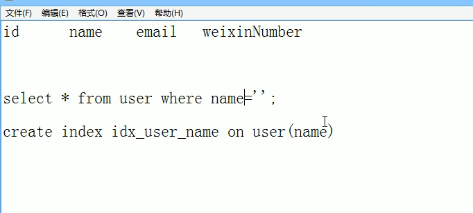

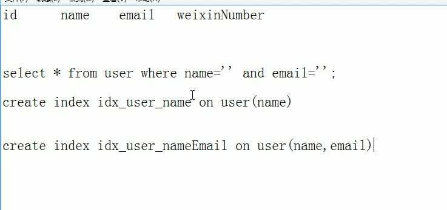

默认索引是idx_开头

> 什么时候建立索引

对频繁使用的字段建立索引

> 索引失效原因

比如上面的name，email做了复合索引，这个是先按照name排序查在按照email查。如果查询语句没有name，只写了whare email = ？，这样就会失效

## sql执行顺序


> SQL语句中order by和group by一起使用的注意事项

1.order by 的列，必须是出现在group by 子句里的列
2.order by 要 放在 group by的后面

## join

> 左连接


两张表的高度要一致，不一致要补null

左边的全部查出来，根据on进行连接，右表没有的补null

> 右链接


> 内链接


on是跟的join的条件

> 1


去除AB公共部分，就是B.key is null

> 1


> 全连接

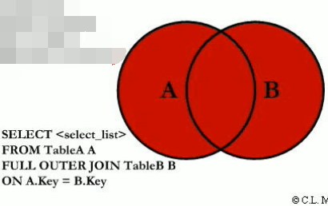

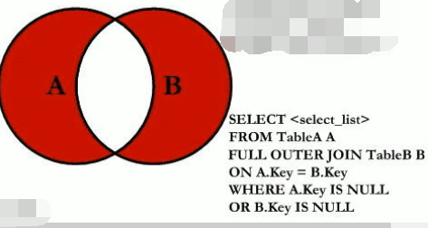


## 索引

> 什么是索引

索引是帮助mysql高效的获取数据的**数据结构**

MySQL中，用的最多的是InnoDB存储引擎，InnoDB中的索引采用B+Tree这种s数据结构

(排好序的快速查找的数据结构)

会影响查找和排序（比如orderby）

一般来说，索引也很大，不可能全部存储在内存中，因此索引往往以索引文件的形式存储在磁盘上

> 有哪些索引

单值索引

唯一索引

复合索引

> 基本语法


> 哪些适合建立索引

1. 主键自动建立唯一索引

2. 频繁查询
3. 查询中排序的字段，索引可以大大提升速度

> 不适合索引

where用不到的字段

频繁更新的字段（因为更新也要更新索引）

表记录很少就算了

数据重复率高，又或者类别很少（比如说ture，false）就不建立了


## 事务四大特性


## 并发情况下引发的问题

* 脏读：A事务还没提交，B事务就读到了A事务的结果。（破坏隔离性）

  例如：
  张三的工资为5000,事务A中把他的工资改为8000,但事务A尚未提交。
  与此同时，
  事务B正在读取张三的工资，读取到张三的工资为8000。
  随后，
  事务A发生异常，而回滚了事务。张三的工资又回滚为5000。
  最后，
  事务B读取到的张三工资为8000的数据即为脏数据，事务B做了一次脏读

* 不可重复读：是指在一个事务内，多次读同一数据。在这个事务还没有结束时，另外一个事务也访问该同一数据。那么，在第一个事务中的两次读数据之间，由于第二个事务的修改，那么第一个事务两次读到的的数据可能是不一样的。这样就发生了在一个事务内两次读到的数据是不一样的，因此称为是不可重复读。（破坏一致性，update，delete）
  例如：
  在事务A中，读取到张三的工资为5000，操作没有完成，事务还没提交。
  与此同时，
  事务B把张三的工资改为8000，并提交了事务。
  随后，
  在事务A中，再次读取张三的工资，此时工资变为8000。在一个事务中前后两次读取的结果并不致，导致了不可重复读。
* 幻读：是指当事务不是独立执行时发生的一种现象，例如第一个事务对一个表中的数据进行了修改，这种修改涉及到表中的全部数据行。同时，第二个事务也修改这个表中的数据，这种修改是向表中插入一行新数据。那么，以后就会发生操作第一个事务的用户发现表中还有没有修改的数据行，就好象发生了幻觉一样。（破坏一致性，insert）
  例如：
  目前工资为5000的员工有10人，事务A读取所有工资为5000的人数为10人。
  此时，
  事务B插入一条工资也为5000的记录。
  这是，事务A再次读取工资为5000的员工，记录为11人。此时产生了幻读。

> 解决

四种隔离级别，隔离程度不同，副作用也不同

1. 读未提交（Read uncommitted）：

​    这种事务隔离级别下，select语句不加锁。

​    此时，可能读取到不一致的数据，即“读脏 ”。这是并发最高，一致性最差的隔离级别。

2. 读已提交（Read committed）：

​    可避免 脏读 的发生。

​    在互联网大数据量，高并发量的场景下，几乎 不会使用 上述两种隔离级别。

3 .可重复读（Repeatable read）：

​    MySql默认隔离级别。

​    可避免 脏读 、不可重复读 的发生。

4. 串行化（Serializable ）：

​    可避免 脏读、不可重复读、幻读 的发生。

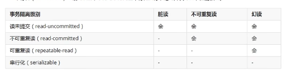

> > 实现（innoDB）

隔离级别就是依赖锁和MVCC实现的。

## 锁

 InnoDB中的行锁

① 记录锁（Record Locks）

锁住某一条记录

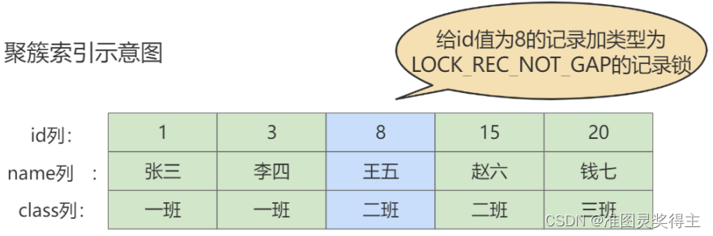

② 间隙锁（Gap Locks）

比如幻读，一开始没有数据，没办法加记录锁，可以加间隙锁


(3, 8)这个区间被锁

③ 临键锁（Next-Key Locks）

是上两个锁的组合，间隙锁是开区间（3，8），如果我们也想锁住8，那么用临键锁（3，8]

innodb默认的锁就是Next-Key locks。


④ 插入意向锁（Insert Intention Locks）

## 为什么索引用b+不用b

b+数非叶子叶子结点只包含导航信息，不包含实际的值，所有的叶子结点和相连的节点使用链表相连，便于区间查找和遍历。**IO次数更少**

b+高度为 3 的 B+ 树就能够存储千万级别的数据，实践中 B+ 树的高度最多也就 4 或者 5，


## **为什么MySQL 没有用hash作为索引的数据结构呢？**

**1.Hash 冲突问题** ：我们上面也提到过Hash 冲突了，不过对于数据库来说这还不算最大的缺点。

**2.Hash 索引不支持顺序和范围查询(Hash 索引不支持顺序和范围查询是它最大的缺点：** 假如我们要对表中的数据进行排序或者进行范围查询，那 Hash 索引可就不行了。

## 数据库常用得命令

```sql

```

## 超键、候选键、主键、外键

超键(super key):在关系中能唯一标识元组的属性集称为关系模式的超键

候选键(candidate key):不含有多余属性的超键称为候选键

主键(primary key):用户选作元组标识的一个候选键程序主键

外键(foreign key)如果关系模式R1中的某属性集不是R1的主键，而是另一个关系R2的主键则该属性集是关系模式R1的外键。

> 结合实例的具体解释：

假设有如下两个表：

学生（学号，姓名，性别，身份证号，教师编号）

教师（教师编号，姓名，工资）

超键：

由超键的定义可知，学生表中含有学号或者身份证号的任意组合都为此表的超键。如：（学号）、（学号，姓名）、（身份证号，性别）等。

候选键：

候选键属于超键，它是最小的超键，就是说如果再去掉候选键中的任何一个属性它就不再是超键了。学生表中的候选键为：（学号）、（身份证号）。

主键：

主键就是候选键里面的一个，是人为规定的，例如学生表中，我们通常会让“学号”做主键，教师表中让“教师编号”做主键。

外键：

外键比较简单，学生表中的外键就是“教师编号”。外键主要是用来描述两个表的关系。


## sql五种约束

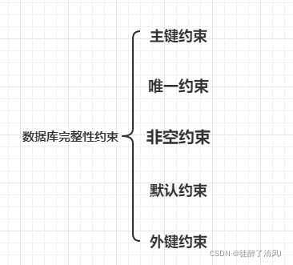

主键约束：不重复、唯一、非空

设置主键的列不允许为空，

唯一约束用来保护表中某列数据不允许重复，

## char与varchar的区别

1. char的长度不可变，而varchar的长度可变

* 这就表示，存储字符串'abc'，使用char(10)，表示存储的字符将占10个字节（包括7个空字符）

* 使用varchar(10),则表示只占3个字节，10是最大值，当存储的字符小于10时，按照实际的长度存储

2. char类型的效率比varchar的效率稍高

3. varchar比char节省空间，但是在效率上比char稍差些。既要获得效率即必须牺牲一点空间，这就是设计上的""以空间换时间""

## 三范式

> 一范式

不重复，原子


数据冗余


> 插入异常

比如说你新建一个系，这个时候没有学生就插入不了


二范数

消除部分依赖，

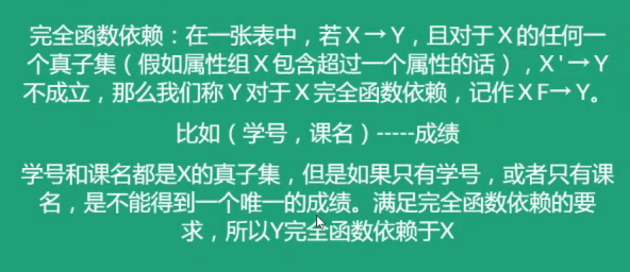

完全依赖，通过一个候选码可以确定其他码

比如id可以确定姓名等但是id和课名才能确定分数

分数完全依赖于（id和课程），可以说（id和课程）就是候选码，但是name只需要id就可以，所以说name部分依赖于（id和课程）消除

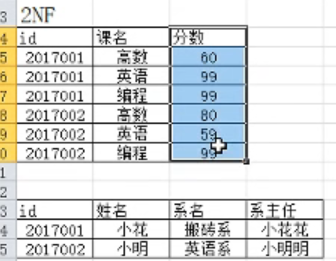

解决了1范式的数据冗余，修改异常

> 3范式

消除传递依赖

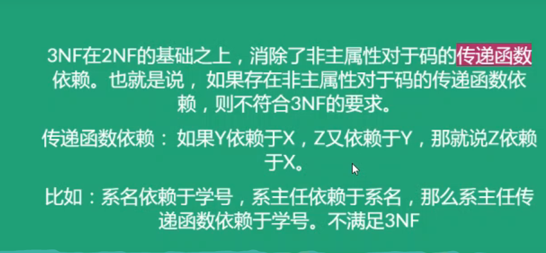

插入和删除没问题

 

## 事务

原子性

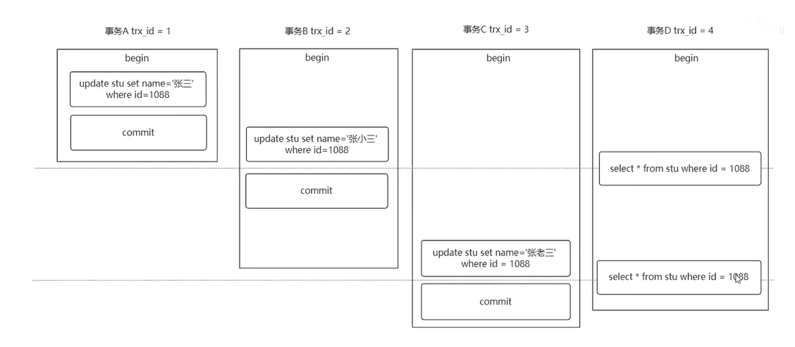

undo log

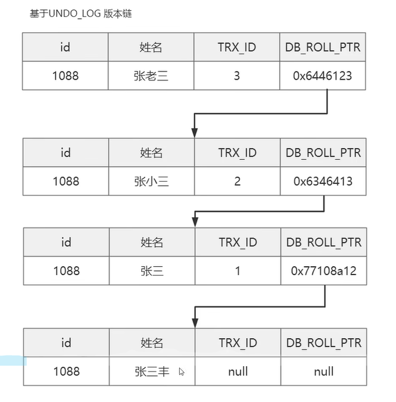

持久性

redo log

mysql数据是写入磁盘的，但写入磁盘比较慢，所以出现了一个缓存buffer，再写的时候是先写入buffer，在慢慢同步到磁盘。找的时候也如此。如果这时候宕机，buffer嗝屁，不能持久性，这时候有个日志redo log，在放buffer时候也在redo log记录一下，它记录了修改，根据它回复

隔离性

写-写：锁

写-读：mvcc

## mvcc

主要是处理读请求，是快照读而不是当前读

目的是读写得时候不用去竞争锁，提高性能

读已提交和可重复读的快照读都是基于mvcc实现的


基于三个实现

undo log 、版本连、ReadView

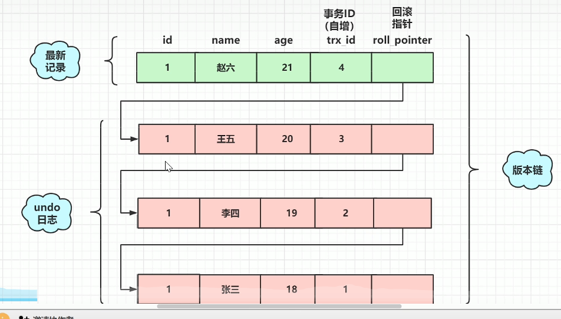

如图，把di为1的一直修改，有事务id，这个是自增的，然后回滚指针，指向之前修改的

undo log记录之前修改的

> readview啥用

你看版本连里面这么多版本，不知道取哪一个啊

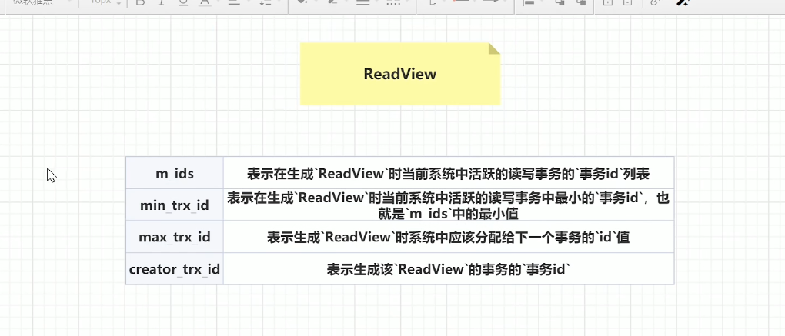

其实readview在代码里就是一个对象

m_ids 表示活跃的，啥是活跃的，就是没有commit

creator_trx_id 谁生成了这个readview

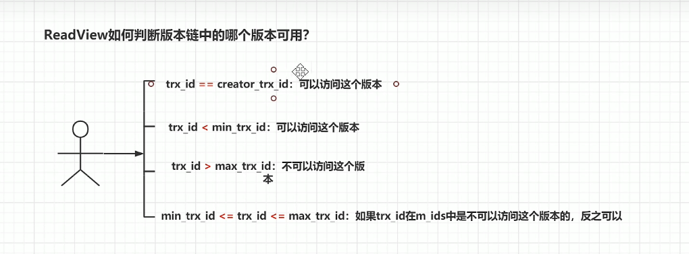

例子

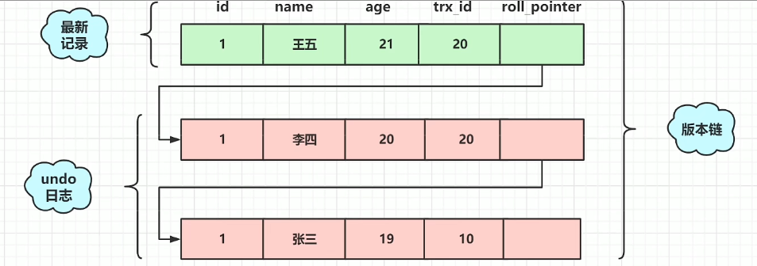


读已提交RC：这个级别下每次select都会产生一个readview。

可重复读RR：这个级别下readview是以事务为单位，第一个select产生一个readview，后面不产生了

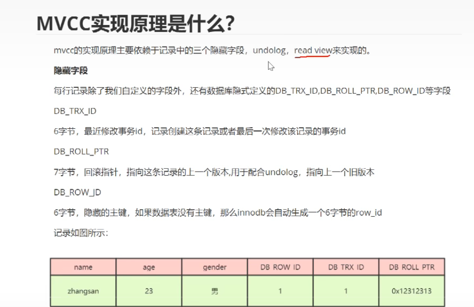

## redolog

保证持久性

当一条数据需要更新时,InnoDB会先将数据更新，然后记录redoLog 在内存中，然后找个时间将redoLog的操作执行到磁盘上的文件上。

> 为啥不直接写入磁盘

写入redolog快，写入的方式是在文件后面追加，不需要找位置。但是写入磁盘需要找的写入的具体位置，这个比较慢

> redolog写满怎么办

它是写满了就从头开始写，像一个环状

## redolog和binlog区别


## 主从复制

springboot怎么使用

springboot是自动装配的，你好几个数据库，它怎么知道链接哪一个

在aplication.apropeity里分别定义主从的密码，用户名，链接这些

然后这里仿照springboot配置文件自己定义了一个配置类，取出aprlicaotion中的文件


配置数据源


设置链接工厂这些


	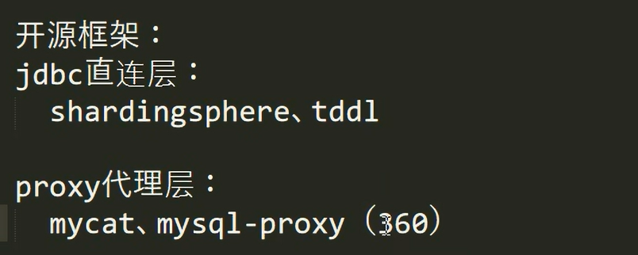

## 设置默认值

defult

```sql
CREATE TABLE students(
     student_id INT DEFAULT 100,
     name VARCHAR(255) NOT NULL,
     age INT DEFAULT 15
);
```

## 分布式ID

uuid和雪花（snowflake）

> 区别

uuid是无序的不建议使用（因为无序在索引使用的时候影响较大）

> 雪花算法

它有64个bit位

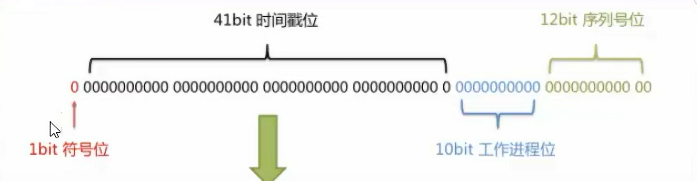

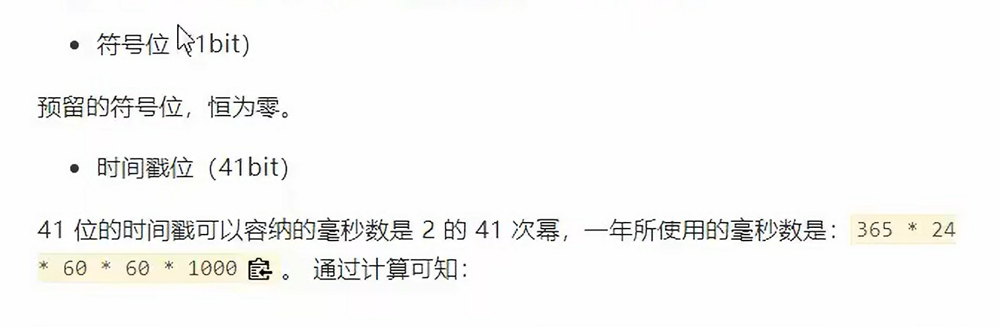


配置也是通过shardingspere ，在properties中配置

## 非聚集索引回表

一般普通索引就是非聚集索引，需要回表。聚集索引一般为主键索引，根据这个再进行回表。

> 为啥不都用聚集索引

没必要，浪费空间，因为每一个创建一个索引，innodb都会创建一个索引树，如果叶子节点都放数据就会浪费空间

> 具体参考

https://blog.csdn.net/weixin_38192427/article/details/111872683

## 不同类别索引创建

> 主键索引

```sql
ALTER TABLE tbl_name ADD PRIMARY KEY (col_list);

// 该语句添加一个主键，这意味着索引值必须是唯一的，且不能为NULL。
```

> 唯一索引

```sql
ALTER TABLE tbl_name ADD UNIQUE index_name (col_list);

// 这条语句创建索引的值必须是唯一的，索引值可以为null（null可重复出现）
```

> 普通索引

```sql
ALTER TABLE tbl_name ADD INDEX index_name (col_list);

// 添加普通索引，索引值可出现多次。
```

> 删除

```sql
ALTER TABLE tbl_name DROP INDEX index_name；
```

## 索引失效原因

https://blog.csdn.net/qq_43460095/article/details/125538837

## 覆盖索引

就是联合索引，在普通索引查询后，需要进行回表操作，但如果查的多，一直回表比较费时。

这时候可以采用覆盖索引进行解决


比如这里增加name、和age复合索引，这样在查name和age就不需要回表，但要注意索引失效

> 参考链接

https://www.bilibili.com/video/BV1cv411P7Wb/?spm_id_from=333.337.search-card.all.click&vd_source=c2eaa7091973b76eb57f77f9dfc9eecc

https://blog.csdn.net/Aplumage/article/details/117015144

## 索引下推

Mysql5.6更新后一个重要特性，被问到要答出来


> 参考

https://www.bilibili.com/video/BV1ks4y157CS/?spm_id_from=333.337.search-card.all.click&vd_source=c2eaa7091973b76eb57f77f9dfc9eecc