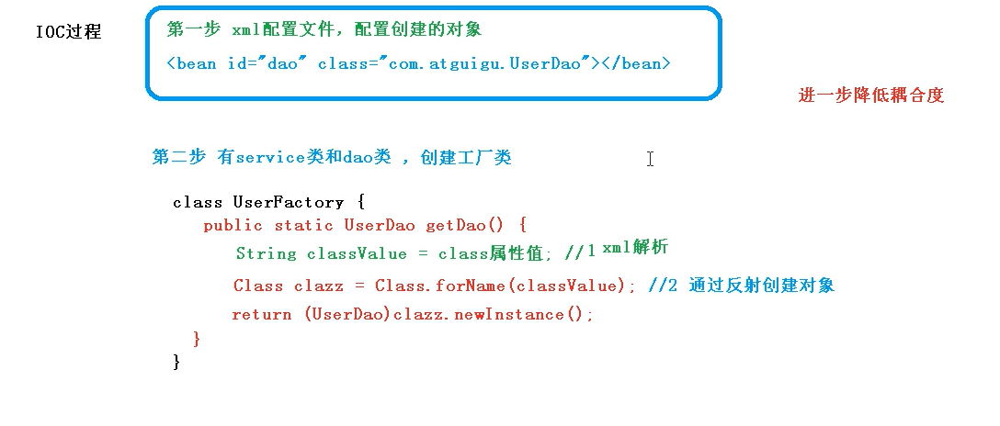
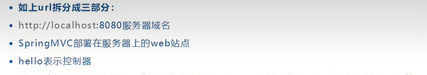
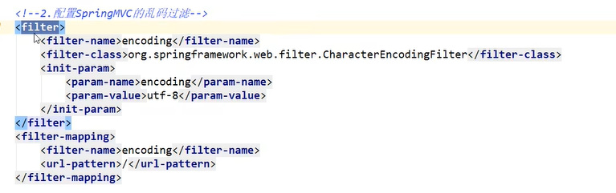
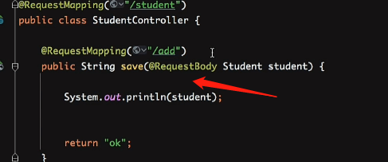
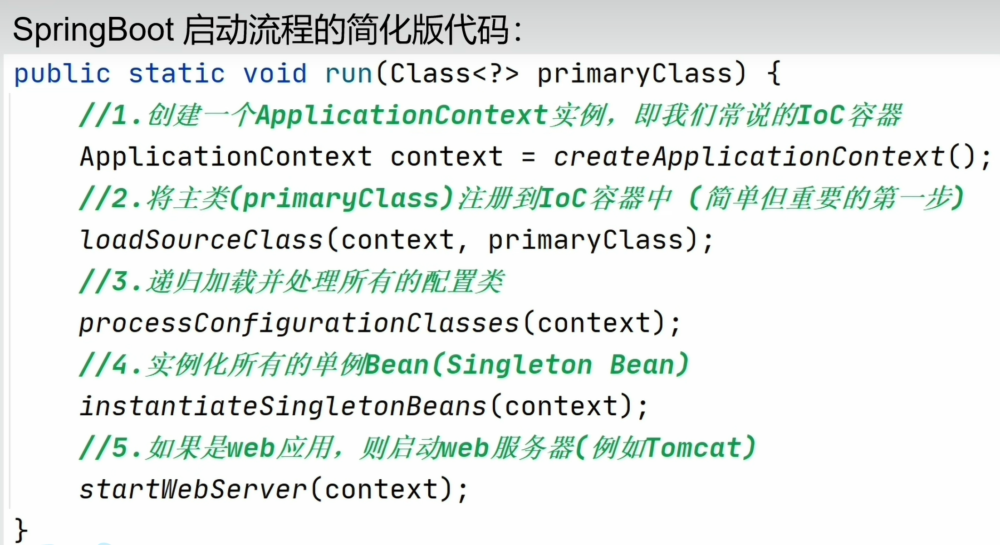
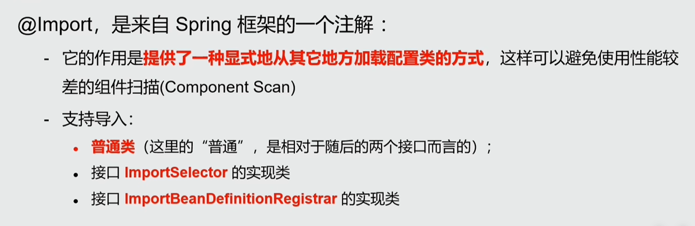

## ioc

为了降低耦合度

> 底层原理

[xml](https://so.csdn.net/so/search?q=xml&spm=1001.2101.3001.7020)解析、工厂模式、反射

> 工厂模式

它的出现就是为了解耦合


> ioc



工厂不在new了，通过反射来创建对象，这样我们只需要修改xml就可以了

> **Spring提供的IOC容器实现的两种方式（两个接口）**

BeanFactory接口：IOC容器基本实现是Spring内部接口的使用接口，不提供给开发人员进行使用（加载配置文件时候不会创建对象，在获取对象时才会创建对象。）

ApplicationContext接口：BeanFactory接口的子接口，提供更多更强大的功能，提供给开发人员使用（加载配置文件时候就会把在配置文件对象进行创建）推荐使用！

> 注入

set

```xml
<!--（2）spring方式： set方法注入属性-->
<bean id="book" class="com.atguigu.spring5.Book">
    <!--使用property完成属性注入
        name：类里面属性名称
        value：向属性注入的值
    -->
    <property name="bname" value="Hello"></property>
    <property name="bauthor" value="World"></property>
</bean>

```

construct

```xml
<!--（2）spring方式：有参数构造注入属性-->
<bean id="orders" class="com.atguigu.spring5.Orders">
    <constructor-arg name="oname" value="Hello"></constructor-arg>
    <constructor-arg name="address" value="China！"></constructor-arg>
</bean>

```

注入空值和特殊值

```xml
<bean id="book" class="com.atguigu.spring5.Book">
    <!--（1）null值-->
    <property name="address">
        <null/><!--属性里边添加一个null标签-->
    </property>
    
    <!--（2）特殊符号赋值-->
     <!--属性值包含特殊符号
       a 把<>进行转义 &lt; &gt;
       b 把带特殊符号内容写到CDATA
      -->
        <property name="address">
            <value><![CDATA[<<南京>>]]></value>
        </property>
</bean>

```

注入外部bean

```xml
<!--1 service和dao对象创建-->
<bean id="userService" class="com.atguigu.spring5.service.UserService">
    <!--注入userDao对象
        name属性：类里面属性名称
        ref属性：创建userDao对象bean标签id值
    -->
    <property name="userDao" ref="userDaoImpl"></property>
</bean>
<bean id="userDaoImpl" class="com.atguigu.spring5.dao.UserDaoImpl"></bean>

```

**xml 注入集合属性**

```xml
<!--（2）在 spring 配置文件进行配置-->
    <bean id="stu" class="com.atguigu.spring5.collectiontype.Stu">
        <!--数组类型属性注入-->
        <property name="courses">
            <array>
                <value>java课程</value>
                <value>数据库课程</value>
            </array>
        </property>
        <!--list类型属性注入-->
        <property name="list">
            <list>
                <value>张三</value>
                <value>小三</value>
            </list>
        </property>
        <!--map类型属性注入-->
        <property name="maps">
            <map>
                <entry key="JAVA" value="java"></entry>
                <entry key="PHP" value="php"></entry>
            </map>
        </property>
        <!--set类型属性注入-->
        <property name="sets">
            <set>
                <value>MySQL</value>
                <value>Redis</value>
            </set>
        </property>
</bean>

```

**在集合里面设置对象类型值**

```xml

    <!--创建多个course对象-->
    <bean id="course1" class="com.atguigu.spring5.collectiontype.Course">
        <property name="cname" value="Spring5框架"></property>
    </bean>
    <bean id="course2" class="com.atguigu.spring5.collectiontype.Course">
        <property name="cname" value="MyBatis框架"></property>
    </bean>
    
   	<!--注入list集合类型，值是对象-->
       <property name="courseList">
           <list>
               <ref bean="course1"></ref>
               <ref bean="course2"></ref>
           </list>
       </property>

```

## 自动装配


两个的弊端：byname必须名字一样，要不不行

bytype，两个同类型的容器不行，直接报错

> 注解实现

当然要首先开启注解的支持


@Autowired

@Qualifier

@Resource

## Bean 的作用域有哪些?

Spring 中 Bean 的作用域通常有下面几种：

- **singleton** : 唯一 bean 实例，Spring 中的 bean 默认都是单例的，对单例设计模式的应用。（单例）
- **prototype** : 每次请求都会创建一个新的 bean 实例。（原型）
- **request** : 每一次 HTTP 请求都会产生一个新的 bean，该 bean 仅在当前 HTTP request 内有效。
- **session** : 每一次来自新 session 的 HTTP 请求都会产生一个新的 bean，该 bean 仅在当前 HTTP session 内有效。
- **global-session** ： 全局 session 作用域，仅仅在基于 portlet 的 web 应用中才有意义，Spring5 已经没有了。Portlet 是能够生成语义代码(例如：HTML)片段的小型 Java Web 插件。它们基于 portlet 容器，可以像 servlet 一样处理 HTTP 请求。但是，与 servlet 不同，每个 portlet 都有不同的会话。

## 单例 Bean 的线程安全问题了解吗？

大部分时候我们并没有在项目中使用多线程，所以很少有人会关注这个问题。单例 Bean 存在线程问题，主要是因为当多个线程操作同一个对象的时候是存在资源竞争的。

常见的有两种解决办法：

1. 在 Bean 中尽量避免定义可变的成员变量。
2. 在类中定义一个 `ThreadLocal` 成员变量，将需要的可变成员变量保存在 `ThreadLocal` 中（推荐的一种方式）。

(换成原型模式就安全了)（加锁当然也可以不过会降低效率）

## 代理模式

这是spring aop的底层

## aop

切面编程

AOP(Aspect Oriented Programming)：面向切面编程，一种编程范式，AOP弥补了OOP的不足，基于OOP基础之上进行横向开发。

OOP规定程序开发以类为主体模型，一切围绕对象进行，完成某个任务先构建模型；AOP程序开发主要关注基于OOP开发中的共性功能，一切围绕共性功能进行，


## springmvc的执行流程


1. 客户端（浏览器）发送请求，直接请求到 `DispatcherServlet`。（被它拦截，拦截什么可以配置，比如配置/nihao，就拦截/你好）(一般写/，全拦截就行了)

2. `DispatcherServlet` 根据请求信息调用 `HandlerMapping`，解析请求对应的 `Handler`。（这个是根据url获取handler）

   > url分为什么

   

   

   

3. 解析到对应的 `Handler`（也就是我们平常说的 `Controller` 控制器）后，开始由 `HandlerAdapter` 适配器处理。

   为什么要在 Spring MVC 中使用适配器模式？Spring MVC 中的 Controller 种类众多，不同类型的 Controller 通过不同的方法来对请求进行处理。如果不利用适配器模式的话，DispatcherServlet 直接获取对应类型的 Controller，需要的自行来判断，像下面这段代码一样：

   ```java
   if(mappedHandler.getHandler() instanceof MultiActionController){  
      ((MultiActionController)mappedHandler.getHandler()).xxx  
   }else if(mappedHandler.getHandler() instanceof XXX){  
       ...  
   }else if(...){  
      ...  
   }  
   ```

   这样假设如果我们增加一个 HardController,就要在代码中加入一行 if(mappedHandler.getHandler() instanceof HardController)，这种形式就使得程序难以维护，也违反了设计模式中的开闭原则 – 对扩展开放，对修改关闭。

4. `HandlerAdapter` 会根据 `Handler`来调用真正的处理器开处理请求，并处理相应的业务逻辑。

5. 处理器处理完业务后，会返回一个 `ModelAndView` 对象，`Model` 是返回的数据对象，`View` 是个逻辑上的 `View`。

6. `ViewResolver` 会根据逻辑 `View` 查找实际的 `View`。

7. `DispaterServlet` 把返回的 `Model` 传给 `View`（视图渲染）。

8. 把 `View` 返回给请求者（浏览器

## 什么是MVC

MVC是一种软件架构的思想，将软件按照模型、视图、控制器来划分

M：Model，模型层，指工程中的JavaBean，作用是处理数据

JavaBean分为两类：

一类称为实体类Bean：专门存储业务数据的，如 Student、User 等
一类称为业务处理 Bean：指 **Service 或 Dao 对象**，专门用于处理业务逻辑和数据访问。
V：View，视图层，指工程中的**html或jsp等页面**，作用是与用户进行交互，展示数据

C：Controller，**控制层**，指工程中的**servlet**，作用是接收请求和响应浏览器

## 转发和重定向

1、请求次数

重定向是浏览器向服务器发送一个请求并收到响应后再次向一个新地址发出请求，转发是服务器收到请求后为了完成响应跳转到一个新的地址；重定向至少请求两次，转发请求一次；

2、地址栏不同

重定向地址栏会发生变化，转发地址栏不会发生变化；

3、是否共享数据

重定向两次请求不共享数据，转发一次请求共享数据（在request级别使用信息共享，使用重定向必然出错）；

4、跳转限制

重定向可以跳转到任意URL，转发只能跳转本站点资源；

5、发生行为不同

重定向是客户端行为，转发是服务器端行为；

```jsp
请求转发：request.getRequestDispatcher(“info.html”).forward(request, response);
请求重定向：response.sendRedirect(“1.html”);
```

## 项目构建

1. 先创建一个父工程

   删除父工程src，因为用不到

   导入自己知道的公共依赖

2. 创建子工程，一个普通的maven即可

## servlet

继承httpservlet，重写doGet、depost

## 乱码问题

过滤器解决乱码


配置文件配置


(上面的/换/*)

springmvc自带过滤器（在配置文件上配置就可以了）



## jison

它是一种数据格式，现在都是前后端分离开放，需要这样一种格式约定


## requestbody

了解http请求


第一行是请求url；包含请求类型，地址等

第二行是请求头；包含身份信息，请求内容的类型等

然后空行

第四行请求体：


get请求是url传参的，例如上面？后面的

post请求体传参的，比如上面两个，可能是json或者字符串（表单）等等


测试

> 加上requestbody



get请求不行，post请求表单不行，jsion可以

> 不加requestbody

get，post表单都可以。jsion不行

所以处理传来的是jison的时候加上requestbody

> 注意

用requestbody修饰字符串的时候，会接收整个jsion


所以requestbody尽量修饰一个实体参数，或者map

## requestparam

其实这个在参数上加和不加是一样的，只不过加上可以解决前端和后端传递参数名不一致的情况


## 跨域问题

1.使用注解 (局部跨域)

**在控制器(类上)上使用注解 @CrossOrigin:，表示该类的所有方法允许跨域**。

```java
@RestController
@CrossOrigin(origins = "*")
public class HelloController {
 
    @RequestMapping("/hello")
    public String hello() {
        return "hello world";
    }
}
```

2.手动设置响应头(局部跨域)

使用 HttpServletResponse 对象添加响应头(Access-Control-Allow-Origin)来授权原始域，这里 Origin的值也可以设置为 “*”,表示全部放行。

```java
@RequestMapping("/index")
public String index(HttpServletResponse response) {
 
    response.addHeader("Access-Allow-Control-Origin","*");
    return "index";
}
```

3.使用自定义filter实现跨域

```java
package cn.wideth.aop;
 
import java.io.IOException;
import javax.servlet.Filter;
import javax.servlet.FilterChain;
import javax.servlet.FilterConfig;
import javax.servlet.ServletException;
import javax.servlet.ServletRequest;
import javax.servlet.ServletResponse;
import javax.servlet.http.HttpServletResponse;
import org.springframework.stereotype.Component;
 
@Component
public class MyCorsFilter implements Filter {
 
  public void doFilter(ServletRequest req, ServletResponse res, 
  FilterChain chain) throws IOException, ServletException {
  
    HttpServletResponse response = (HttpServletResponse) res;
    response.setHeader("Access-Control-Allow-Origin", "*");
    response.setHeader("Access-Control-Allow-Methods", "POST, GET, OPTIONS, DELETE");
    response.setHeader("Access-Control-Max-Age", "3600");
    response.setHeader("Access-Control-Allow-Headers", "x-requested-with,content-type");
    chain.doFilter(req, res);
    
  }
  
  public void init(FilterConfig filterConfig) {}
  public void destroy() {}
}
```

## get请求和post请求的区别

1.get请求一般是去取获取数据（其实也可以提交，但常见的是获取数据）；
post请求一般是去提交数据。

2.get因为参数会放在url中，所以隐私性，安全性较差，请求的数据长度是有限制的，
不同的浏览器和服务器不同，一般限制在 2~8K 之间，更加常见的是 1k 以内；
post请求是没有的长度限制，请求数据是放在body中；

3.get请求刷新服务器或者回退没有影响，post请求回退时会重新提交数据请求。

4.get请求可以被缓存，post请求不会被缓存。

5.get请求会被保存在浏览器历史记录当中，post不会。get请求可以被收藏为书签，因为参数就是url中，但post不能。它的参数不在url中。

6.get请求只能进行url编码（appliacation-x-www-form-urlencoded）,post请求支持多种（multipart/form-data等）。

## requestbody和RequestParam

RequestBody注解的主要作用就是用于接收前端的参数，当我们使用post请求的时候，我们会将参数放在request body中，此时我们就需要在Controller的方法的参数前面加上@RequestBody用来接受到前端传过来的request body中的值，举个栗子：

```java
@Controller
@RequestMapping（“/test”）
public class test{
 
public void testMethod(@RequestBody String string)"{
 
       System.out.println("测试");
  
  }
}
```

一个请求只能有一个RequestBody，也就是说，当一个方法中有两个参数的时候，最多只能有一个参数加@RequestBody注解用来接受request body中的参数；

@RequestParam接收的参数主要是来自request Header中，即请求头中。通常用于get请求中，我们都知道get请求的参数都是写在url中的，例如：http://localhost:8080/my/api/testMethod?name=雷神&age=3   该url我们可以看到有那么和age两种属性，那么当我们将此请求发送到后台服务以后，Controller写法如下：

```java
@Controller
@RequesMapping（“/api”）
public class test{
 
public void testMethod(@RequestParam(value="name",required=false,defaultValue="雷神")String name,@RequestParam(value="age")Int age){
 
    System.out.println("年仅"+age+“岁肥宅”+name);
 
} 
}
```

> 注意

RequestBody的作用是将前端传来的json格式的数据转为自己定义好的javabean对象，需要注意的是传入数据的属性名称要和后端javabean中定义的一致，发送请求后可以看到在控制台中我们通过javabean对象的get方法打印出了前端传来的值，说明json数据已经成功被转换为了javabean对象，将对应的属性进行了赋值。

## SpringBoot 的核心注解是哪个？它主要由哪几个注解组成的？

启动类上面的注解是@SpringBootApplication，它也是 SpringBoot 的核心注解，主要组合包含了以下 3 个注解：

1，@SpringBootConfiguration:组合了@Configuration注解,实现配置文件的功能。

2，@EnableAotuConfiguration:打开自动配置功能，也可以关闭某些自动配置的选项 

3，@ComponentScan:Spring组件扫描功能，让SpringBoot扫描到Configuration类并把它加入到程序的上下文。

## springboot自动配置

> springboot启动流程




> 原理

https://blog.csdn.net/m0_46316970/article/details/125898849

## @ComponentScan 扫描类，可以扫描很多个类还是只能一个类？

默认情况下,@*ComponentScan扫描*入口类同级及其子级包下的所有文件。

> 扫描其他包

动指定扫描包路径。

## springboot自动装配

> 自动装配和自动配置

自动装配是autowire

自动配置是auto-configuration

> 自动配置

这里用@ComponentScan来加载我们application路径下的包，用@EnableAutoConfiguration来用spring factory机制来加载第三方的jar包的配置类，所有加载好后，再去加载这些配置类用@Import，@Bean等注解去加载的别的配置类，此时所有需要加载的配置类都加载好了，再去实例化这些bean，将这些bean注册到IOC中

https://www.bilibili.com/video/BV1NY411P7VX/?spm_id_from=333.337.search-card.all.click&vd_source=c2eaa7091973b76eb57f77f9dfc9eecc

## @import



> 用法

1、直接填class数组方式
2、ImportSelector方式【重点】
3、ImportBeanDefinitionRegistrar方式

> 普通

```java
@Import({ 类名.class , 类名.class... })
public class TestDemo {

}
```

>ImportSelector

分析实现接口的selectImports方法中的：
1、返回值： 就是我们实际上要导入到容器中的组件全类名【重点 】
2、参数： AnnotationMetadata表示当前被@Import注解给标注的所有注解信息【不是重点】
需要注意的是selectImports方法可以返回空数组但是不能返回null，否则会报空指针异常！

第一步：创建Myclass类并实现ImportSelector接口，这里用于演示就添加一个全类名给其返回值

```java
public class Myclass implements ImportSelector {//要实现ImportSelector接口
    @Override
    public String[] selectImports(AnnotationMetadata annotationMetadata) {
        return new String[]{"com.yc.Test.TestDemo3"};//这里是要导入的全限定名
    }
}
```

类似注入多个，每个用它的全限定名

第二步：使用ImportSelector方式的Myclass类

```java
@Import({Myclass.class})
```

> 参考

https://blog.csdn.net/a14654/article/details/114398753

https://www.bilibili.com/video/BV1NY411P7VX/?spm_id_from=333.337.search-card.all.click&vd_source=c2eaa7091973b76eb57f77f9dfc9eecc