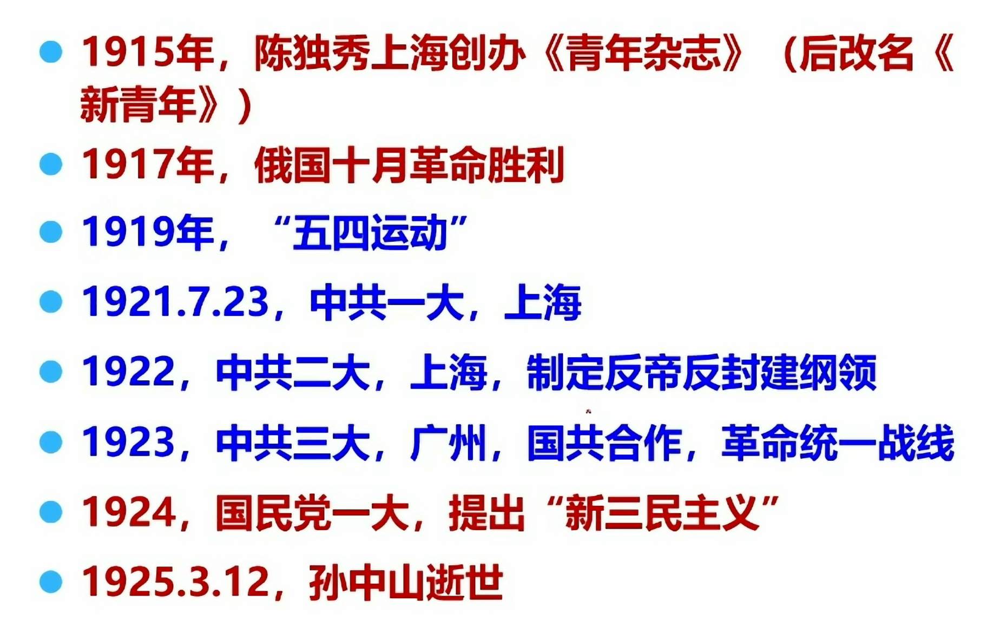
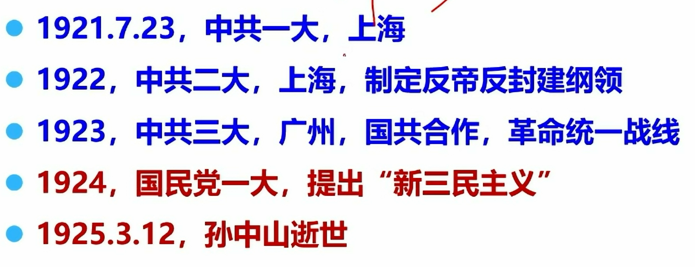
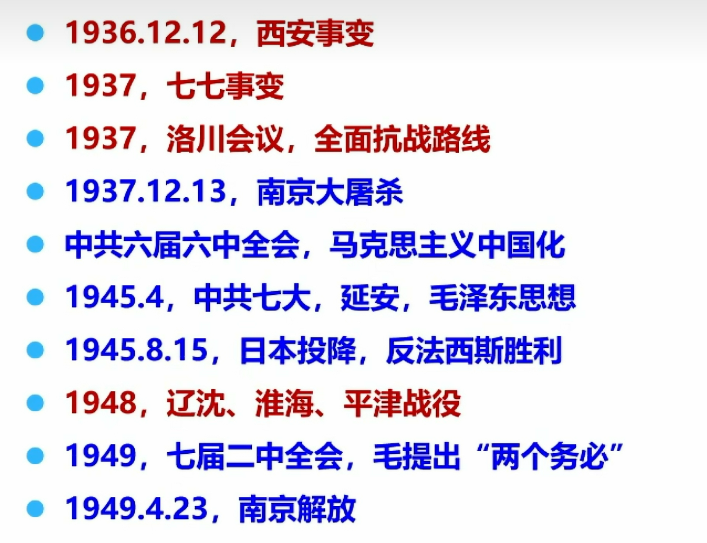
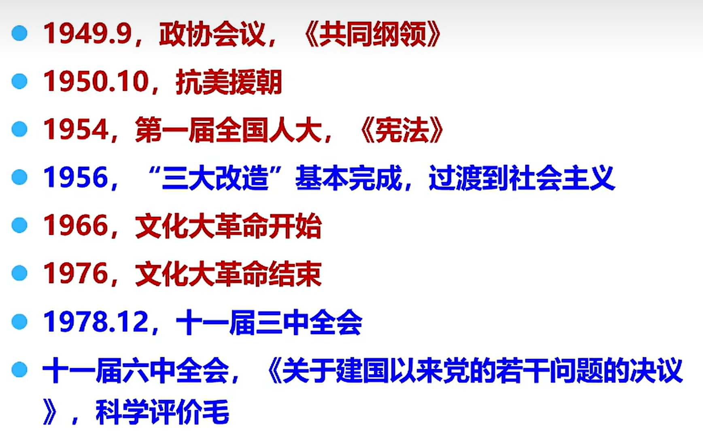
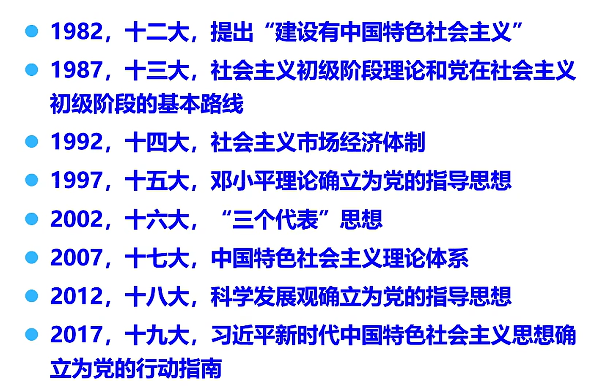
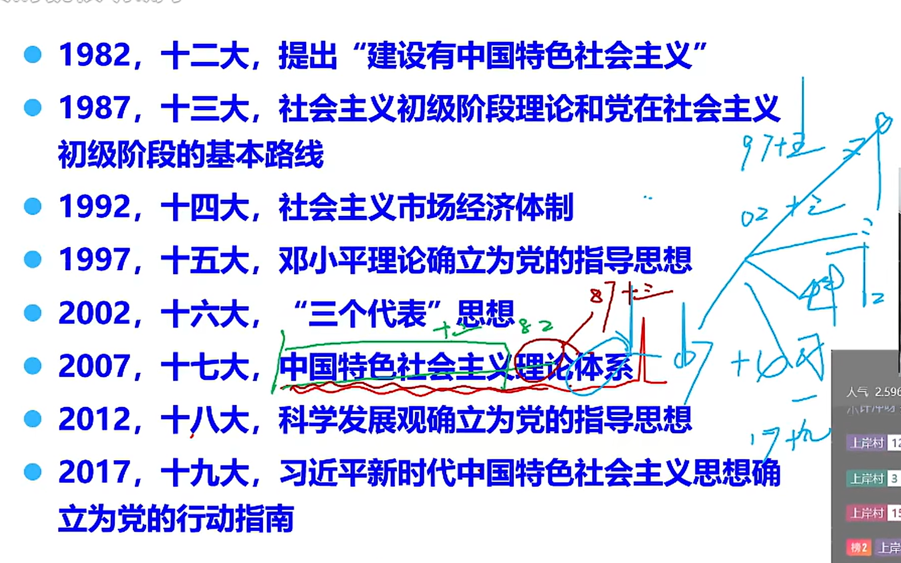

## 党史

### 青年杂志

1915年陈独秀创办《青年杂志》，这是新文化运动。以鲁迅、胡适等，有两个口号，’德先生‘（民主）、’赛先生‘（科学）。（新文化运动是在前面的失败了操弄，比如戊戌变法、辛亥革命）（青年杂志把马克思主义传到中国，在这之前，并没有马克思主义）

陈独秀是《青年杂志的创办者》，实际发稿最多的是李大钊

最先提出“中国共产党”这个名称的是**蔡和森**

开眼看世界的第一人是**林则徐**

把马克思引入到中国的第一人是**李大钊**

《青年杂志》带来了马克思主义理论

### 十月革命

列宁领导的

给中国带来了马克思主义实践

### 五四运动

这是党史的开端

五四运动**导火索**是巴黎和会（第一次世界大战刚结束，中国是战胜国，小日本欺负人，逼迫中国签订21条不平等合约，包括把山东割地给小日本，当时北洋政府居然同意了，但国内老百姓不愿意，学生罢课，**工人罢工**，商人罢市）（工人就是无产阶级，这里说明无产阶级开始走向政治的舞台）

五四运动**标志着**无产阶级走向了历史的舞台

五四运动**标志着**旧民主主义革命的结束和新民主主义革命的开端

第一次**世界大战导火索**虎门销烟

<u>**上面四个日期是等差，这样记忆好记**</u>

## 会议

重要会议9+8，共17次

（绿色重要，红色了解）

### 一大（重要）

年月日都记

参会人员**13名**（代表50多名，当时只有这么多党员）（毛泽东在这13中，但当时没有发言的机会，只能记录）

**标志着**共产党的诞生

党的生日7月1号

### 二大

立纲

最高（终极目标，到今天也是）：实现共产主义

最低（最低目标，首要目标）：制定反帝反封建纲领

### 三大

国共合作（共产党没有军队，但是国民党有，所以合作，那时候国民党孙中山同意了）

袁世凯嗝屁了（老大嗝屁了，下面的都想当老大，所以天天打，嗷嗷叫）

### 国民党一大

提出“新三民”

上面三大相当于共产党要约，这里是给了

联俄联共助农工

国共正式合作是这时候开始的（1924年）

当时合作方式是共产党员以个人名义加入国民党（又是共产党，又是国民党）

合作的目的是打北洋军阀，开始北伐，到1927年差不多干完了

国民党最后撕票了，孙中山去世，蒋介石和汪精卫掌权（汪精卫权大），蒋介石发动**’四一二‘**反革命（这里的主要目的是夺权，夺汪精卫的权，汪精卫后来不惜投靠小日本来干蒋介石，变成了中国第一大汉奸）（也是国共撕票），汪精卫发动’**七一五‘反革命**（他两个虽然是死对头，但共同的敌人是共产党，所以发动两个政变）开始暗杀共产党，危险（这时候党的领导人是陈独秀，他还想和国民党谈，再谈就灭团个去求了，所以后来不听他的了）

左倾和右倾（这是哲学中的质量互变，如果只看到质而忽略量，左倾。右倾是只看到量的积累，而忽略质。陈独秀是右倾，光想投降）

### 南昌起义

上面说了陈独秀右倾，党内其他人（例如周恩来、朱德、贺龙）必须起义了，**标志着**军队的诞生

建军节就是8月1号，纪念这一天

打响了第一枪（打响国民党武装反抗）不服就干

周恩来、朱德、贺龙、叶挺、刘伯承（朱刘喝夜粥）

### 八七会议

反右的会议，反对陈独秀右倾

毛主席发言了，枪杆里出政权

但是打不过啊，只能逃命，往农村逃，没吃的咋办，抢，抢地主的，这就来到了秋收起义

### 秋收起义

打土豪、分田地，粮食带走，地没啥用，分给农民，土地归集体所有，集体所有制就这样诞生的

### 长征

国民党对共产党的四次围剿都躲过去了，第五次没抗住，开始了长征。

这个时候领导人是王明，他是左倾（第五次他改防守为进攻，没攻出去，农村也待不住了，往山里逃命，往没人的地方逃，东北那边）

34年开始，36年会师，标志成功

**湘江战役**是长征以来最壮烈的一战

**飞夺泸定桥**也是一次重要战役

### 遵义会议

1935年1月召开

反左的会议，**确定**了毛泽东的领导低位

**标志着**共产党走向了成熟

**标志着**第一次**独立自主**（之前也用，这次是独立自主，之前听有个共产国际的，否定了这群只会纸上谈兵的家伙）运用马列主义解决中国事情的会议

### 一二九运动

1935年12月9号

1927-1937国共在内战

1931九一八小日本来了，主要干东北三省（习大大改这里，说抗日从这里开始的，也就是14年，到1945年抗日胜利）

这个时候国共还在内战（国民党还在追杀共产党，学生又看不下去了，这就是一二九运动）

学生游街示威了，要求国共两党停止内战，一致抗日

### 瓦窑堡会议

共产生密切联系群众，会议上面的一二九了（没隔几天，都是1935年12月份）

第二次向国民党发送要约，国民党不愿意

到1936年，张学良和杨虎城看不下去了，发动西安事变，胁迫蒋介石停止内战

### 洛川会议

1937年，会议通过了《抗日救国的十大纲领》

### 西安事变

1936年12月12日

### 七七事变

1937年小日本发动在北京卢沟桥事变

1937-45全面抗战时期（8年，以前书本写的是八年，但习大大改为14年，说1931-1937年虽然国共在内战没抗日，但东北在抗）

标志着抗日民族统一战线的正式达成

标志着日本全面侵华爆发

抗日战争胜利是在1945年8月15，9月2号签订投降书，9月3号被习大大命为抗日战争纪念日

### 淞沪会战（不重要）

小日本从东北开始打，1937年七七事变，到10月份就打到上海了。这时候蒋介石发动74个师在这里和小日本干起来了（基本全面出动），为了转业自己的家业首都（这是首都在南京，也是小日本要去的地方）

国共合作后，共产党的部队收编到国民党中，比如新四军、八路军，但还是自己指挥自己。正面蒋介石打，游击共产党打

### 南京大屠杀

1937年12月13日

淞沪会战蒋介石败了，小日本死了四W人左右，蒋介石死了30w左右，上海失手

德国**拉贝**记录了南京大屠杀

美国魏特琳，救了很多儿童，她挂上美国的国旗（小日本当时还害怕美国）

### 中共六届六中全会

1938年9月

批判了王明的右倾投降主义,

马克思主义中国化（毛主席提出的）

刘少奇秒懂，所以马上开七大

### 中国七大

这时候抗日快胜利了，可以同患难不能同富贵，所以先开个会

毛泽东思想诞生了

1945年4月

（这个是刘少奇组织召开的）

> 评价意义

评价意义是**灯塔指引**

一大的意义是开天辟地

遵义会议的意义是生死攸关

### 辽沈、淮海、平津战役

这是共产党干国民党的，记住先后顺序就行

这里打完国民党大势已去，但毛主席没有乘胜追击，因为党内出现了问题

### 七届二中全会（重要）

1949年

地点西柏坡

提出了两个务必，政治思想（别骄傲自满。务必保持戒躁急噪、谦虚谨慎，务必保持艰苦奋斗）（整顿思想）

第一个整顿党，党的自身建设

习大大也整治了，在十八届六中全会，提出全面从严治党

然后向南京开始进发，开始渡江战役(1949年4月21日胜利，4月23日南京解放)

### 三大改造

在1949年10月1日建国的时候，是新民主主义国家，那时候觉得光无产阶级领导太小，就大家一起领导。是人民明主专政的社会主义国家

但我们的目标是社会主义，社会主义就是无产阶级领导的，所以要改造，消除其他（封建制度、私有制等）改造成公有制

 1956年完成了

私有变成人民公社，这个时候才是社会主义社会

由于社会是从封建-资产阶级-社会主义，由于我们现在是社会主义，比较牛逼，所以毛主席认为可以跑得快，就出来了后面的**大跃进**（1956-1966年）

大跃进不行，毛主义一分析，觉得应该是队伍里有反动分子，影响了，所以立刻把知识分子剔除了队伍（文化大革命，都不要读书了，都去干活，踏实做事，消灭孔子，儒家思想，等知识忘干净了，在从头到尾学习马列主义、毛泽东思想）（1966-1976文化大革命失败）

1976年9月9号毛主席去世 

1976年1月8号周恩来去世

### 十一届三中全会

1978年12月

邓小平上台

1976-1978这两年邓小平并没有上台，不是很受拥戴（他资），后来上台是十大元帅之一叶剑英推选，大家都给叶帅一个面子。

这个会议拨乱反正，把党从阶级斗争转移到社会主义建设中来

改革开放

### 十一届六中全会

关于党建设的若干问题

科学评价毛，七分功三分过

### 八个会议背诵

五年一开，2对双数大，7对单数大

进行换届选举，总结归纳

中国特色理论体系包括邓小平理论、三个代表、科学发展观

十四大主要搞市场经济，南方谈话

记忆：
中国特色社会主义理论体系

中国特色社会主义 --- 十二大邓小平提出

理论--- 十三大邓小平理论（这个时候邓小平没这么说，他说是社会主义初级阶段和党在……）--十五大写入党章

体系 --十七大胡锦涛提出的

这个中国特色社会主义理论体系还包括三个代表（十六大写入党章）科学发展观（十八大写入党章）习大大思想（十九大写入党章）

三个代表思想是**十三届四中全会**形成的

### 会议小节

> 会议

十九大习近平中特

## 积累

### 对民主资产阶级

和平赎买、四马分肥（国家一份、资本家一份、企业一份、企业员工一份）

### 红船精神

开天辟地、敢为人先的首创精神

鉴定信念、百折不挠的奋斗精神

立党为公、忠诚为民的奉献精神

### 南泥湾精神

自力更生、艰苦奋斗

### 三会一课

“四党”

支部党员大会、党支部委员会、党小组会，党课

### 中华苏维埃第一次全国代表大会

在瑞金召开

### 三重一大

重大事项决策、重要干部任免、重要项目安排、大额资金的使用，必须经过集体讨论做决定

### 新发展格局

内涵：构建以国内大循环为主题，国内国际双循环相互促进的新发展格局

关键：经济循环畅通无阻

本质特征：高水平的自立自强

### 马克思主义阶级基础

无产阶级作为一支独立的力量登上了历史舞台

### 《改造我们的学习》

文中详细地解释了“实事求是的内涵”，他认为马克思主义和中国国情相结合就是实事求是的态度。“墙上芦苇，头重脚轻根底浅；山间竹笋，嘴尖皮厚腹中空。”（<u>贬义对联，形容傲娇自满的人，不扎实做事，偏好虚名浮事；嘴上浮夸刻薄，而肚子里没有学问和真功夫。</u>）讽刺了主观主义学风

### 党员

预备党员到党员 考察期是一年   延长考察期不能超过一年

### 党的思想路线

一切从实际出发，理论联系实际，实事求是，在实践中检验真理和发展真理

### 五位一体

包括：经济建设、政治建设、文化建设、社会建设、生态建设

**五位一体是对国家来说的，这里是经济建设最重要。全面从严治党是从党来说的，政治建设最重要**

### 社会主义主要矛盾

随着去国社会主义矛盾的变化，我国社会主义一变三不变

一变：人民日益增长的美好生活的需要和不平衡不充分发展之间的矛盾

两不变：我国仍然长期处于社会主义初级阶段的基本国情没有变

​                我国是世界上最大发展中国家没有变

### 低碳经济

低排放、低耗能、低污染

## 基础知识

六大在**莫斯科**召开

一国两制，**爱国者治港**

**香山**是进京赶考的第一站

党的生死攸关转折点遵义会议

中华名族生死攸关转折点是抗日战争胜利

党的基层组织是党在社会基层中战斗堡垒

党的纪律必须严于国法，根本原因在于中国共产党的**先进性**

**生产工具**是衡量生产力发展水平的重要标志

**井冈山**是1927年的第一个农村根据地，他不是抗日的时候，是国共内战的时候，也可以说是土地革命时期

## 新时代的东西

### 生态文明

尊重自然是首要态度

保护自然是重要责任

顺应自然是基本原则

### 新发展格局

> 内涵

什么是新发展格局？

构建国内大循环为主体，国内国际双循环相互促进的新发展格局

> 关键

经济循环畅通无阻

> 本质特征

高水平的自立自强

### 中国式现代化的五个重要特征（未来要实现的方向）

人口规模巨大

全体人员共同富裕

物质文明和精神文明相协调

人与自然和谐共生

走和平发展道路

### 四个伟大

19大习大大提出的

伟大梦想（中国梦）

伟大事业（中特事业）

伟大工程（党的建设）

伟大斗争（矛盾）

其中，伟大的工程是主体力量，（火车快不快，全靠车都带，这里的伟大工程是党）

### 中国共产党近一百年来 

全心全意为人民服务（宗旨）

实现中华名族伟大复兴（一切奋斗、一切牺牲，归结起来的 主题）（比较大，正确选项可能性大）

实现共建共治共享（社会治理）

### 中国精神

> 民族精神

爱国主义（始终把中华名族团结在一起）

> 时代精神

改革创新（始终鞭策我们改革开发、与时俱进）

### 民主党派

四民二公，三九胃泰

### 背下来

法——保障

党--保证

依法治国--重要保障

从严治党--政治保证

深化改革--动力源泉

建设社会主义现代化国家--战略目标

### 我国经济

从高速**增长**到高质量**发展**

