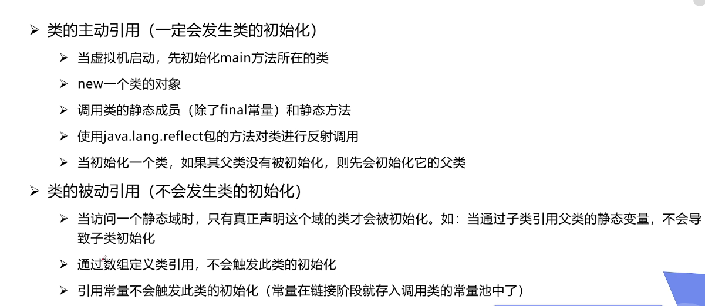
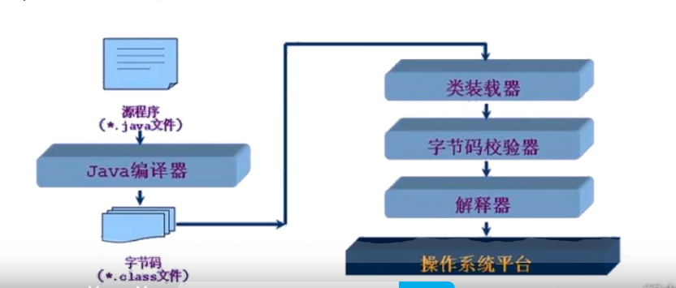
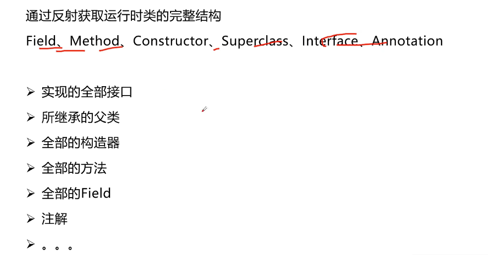
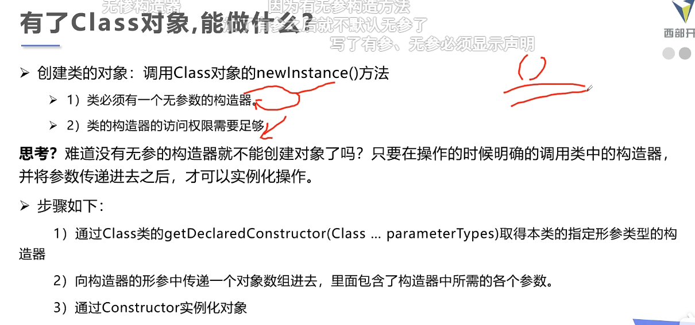

## 动态语言和静态语言

动态语言是在运行的时候可以改变其结构的语言，比如说c#、javascript、PHP、Python等

静态比如说C、JAVA、C++

java不是动态语言，但java可以有一定的动态性，可以通过反射机制获得类似动态语言的特性，让编程更加灵活。

## 反射

java reflection


## 反射获得类的class对象三种方式

若已知具体的类，通过类的class属性获取，该方法最为安全可靠，程序性能最高

```java
Class clazz = Person.class;
```

已知某个类的实例，调用该实例的getClass()方法获取Class对象

```java
Class clazz = person.getClass();
```

已知一个类的全类名，且该类在路径下，可通过Class类的静态方法forName()获取，可能抛出ClassNotFoundException

```java
static Class<?> aclass = Class.forName("绝对路径");  
```

- 内置基本类型可以通过类名.Type(例 Integer、Long)
- 还可以利用ClassLoader

## 哪些类型有可以有class对象？

- Object //类
- Comparable //接口
- String[] //一维数组
- int[] [] // 二维数组
- Override //注解
- ElementType //枚举
- Integer //基本数据类型
- void //void
- Class //class

## 快捷键

alt可以竖着复制多行，方便快捷

要遍历的时候直接（遍历对象）.for

## 类加载

   

## 什么时候类会初始化



## 执行过程



## 通过反射能够获取到什么



```java
package com.text;
 
import java.lang.reflect.Constructor;
import java.lang.reflect.Field;
import java.lang.reflect.InvocationTargetException;
import java.lang.reflect.Method;
import java.util.concurrent.atomic.AtomicInteger;
 
public class test32 {
    public static void main(String[] args) throws ClassNotFoundException, NoSuchFieldException, NoSuchMethodException, InvocationTargetException, InstantiationException, IllegalAccessException {
        //获取Class类
        Class<?> c1 = Class.forName("com.text.Animal");
        //获取类名
        System.out.println("--------------------获取类名--------------------");
        System.out.println("类名" + c1.getSimpleName());
        System.out.println("包名+类名:" + c1.getName());//包名+类名
 
        //获取类的属性
        System.out.println("--------------------获取类的属性--------------------");
        Field[] fields = c1.getFields();//只能获取公共的字段表示属性
        Field[] declaredFields = c1.getDeclaredFields();//获取所以的字段属性(包括私有的等等)
        for (Field declaredField : declaredFields) {
            System.out.println(declaredField);
        }
 
        //获取指定属性的值
        System.out.println("--------------------获取指定属性的值--------------------");
        Field name = c1.getDeclaredField("name");
        System.out.println(name);
 
        //获取方法
        System.out.println("--------------------获取类的方法--------------------");
        Method[] declaredMethods = c1.getDeclaredMethods();//获得本类全部方法(无关修饰符)
        Method[] methods = c1.getMethods(); //获得本类及父类的全部public方法
        for (Method method : declaredMethods) {
            System.out.println(method);
        }
 
        //获取指定方法
        System.out.println("--------------------获取指定方法--------------------");
        Method getNames = c1.getMethod("getName", null);
        System.out.println(getNames);
 
        //获取Class全部的公有构造方法
        System.out.println("---------------------获取所有公共的构造函数---------------------");
        Constructor<?>[] constructors = c1.getConstructors();
        for (Constructor<?> constructor : constructors) {
            System.out.println(constructor);
        }
 
        //获取Class全部的构造方法
        System.out.println("---------------------获取所有全部的构造函数(包括：公共的,默认的,受保护的,私有的)---------------------");
        Constructor<?>[] declaredConstructors = c1.getDeclaredConstructors();
        for (Constructor<?> declaredConstructor : declaredConstructors) {
            System.out.println(declaredConstructor);
        }
 
        //获取公共构造方法v
        System.out.println("---------------------获取公共无参构造方法---------------------");
        Constructor<?> constructor = c1.getConstructor(null);//这里必须是一个参数类型的class,默认为null
        System.out.println(constructor);
 
        Object o = constructor.newInstance();//调用构造方法
//        System.out.println("o:"+o.toString());
//        User user=(User)o;
//        user.user2();
 
        //获取私有构造放
        System.out.println("---------------------获取私有构造方法---------------------");
        Constructor<?> declaredConstructor = c1.getDeclaredConstructor(int.class);
        System.out.println(constructor);
 
        declaredConstructor.setAccessible(true);
        Object test = declaredConstructor.newInstance(123);
        System.out.println(test);
 
        //获取指定构造方法
        System.out.println("---------------------获取指定构造方法---------------------");
        Constructor<?> declaredConstructor1 = c1.getDeclaredConstructor(int.class, String.class);
        System.out.println(declaredConstructor1);
    }
 
}
 
class Animal {
    private int age;
    private String name;
 
    public Animal() {
    }
 
    //这个是测试
    private Animal(int a){
 
    }
 
    private void test() {
        System.out.println("私有方法");
    }
 
    public Animal(int age, String name) {
        this.age = age;
        this.name = name;
    }
 
    public int getAge() {
        return age;
    }
 
    public void setAge(int age) {
        this.age = age;
    }
 
    public String getName() {
        return name;
    }
 
    public void setName(String name) {
        this.name = name;
    }
 
    @Override
    public String toString() {
        return "Animal{" +
                "age=" + age +
                ", name='" + name + '\'' +
                '}';
    }
}
 
class Dog extends Animal {
    private String name;
 
    public Dog() {
        this.setName("小狗");
        this.setAge((int) (Math.random() * 7));
    }
}
 
class Cat extends Animal {
    public Cat() {
        this.setName("猫");
        this.setAge((int) (Math.random() * 7));
    }
}
```

## 反射创建对象



```java
package com.text;
 
import java.lang.reflect.Constructor;
import java.lang.reflect.Field;
import java.lang.reflect.InvocationTargetException;
 
public class test34 {
    public static void main(String[] args) throws ClassNotFoundException, NoSuchMethodException, InvocationTargetException, InstantiationException, IllegalAccessException, NoSuchFieldException {
        //1.创建class对象
        Class<?> c1 = Class.forName("com.text.personnel");
        //2.获取构造方法
        Constructor<?> declaredConstructor = c1.getDeclaredConstructor();
        //3.通过构造方法new类(这里知道是什么类就可以强行转换了)
        personnel o = (personnel)(declaredConstructor.newInstance());
        //4.这里获取字段(也可以获取方法全看需要)
        Field id = c1.getDeclaredField("id");
        //5.因为是私有的属性所以关闭安全检测
        id.setAccessible(true);
        //6.设置属性，参数是(设置属性的对象,属性值)
        id.set(o,"1234");
        //7.查看调用方法查看是否设置成功
        System.out.println(o.getId());
    }
}
 
//账号类
class personnel{
    private String id;
    private String password;
 
    public String getId() {
        return id;
    }
 
    public String getPassword() {
        return password;
    }
}
```

