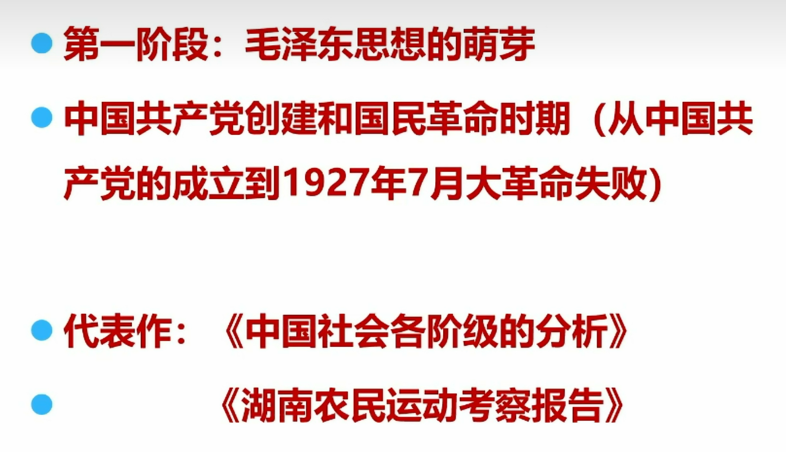
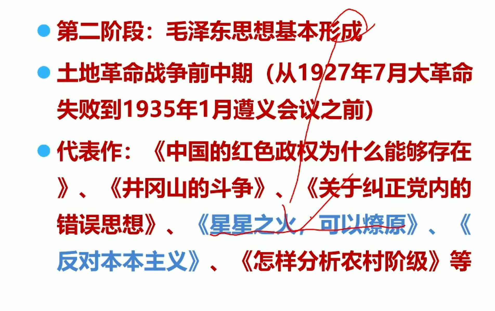
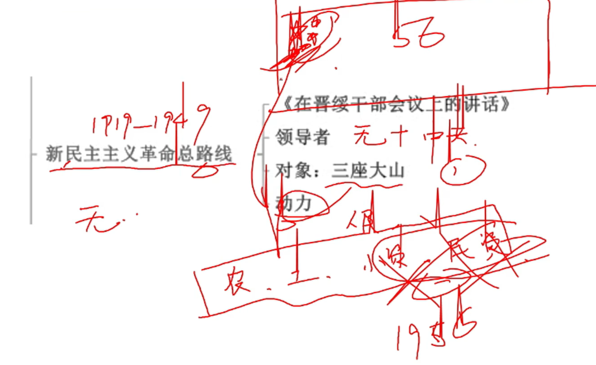
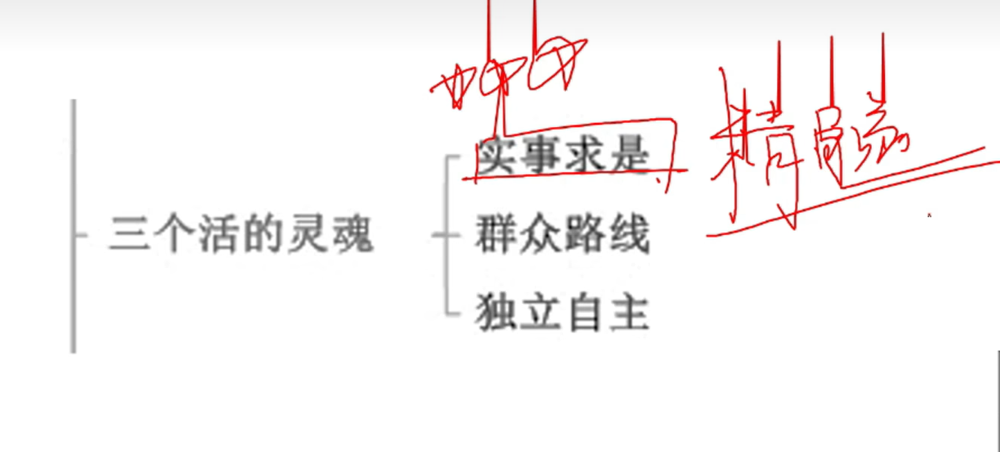
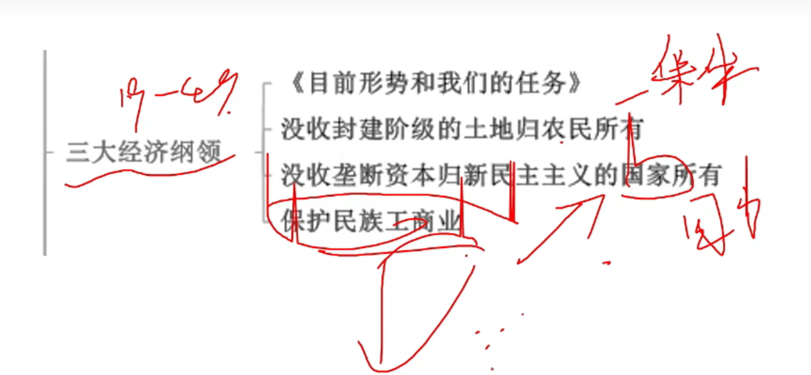
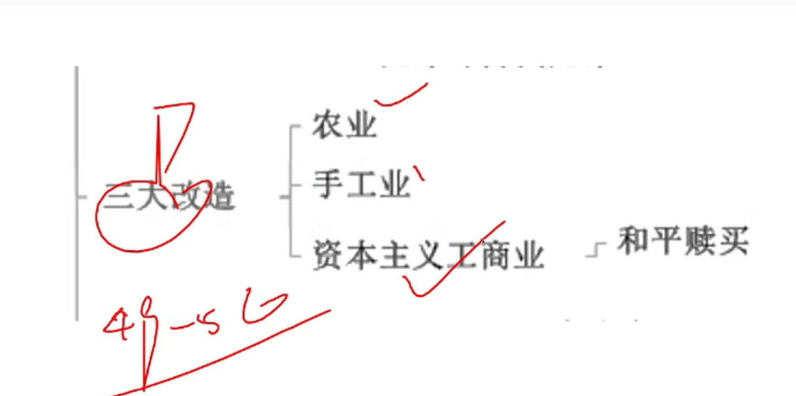
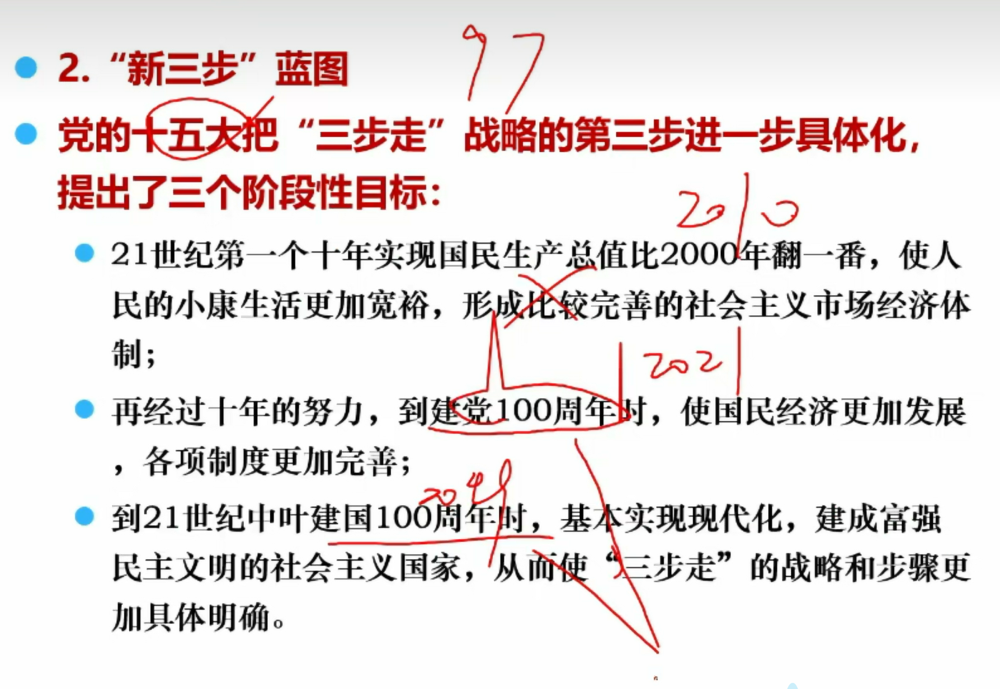

## 毛泽东思想

### 直接理论来源

马克思列宁主义

### 物质基础

新的社会生产力的增长和工人运动

### 实践基础

中国共产党领导的人民革命

### 形成和发展

1921年 一大

1927年八七会议召开，毛主义讲话了，枪杆子里出政权

1935年遵义会议，毛主义确立了领导低位

1945年毛泽东思想确立党章

1956年三大改造完成，标志进入社会主义社会

后面的二十年开始犯错了，不会考

达到**成熟的标志**是新民主主义理论科学体系形成

> 萌芽阶段

这里主要是调查报告

> 第二阶段

这个时候写文章还不规范，比如本本主义，其实外语里是教条，由于不懂，写为本本

这里还没建国，是斗争多

**《星星之火，可以燎原》是**毛泽东在1930年给林彪的一封信，提出了农村包围城市、武装夺取政权，标志着毛泽东思想基本形成

《反对本本主义》论述了“从斗争中创造新局面”，“没有调查就没有发言权”，反对教条，做任何事情都要从实际出发

> 第三阶段

大佬级别，学术牛逼，比如战略问题、各种论，用词专业

论联合政府（1945）---目的为了建国（在**七大**上做的报告，全心全意为人民服务，一刻也不脱离群众，一切从人民利益出发）（三大优良作风）（快打败小日本了，建立一个什么样的国家呢）

*毛泽东思想*的成熟(1935—1945):1935年遵义会议后到抗日战争时期 标志**:新民主主义论**革命理论形成

1939年10月，中共中央主办的党内刊物《共产党人》创刊，毛泽东撰写了《〈共产党人〉发刊词》。在《〈共产党人〉发刊词》中，毛泽东指出，统一战线、武装斗争、党的建设是中国共产党在中国革命中的三个基本问题，也是中国共产党在中国革命中战胜敌人的三个法宝。

论持久战--它是针对党内部分“中国速亡论”、“中国速胜论”，持久抗日。强调“**民兵是胜利之本**”“武器是重要因素，但不是绝对因素，决定因素是人而不是物”

**《中国革命和中国共产党》**首次提出新民主主义概念（与国民党的区分）

论人民民主专政---国家已经建立起来了，但里面啥政府都有，要建立社会主义国家，剔除其他党派

毛泽东在**《在晋绥干部会议讲话》**中第一次全面、系统地提出了反对帝国主义、封建主义和官僚主义

1956年《论十大关系》，这个时候三大改造完成了，关于建设的文章，把国内外一切关系调动起来。这里提出了“长期共存、互相监督”，标志着人民民主统一战线发展到了一个新的阶段

1957年《关于正确处理人民内部矛盾问题》，改造完成后，有点不适应，学生罢课啥的，为了解决这，划分了敌我矛盾（残余国民党，武力解决），人民内部矛盾（学生罢课等，用非对抗的方式去解决）

1949年《论人民民主专政》主要介绍了新中国的性质。

### 新民主主义革命

1919-1949

1919新民主主义运动（五四）

明珠主义革命是反帝反封建的

马克思主义在中国实现了两次飞跃，第一次是毛泽东思想，第二次是中国特色（这里面包括邓小平理论）

三座大山是：帝国主义；封建主义；官僚主义

### 三个活灵魂

邓小平添加了解放思想

江泽民添加了与时俱进

胡锦涛添加了求真务实

群众路线：一切为了群众，一切依靠群众

实事求是是精髓，独立自主是基本立足点

### 三大经济纲领

### 三大法宝

### 统一战线

### 三大作风

### 三大改造

### 军队建设  

南昌起义标志着军队的诞生

三湾改编是党最早领导军队

古田会议是军队新型建设思想形成

### 延安整风

反对主观主义（中心，也就是学风）

反对宗派主义

反对党八股

（猪排骨）

## 中国特色社会主义

### 邓小平理论

78-97

97年邓小平去世

邓小平理论大部分诞生于十三大

#### 活的灵魂

解放思想，实事求是

#### 社会主义本质和根本任务

1992年南方谈话，南方谈话为了搞市场经济

社会主义本质：共同富裕，消除两极分化

根本任务：解放生产力

邓小平说马克思经济学犯错了，一个是经济制度，一个是经济体制，制度是有阶级性的。但体制没，它包括市场和计划，这就好比两只猫，黑猫和白猫，能抓老鼠就是好猫，老鼠是生产力

#### 社会主义初期阶段理论

87年党十三大提出

78-87近十年，中国还是很穷，没有达到社会主义，怀疑邓小平领导能力不行，所以邓小平说目前我们处于社会主义初期阶段，并长期处于这个阶段

邓小平说要处于社会主义初期阶段100年，人家不信，那说可以分以下三步走

> 三步走

江泽民又把第三阶段进行划分

习近平又把江泽民的第三阶段划分为两个阶段

#### 党的基本路线和基本纲领

也是十三大提出

这里主要是给党下任务书

要领导和团结全国各族人民，以经济建设为中心，坚持四项基本原则，坚持改革开放

#### 一国两制

79年提出

#### 经济特区

广东省的深圳、珠海、汕头

福建的厦门

海南

新建的喀什经济特区、霍尔果斯经济特区

> 注意没有上海

#### 重要事件先后顺序

> 取消农业税

2006年1月1日，我国全面取消农业税

> 北京奥运会

2001年申报成功

2008年北京举行

> 上海浦东新区

1992年

> 经济特区

1980年

#### 南方谈话

判断改革开发姓“社”还是姓“资”，主要看

是否有利于发展社会主义生产力（这个是最基本的）

是否有利于增强社会主义国家的综合国力

是否有利于提高人民生活水平

### 积累

中国特色社会主义的道路是**根本途径**，理论是**指南**，制度是**保障**，文化是**精神力量**

全心全意为人民服务是人民军队的**唯一宗旨**，实行官兵一致、军民一致、瓦解敌军

刘少奇**安源党校**是第一个党校，**延安中学**是第一个中学

小康十二大提出，十六大建设，十八大建成