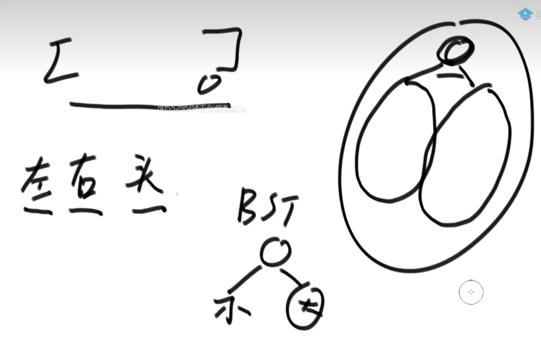
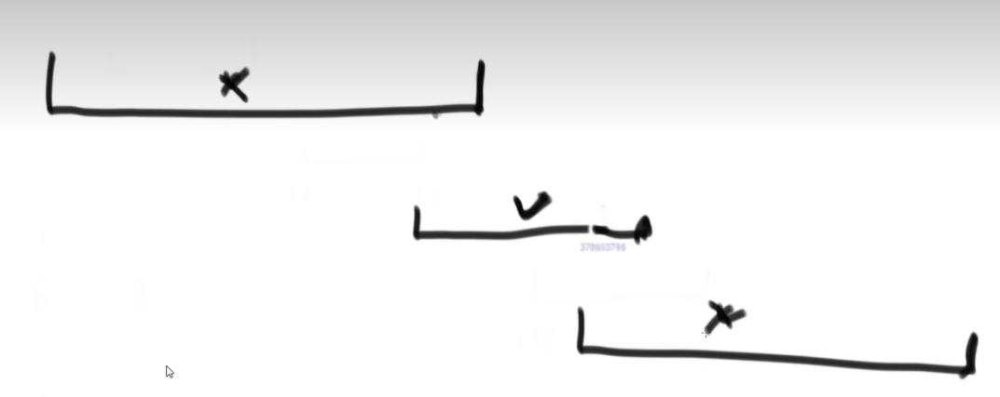
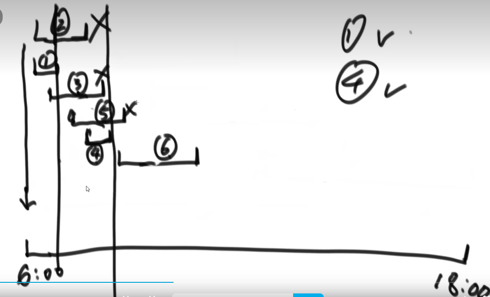
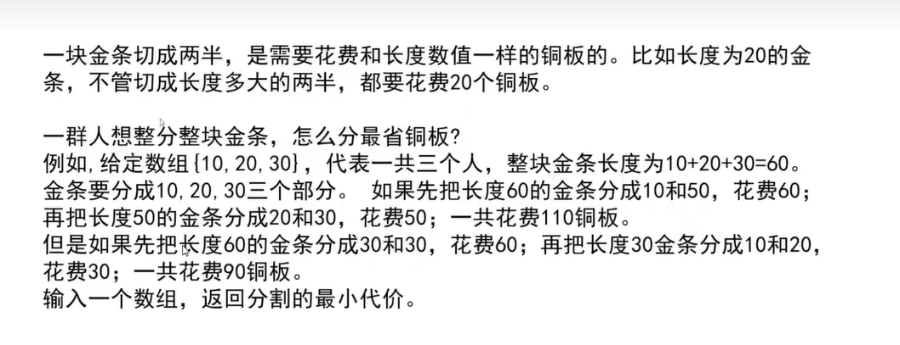
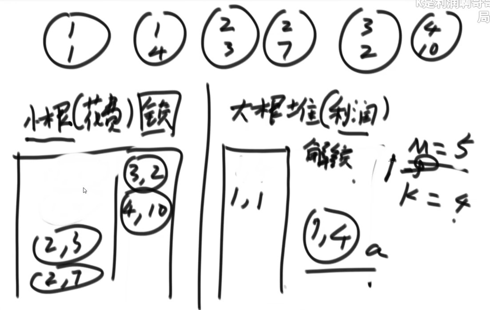

## 搜索二叉树遍历数组重建树

1. 最后得节点是整棵树得头，然后想着左右树建立出来，搜索左边小右边大无重复值

   （进阶：不需要一直遍历，可以二分）

   （无序怎么二分？这个我们可以分后与最后一个节点比较，看他大概在哪个区间。毕竟有这样一个简单得规律，后面一大堆比前面一大堆大）

   

2. 左小右大，直接与根节点（最后一个节点）比较就行了
3. 怎么确立左右树呢，一样得道理

复杂的（遍历得最差是o（n^2）（什么时候最差，单支，每一层都遍历，共n层），二分得最差是o(nlogn)）

##  前缀树


代码里每个节点有pass代表经过几次，还有end代表是不是结尾。

查询的时候只需要从上往下查，怎么加入的就怎么查，看end有没有

根节点的pass代表着一共多少字符串，根节点end代表空串数量

```java
package class07;

public class Code01_TrieTree {

	public static class TrieNode {
		public int path;
		public int end;
		public TrieNode[] nexts;//这个是用数组代表路，如果字符种类特别多，那可以用hash表

		public TrieNode() {
			path = 0;
			end = 0;
			nexts = new TrieNode[26];
		}
	}

	public static class Trie {
		private TrieNode root;

		public Trie() {
			root = new TrieNode();
		}
		//插入
		public void insert(String word) {
			if (word == null) {
				return;
			}
			char[] chs = word.toCharArray();
			TrieNode node = root;
			int index = 0;
			for (int i = 0; i < chs.length; i++) {
				index = chs[i] - 'a';
				if (node.nexts[index] == null) {
					node.nexts[index] = new TrieNode();
				}
				node = node.nexts[index];
				node.path++;
			}
			node.end++;
		}

		public void delete(String word) {
			if (search(word) != 0) {
				char[] chs = word.toCharArray();
				TrieNode node = root;
				int index = 0;
				for (int i = 0; i < chs.length; i++) {
					index = chs[i] - 'a';
					if (--node.nexts[index].path == 0) {
						node.nexts[index] = null;
						return;
					}
					node = node.nexts[index];
				}
				node.end--;
			}
		}
		//查找加入的次数
		public int search(String word) {
			if (word == null) {
				return 0;
			}
			char[] chs = word.toCharArray();
			TrieNode node = root;
			int index = 0;
			for (int i = 0; i < chs.length; i++) {
				index = chs[i] - 'a';
				if (node.nexts[index] == null) {
					return 0;
				}
				node = node.nexts[index];
			}
			return node.end;
		}
		//查有多少字符串以***作为前缀
		public int prefixNumber(String pre) {
			if (pre == null) {
				return 0;
			}
			char[] chs = pre.toCharArray();
			TrieNode node = root;
			int index = 0;
			for (int i = 0; i < chs.length; i++) {
				index = chs[i] - 'a';
				if (node.nexts[index] == null) {
					return 0;
				}
				node = node.nexts[index];
			}
			return node.path;
		}
	}

	public static void main(String[] args) {
		Trie trie = new Trie();
		System.out.println(trie.search("zuo"));
		trie.insert("zuo");
		System.out.println(trie.search("zuo"));
		trie.delete("zuo");
		System.out.println(trie.search("zuo"));
		trie.insert("zuo");
		trie.insert("zuo");
		trie.delete("zuo");
		System.out.println(trie.search("zuo"));
		trie.delete("zuo");
		System.out.println(trie.search("zuo"));
		trie.insert("zuoa");
		trie.insert("zuoac");
		trie.insert("zuoab");
		trie.insert("zuoad");
		trie.delete("zuoa");
		System.out.println(trie.search("zuoa"));
		System.out.println(trie.prefixNumber("zuo"));

	}

}

```

## 贪心

在某一个标准下，优先考虑最满足标准的样本，最后考虑最不满足标准的样本，最终得到 

一个答案的算法，叫作贪心算法。 

也就是说，不从整体最优上加以考虑，所做出的是在某种意义上的局部最优解

### 例题1

```bash
    一些项目要占用一个会议室宣讲，会议室不能同时容纳两个项目的宣讲。给你每一个项目开始的时间和结束的时间(给你一个数 组，里面是一个个具体的项目)，你来安排宣讲的日程，要求会议室进行的宣讲的场次最多。 返回这个最多的宣讲场次
```

思考

我们先想按时间最早分配，显然，如果有一个项目最早开始，但贯穿一天，这种策略不行。然后考虑按时间最短分配，经过思考，也不行，比如下面中间的最短，但是他的开始时间和结束时间卡住了其他



最后我们按照结束时间最早分配，每次把不符合的给删除（因为我们的目的就是数量最多）



代码

```java
package class07;

import java.util.Arrays;
import java.util.Comparator;

public class Code04_BestArrange {

	public static class Program {
		public int start;
		public int end;

		public Program(int start, int end) {
			this.start = start;
			this.end = end;
		}
	}

	public static class ProgramComparator implements Comparator<Program> {

		@Override
		public int compare(Program o1, Program o2) {
			return o1.end - o2.end;
		}

	}

	public static int bestArrange(Program[] programs, int start) {
		Arrays.sort(programs, new ProgramComparator());
		int result = 0;
		for (int i = 0; i < programs.length; i++) {
			if (start <= programs[i].start) {
				result++;
				start = programs[i].end;
			}
		}
		return result;
	}

	public static void main(String[] args) {

	}

}
```

### 例题2

给一个字符串数组，然后进行拼接成一个，要求拼接后的字典序最小

思考

每次都把最小字典序的字符串放前面，经过举例这个不对，例如。b的字典序小于ba，如果谁小谁在前，那么是bba，但是很明显bab更小。


 代码

```java
package class07;

import java.util.Arrays;
import java.util.Comparator;

public class Code02_LowestLexicography {

   // 定义一个比较器，比较策略
	public static class MyComparator implements Comparator<String> {
		@Override
		public int compare(String a, String b) {
			return (a + b).compareTo(b + a);
		}
	}

	public static String lowestString(String[] strs) {
		if (strs == null || strs.length == 0) {
			return "";
		}
        //怎么比较排序，自己定义下 
		Arrays.sort(strs, new MyComparator());
		String res = "";
		for (int i = 0; i < strs.length; i++) {
			res += strs[i];
		}
		return res;
	}

	public static void main(String[] args) {
		String[] strs1 = { "jibw", "ji", "jp", "bw", "jibw" };
		System.out.println(lowestString(strs1));

		String[] strs2 = { "ba", "b" };
		System.out.println(lowestString(strs2));

	}

}
```

### 例3

 

哈夫曼树解决

例题3

给一堆项目，有他的花费和利润，然后你有启动资金去投资它，怎么获利最大



解题思路：

如上面所示，先建立一个小根堆，这个小根堆按照所需投资钱数排，它的目的是根据我们的启动资金找出可以投资哪些项目。然后再建立一个大根堆，根据小根堆筛选出来的放进大根堆，大根堆按照利润排序，毕竟在钱够的情况下做利润大的，得到利润的钱后，在去小根堆瞅瞅哪些现在可以做了，筛选出来放大根堆，以此类推

```java
package class07;

import java.util.Comparator;
import java.util.PriorityQueue;

public class Code05_IPO {
	public static class Node {
		public int p;
		public int c;

		public Node(int p, int c) {
			this.p = p;
			this.c = c;
		}
	}
	//小根堆比较器
	public static class MinCostComparator implements Comparator<Node> {

		@Override
		public int compare(Node o1, Node o2) {
			return o1.c - o2.c;
		}

	}
	//大根堆比较器
	public static class MaxProfitComparator implements Comparator<Node> {

		@Override
		public int compare(Node o1, Node o2) {
			return o2.p - o1.p;
		}

	}
	//w是启动资金，k是最多处理几个项目
	public static int findMaximizedCapital(int k, int W, int[] Profits, int[] Capital) {
		Node[] nodes = new Node[Profits.length];
		for (int i = 0; i < Profits.length; i++) {
			nodes[i] = new Node(Profits[i], Capital[i]);
		}
		//定义堆，通过比较器来看大小
		PriorityQueue<Node> minCostQ = new PriorityQueue<>(new MinCostComparator());
		PriorityQueue<Node> maxProfitQ = new PriorityQueue<>(new MaxProfitComparator());
        //所有节点放在小根堆里
		for (int i = 0; i < nodes.length; i++) {
			minCostQ.add(nodes[i]);
		}
		for (int i = 0; i < k; i++) {
			while (!minCostQ.isEmpty() && minCostQ.peek().c <= W) {
				maxProfitQ.add(minCostQ.poll());
			}
            //剩下的都做不了了，提前
			if (maxProfitQ.isEmpty()) {
				return W;
			}
			W += maxProfitQ.poll().p;
		}
		return W;
	}

}

```

## 动态规划

> 啥是动态规划

空间换时间

如何你发现计算中有重复的部分，就把重复的给记录下来，下次不用重复算