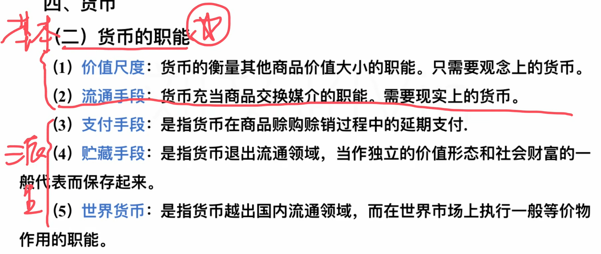
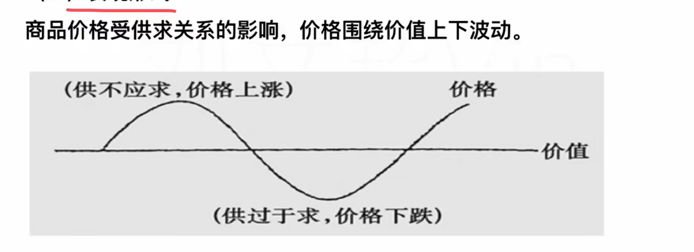
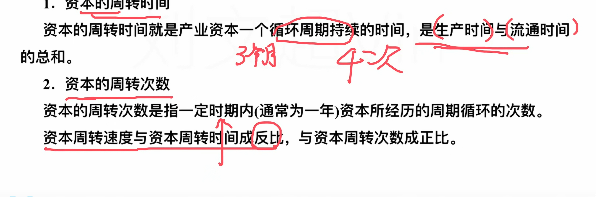
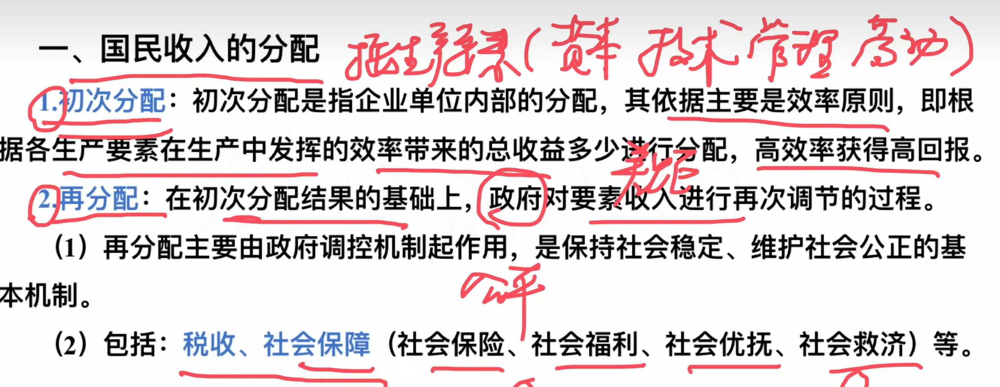

## 物质资料生产三要素

劳动者的劳动

劳动资料（生产工具）

劳动对象

## 物质资料生产过程

生产  > 分配 > 交换 > 消费  >  生产（消费了，有钱了，再生产）

分配 、 交换 、 消费 对生产都具有反作用

消费是是物质生产的最终目的和动力

## 商品

> 含义

**商品**必须用于交换，必须投入**人类**的劳动

（武汉疫情捐赠物品是商品吗？不是，因为没有交换）

> 二要素

使用价值和价值

使用价值（就是有用性，比如水可以解渴）（有使用价值，商品才能交换）

价值（凝结在商品中的无差别人类劳动）

> 关系

比如说，你种菜，没有去卖，自己吃，这里有使用价值，是人与自然的

价值，比如说，你生产了一个东西，你觉得有价值不行，要别人也觉得，这展现了人与人

## 劳动的二重性

商品的使用价值和价值是由劳动二重性决定的

> 二重

具体劳动（看的见的，比如你干活）

抽象劳动（撇开具体形式的无差别劳动，不管脑力还是体力）

> 与商品的关系

具体劳动创造商品的使用价值

抽象劳动创造商品的价值

## 货币

### 概念

货币是一般等价物

先有商品，再有货币

> 何为一般等价物

在古代，两个物品进行交换，比如说，我有小麦，你有蔬菜，我需要你的，你需要我的，咱两个进行交换。

但如果我需要蔬菜，但你不需要小麦，就很难受，这时候出现了一般等价物，类似于媒介

一般等价物固定后就是货币

一般等价物本质就是商品

### 职能

价值尺度：比如你买东西，上面有标价，这就是价值尺度（为什么货币有价值尺度？因为货币自身有价值，它也是一种商品）（只需要观念上的就行，这个价值高，这个价值低）

流通手段：充当商品交换的媒介（一手交钱，一手交货）

支付手段：延期支付（时间差，不同步）（比如税收、工资、利息）

贮藏手段：只针对金属货币（金子、银子）

世界货币：世界都能用

### 流通规律

## 价值规律

商品价值量和社会必要劳动时间有关，成正比，与社会必要生产率成反比

价值总量与个别劳动时间成反比，与个别劳动生产力成正比，与社会无关

商品交换要以价值量进行等价交换（但不是每一次的交换都是等价交换，比如说超市打折）

### 表现形式

价值决定价格，供求影响价格

等价交换是从整体来说，从上面的图可以看出，针对某一部分来说，可能高也可能低，但整体是一样的

## 剩余价值

### 资本

不变资本（不发生增值，比如原材料）

可变资本（这里劳动力是可变资本）

### 剩余价值

> 来源

工人劳动时间分为必要劳动时间（付给你工资，应该干的）和剩余劳动时间（被压榨的）

> 劳动力和劳动

不一样，劳动力的使用才是劳动，这里的劳动会有剩余价值，压榨

> 劳动力成为商品的条件

自己的自由

除了劳动力别的没啥可卖了（农民不是，农民有地）（无产阶级是）

> 资本家钱生钱

必须通过劳动力

> 剩余价值率

这里的可变资本是买你的价格（因为可变资本才能有剩余）

> 例题

> 资本有机构成

有机构成=不变资本/可变资本

### 产生方法

绝对剩余（加时长，加班）

相对剩余（提高效率）

## 资本周转

## 基本主义基本矛盾

生产过剩是相对的，买不起，和卖不出去

## （上面是资产阶级）

## 收入分配

初次分配就是有钱的出钱，没钱的出力，然后按照产生的效率分配（这种分配会拉大贫富差距）

因此有了再分配，再分配比如交税，赚的多交的多，缩小差距，尽量让中等收入者占大多数

第三次分配，比如捐赠这些

只有公有制（国有经济，集体经济）才有按劳分配（多劳多得）

非公有制：

个体经济（按个人劳动进行分配）

私企、外企（按生产要素进行分配）（生产要素：管理、劳动、土地、技术）