---


title: 秋招
author: 蜗牛
coverImg: /medias/banner/6.jpg
top: true
cover: false
toc: true
mathjax: false
summary: 面试常问知识总结
tags:
  - PicGo
  - GitHub图床
categories:
  - 面试
abbrlink: 7f1ae999
reprintPolicy: cc_by
date: 2020-03-15 00:00:00
img:
password:
---
## 秒杀

### 测试

jmeter

请求组

http请求

结果在监听器显示

### redis

引入redis


#### setIfAbsent 和 setnx

setIfAbsent 是java中的方法
setnx 是 redis命令中的方法

```java
BoundValueOperations boundValueOperations = this.redisTemplate.boundValueOps(redisKey);
flag = boundValueOperations.setIfAbsent(value); // flag 表示的是否set
boundValueOperations.expire(seconds, TimeUnit.SECONDS);

if(!flag){ // 重复
    repeatSerial.add(serialNo);
    continue;
}else{// 没有重复
    norepeatSerial.add(serialNo);
}

```


问题

b线程释放a线程的锁

可以在value随机值，然后删的时候判断一下还是原来的随机值吗，但是这个是一个过程，先查是不是原来的，再删，这不是一个原子操作。用lua脚本、

如何用lua

可以在服务器写好，然后调用，优点是方便，但是修改了或者调用有资源消耗了

在java代码里直接写麻烦

java代码里写

1. 先在resources中创建一个lock.lua（要和application.yml同级目录）

   

   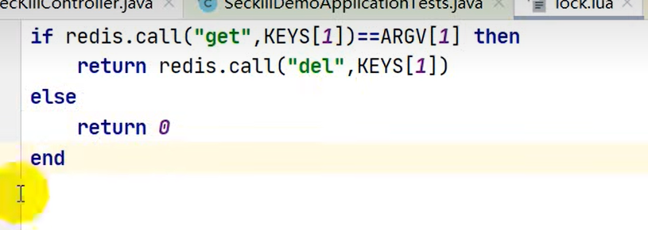

   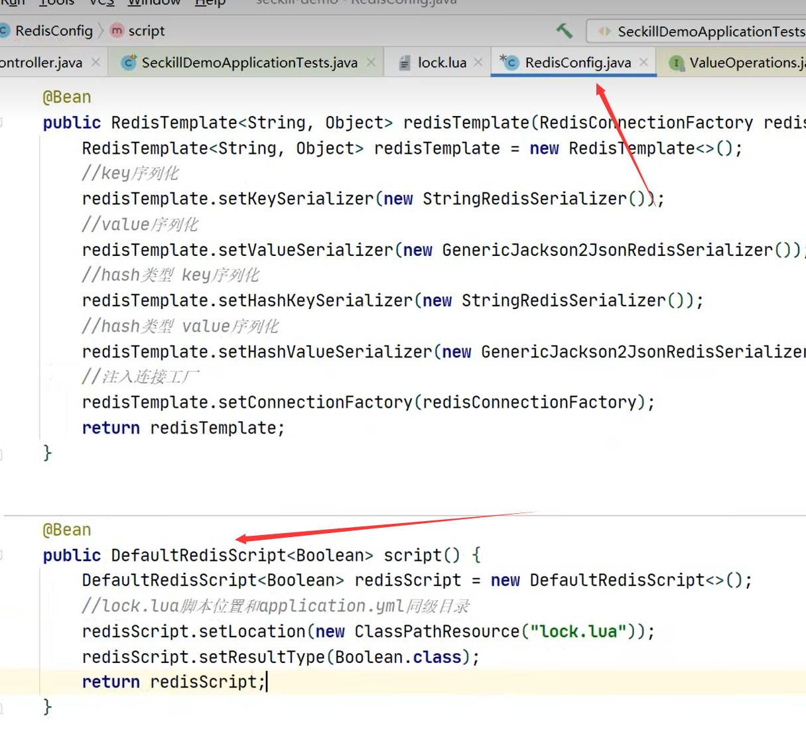

2. 在测试

## threadlocal和synchronized区别


threadlocal原理


  


## spring bean生命周期

1.创建前准备，比如调用工厂的后置处理器
2.对象实例化，根据bean定义，找到类信息，使用反射创建对象（默认用无参构造，如果没有无参(有一个有参，则用有参；如果有多个有参，报错)（有参参数是在spring容器里面找，先bytype后byname））


3.对象属性装填，装填成员变量，如果成员变量有其他bean，则加载其他bean（比如autoware resource这些）
4.执行初始化，某些对象可能有初始化方法，在此时调用


5.销毁


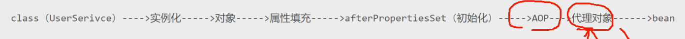

首先初始化，因为spring容器中都是存放的一个个对象。这个初始化是用反射创建，默认使用无参构造，（如果没有看上面）。然后对对象进行属性填充（依赖注入），比如autowire、resource等。然后某些对象可能有初始化方法，比如实现initiallizingbean方法，实现afterproperitiesset进行初始化。然后判断是否存在aop切入点，如果有，则创建aop代理类，放进spring容器里的也是aop代理类。最后销毁。

## 单例bean和单例模式

不是一回事

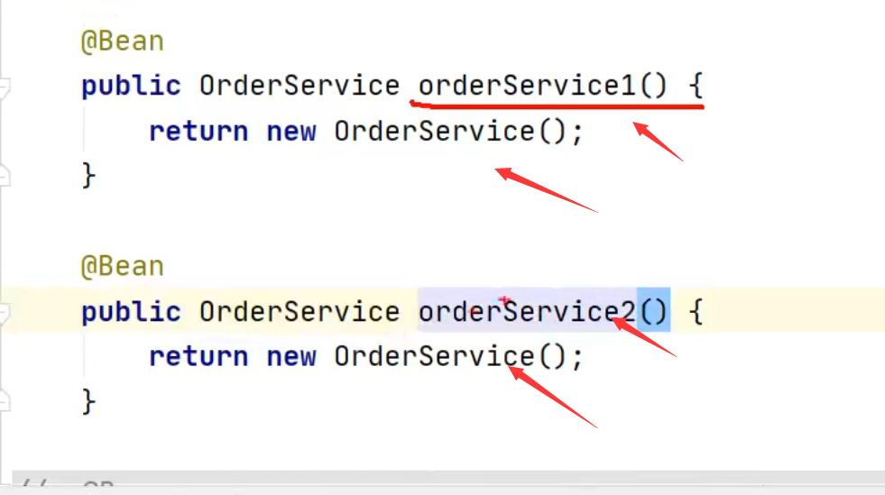

## spring事务

加这样一个注解

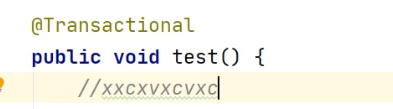

## 数据库表设计规范

1. 字段

   加注释

   3范式

   建议有创建时间和修改时间

   固定的用char

## 线程同步的四种方式

一，什么是[线程同步](https://so.csdn.net/so/search?q=线程同步&spm=1001.2101.3001.7020)和互斥

同步就是协同步调，按预定的先后次序进行运行。如：你说完，我再说。这里的同步千万不要理解成那个同时进行，应是指协同、协助、互相配合。线程同步是指多线程通过特定的设置（如互斥量，事件对象，临界区）来控制线程之间的执行顺序（即所谓的同步）也可以说是在线程之间通过同步建立起执行顺序的关系，如果没有同步，那线程之间是各自运行各自的！

线程互斥是指对于共享的进程系统资源，在各单个线程访问时的排它性。当有若干个线程都要使用某一共享资源时，任何时刻最多只允许一个线程去使用，其它要使用该资源的线程必须等待，直到占用资源者释放该资源。线程互斥可以看成是一种特殊的线程同步（下文统称为同步）。

> 解决 

方法一：使用synchronized关键字

方法二：wait和notify

## [线程间通信](https://so.csdn.net/so/search?q=线程间通信&spm=1001.2101.3001.7020)的几种实现方式

方式一：使用 *volatile* 关键字

方式二：使用Object类的wait() 和 notify() 方法

##  Session的执行流程

浏览器发起一个请求到服务器，服务器先检查是否携带了一个叫做JSEESIONID的Cookie。

如果有携带，会将此cookie值取出来（比如abc），然后从服务器的session池中找到ID为abc的session返回给调用者。
如果没有携带JSESSIONID 这个Cookie，服务器就会自动创建一个session对象并且生成一个随机字符串（abc）作为此sessionID保存到session池中，在服务器为客户端响应时会自动创建一个键为“JSESSIONID”，值为“abc”的cookie对象让浏览器存储起来，以便下次访问的时候带着

## 怎么看走没走索引


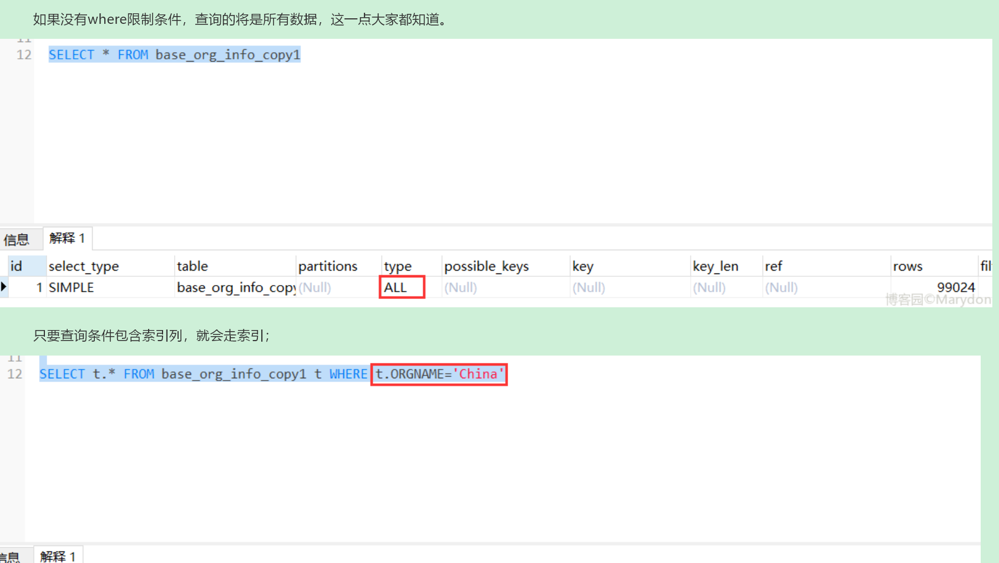

解释Explain得到的结果
1) type 反应查询语句的性能
我们主需要注意一个最重要的的 type 的信息很明显地体现出是否用到了索引：

type 结果值从好到坏依次是：

system > const > eq_ref > ref > fulltext > ref_or_null > index_merge > unique_subquery > index_subquery > range > index > ALL


一般来说，得保证查询至少达到 range 级别，最好能达到 ref 级别，否则就可能出现性能问题。

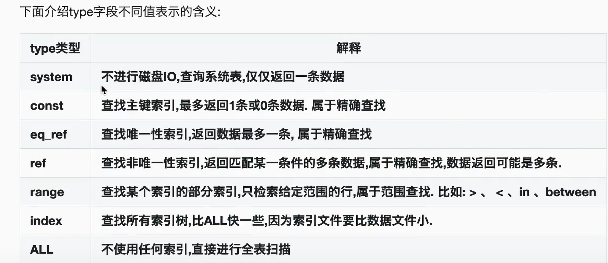

> 解析

反映用什么样的方式查询数据的


2) possible_keys: SQL查询时用到的索引。
可以看到，没加索引时，possible_keys 的值为 NULL，加了索引后的值为 address，即用到了索引address(索引默认为(column_list)中的第一个列的名字).


3) key 显示SQL实际决定查询结果使用的键(索引)。如果没有使用索引，值为NULL
可以看到，没加索引时，key 的值为 NULL，加了索引后的值为 address，即决定查询结果用到了索引address


4) rows 显示MySQL认为它执行查询时必须检查的行数
可以看到，没加索引时，rows 的值为17，即数据表student中所有数据，说明没加索引时的SQL查询是全表扫描；

加了索引后，rows 的值为6，数据库表中address以“北京市”开头的一共也就6条，SQL在执行查询操作时，一共也检查了6行，不必进行全表扫描查询，可以很容易得出结论：加索引的SQL查询性能远高于不加索引的情况。

5）extra

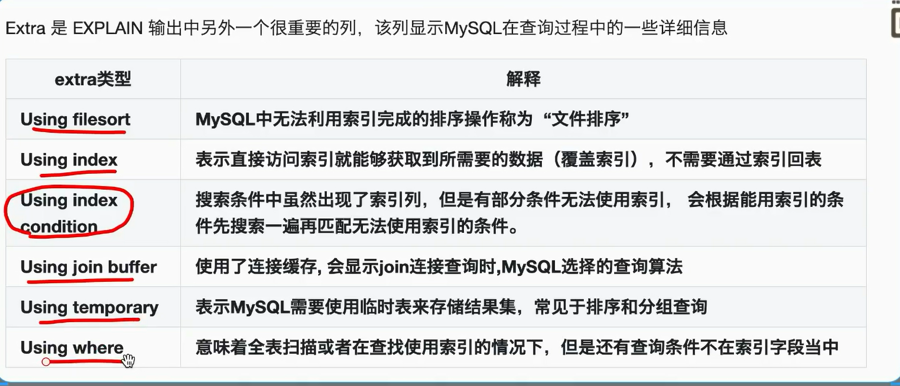

## 模糊查询不走怎么解决

1. 通过业务手段避免，举个实际栗子，博主之前做了一个汽车仓储项目，需求要求汽车表查询时候，车架号要有模糊查询操作，但是实际上对于车架号这个东西有个特殊的业务属性，就是车架号的后六位，基本可以在全省锁定到某一台车，全国不会超过三台车。所以业务人员在实际使用系统的时候，也只是输入后六位进行模糊查询，因此，在表设计的时候就将车架号字段**冗余了一个字段**，用于存储倒序的车架号，在进行模糊查询的时候，使用这个倒序字段进行**右模糊查询**，从而达到走索引的目的。有些时候，通过业务手段是可以达到一个优化要求的。

2. 内连接

  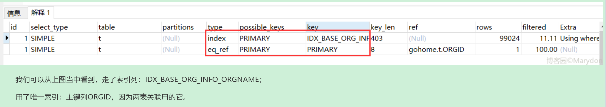

解决地址https://www.cnblogs.com/Marydon20170307/p/15866354.html

## synchronized

https://blog.csdn.net/m0_53474063/article/details/112389756

## 循环依赖

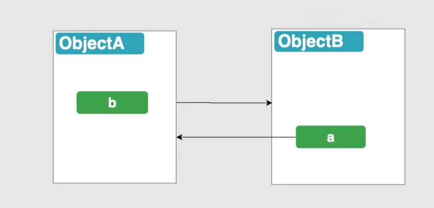

（属性相互赋值）

自己写出来的比较好解决

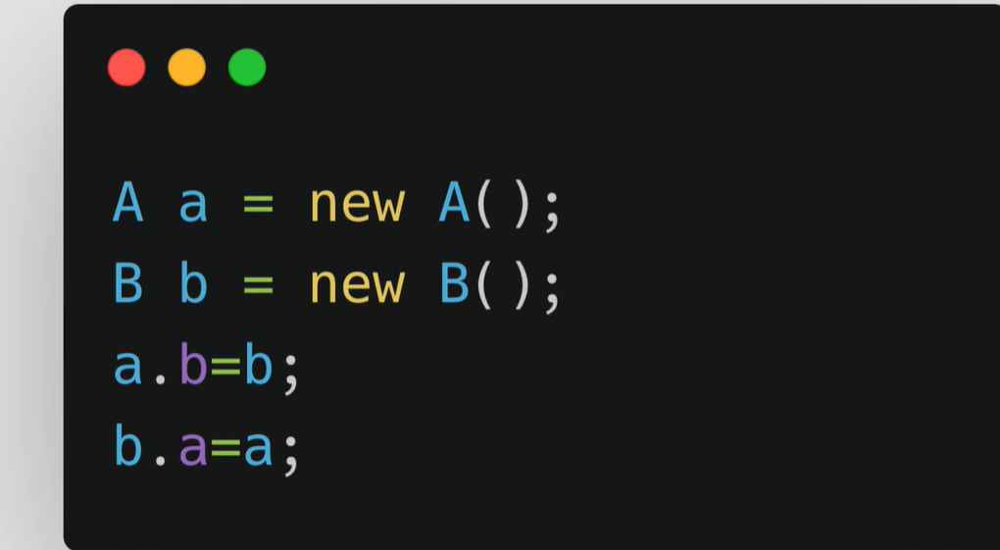

ioc的话比较难解决，主要有两个问题


从单例池中，属性注入b，由于b没有，去创建b，创建的过程有需要注入a。此时a没有，死循环了

解决方法

半成品池

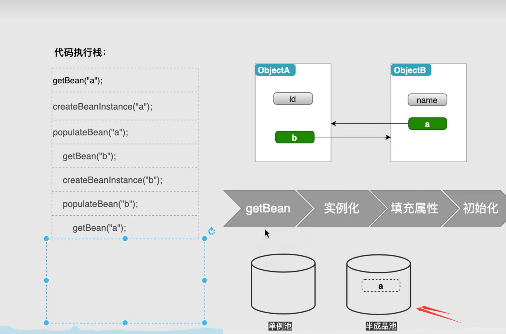

a一旦被实例化，就把他放在半成品池中（二级缓存解决，为啥用三级缓存，因为解决不了aop代理）

aop代理问题

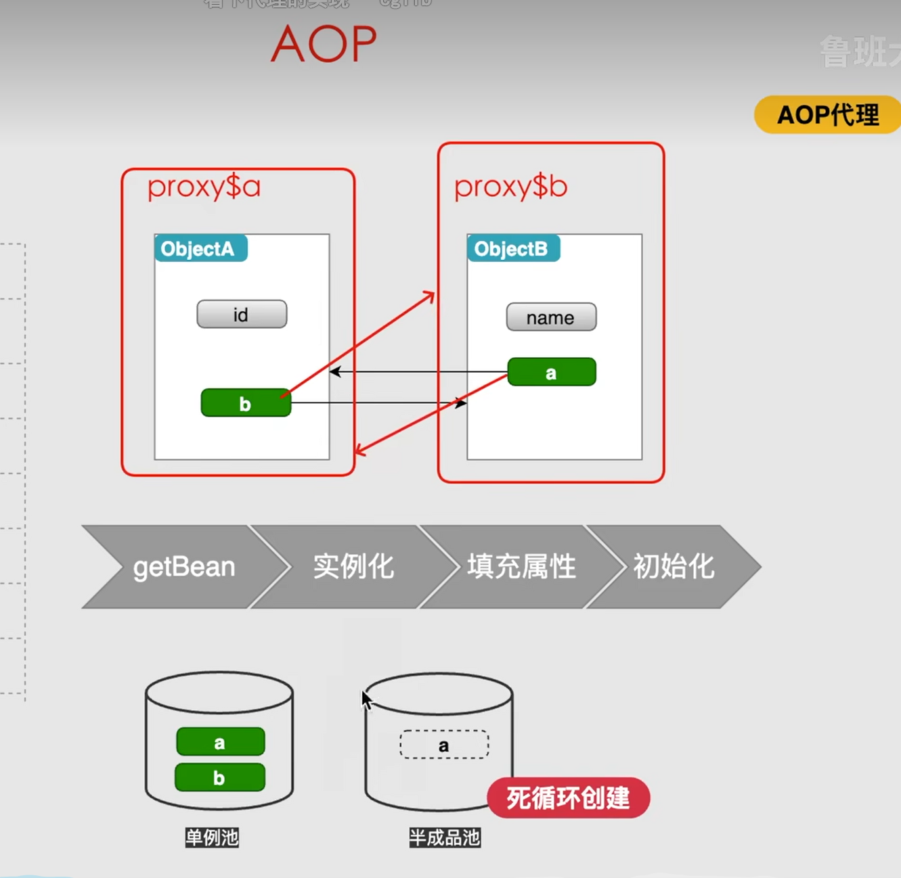


等于说有一个前置方法，在调用的时候提前创建这个代理类

## 负载均衡

1、轮询法

轮询法，就是将用户的请求轮流分配给服务器，就像是挨个数数，轮流分配。这种算法比较简单，他具有绝对均衡的优点，但是也正是因为绝对均衡它必须付出很大的代价，例如它无法保证分配任务的合理性，无法根据服务器承受能力来分配任务。

2、随机法

随机法，是随机选择一台服务器来分配任务。它保证了请求的分散性达到了均衡的目的。同时它是没有状态的不需要维持上次的选择状态和均衡因子[5]。但是随着任务量的增大，它的效果趋向轮询后也会具有轮询算法的部分缺点。

3、最小连接法

最小连接法，将任务分配给此时具有最小连接数的节点，因此它是动态负载均衡算法。一个节点收到一个任务后连接数就会加1，当节点故障时就将节点权值设置为0，不再给节点分配任务。

Ribbon是Netflix发布的开源项目，主要功能是提供**客户端的软件负载均衡算法和服务调用**

### Ribbon默认负载轮询算法原理

**默认负载轮训算法: rest接口第几次请求数 % 服务器集群总数量 = 实际调用服务器位置下标，每次服务重启动后rest接口计数从1开始**。

注解LoadBalancer

## 查看内存使用情况

### 1 查看系统内存free


netstat -anp |grep 端口号

top 查看进程 cup使用情况   内存的使用情况

**		Load Average**load average: 1.79, 2.10, 2.28  系统负载，三个数值分别为 1分钟、5分钟、15分钟前到现在的平均值。如1.79，表示最近一分钟平均负载。

free -h

ps  可以看pid 这个杀死用，也可以看cup使用情况内存使用情况

## 断开通信除了四次挥手还有什么方式？

  如果主机需要尽快关闭连接（或连接超时，或端口、主机不可达）时，发送RST包（RST表示复位）强制关闭TCP连接。

发送RST包关闭连接时，可以丢弃缓存区的包直接发送RST包，而接收端收到RST包后，也不必发送ACK包来确认。

## 线程池场景

https://www.bilibili.com/video/BV1dt4y1i7Gt/?spm_id_from=333.337.search-card.all.click&vd_source=c2eaa7091973b76eb57f77f9dfc9eecc（B站）

https://www.bilibili.com/video/BV1ca411B78i/?spm_id_from=333.880.my_history.page.click&vd_source=c2eaa7091973b76eb57f77f9dfc9eecc

报警那块


我是把每个传感器作为一块子的，每一个子的都用线程池

这里设置了一个计数器来阻止主线程继续，让主线程等线程池中弄完再走

CountDownLatch

这个是同步工具类中的计数器，有几组（我这里是传感器的数量（这里就16了））设置初始值为多少

>CountDownLatch原理

https://zhuanlan.zhihu.com/p/95835099

> 池化思想

线程池、数据库连接池、字符串常量池都是这样，池化思想，目的是为了提高资源利用率

> 常见知识点

https://blog.csdn.net/tumu6889/article/details/125257712

> 阻塞队列

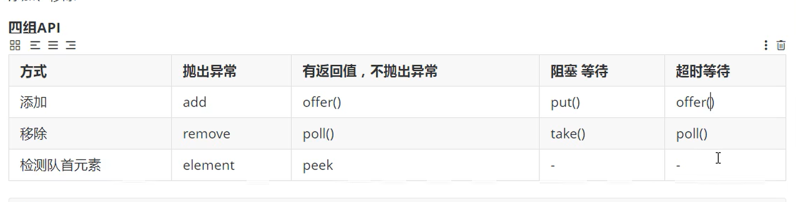

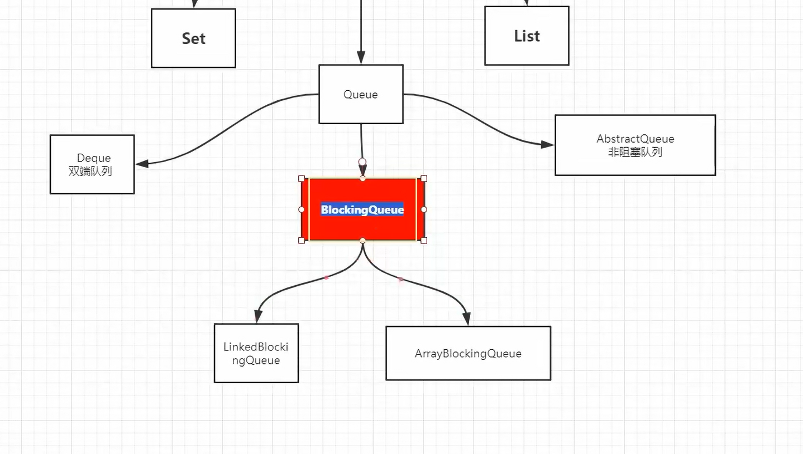

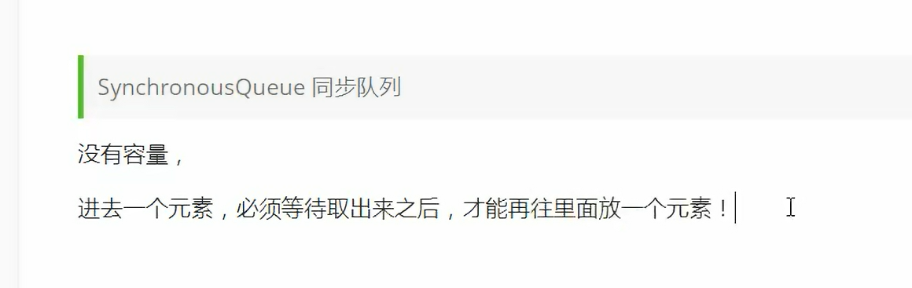


> 线程池方法


这些本质也是调用的threadpool

> 拒绝策略

- AbortPolicy中止策略：丢弃任务并抛出异常。比较关键的业务推荐使用该策略，这样在系统不能承载更大并发量的时候就能通过异常发现
- DiscardPolicy丢弃策略：丢弃任务不抛异常。一些无关紧要的任务可以使用这个策略
- DiscardOldestPolicyi弃老策略：根据实际业务来决定是否允许丢弃老任务
- CallerRunsPolicy：由调用者处理。一般在不允许失败、对性能要求不高、并发量小的场景使用

## AQS

> node


有一个内部类node，如上图所示，每个node都有prev、next、waitstatus（记录上一个节点是谁，下个节点，状态（这个状态是上面那两个标志exclusive、signal））

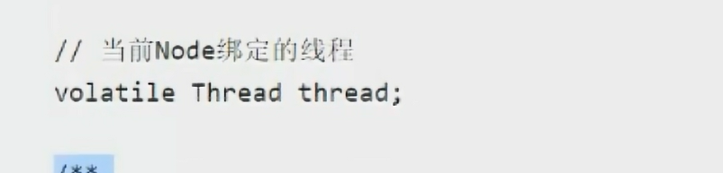

还有这一个属性，记录当前绑定的线程

> 头和尾节点


> state


只要不是0，说明拿到锁

> 结构图

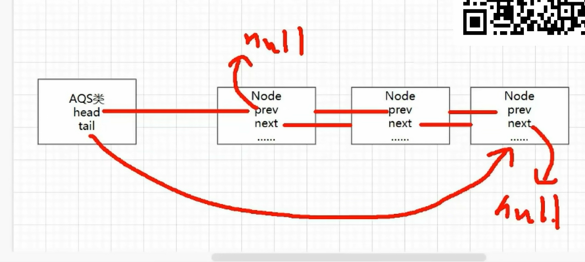

## Renntralock

> 非公平锁

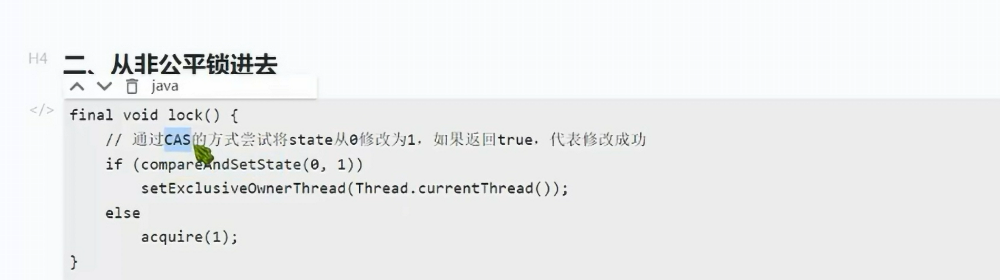

通过cas，如果把0修改成1，说明成功获取到了锁（这里通过cas怕别人并发拿到）


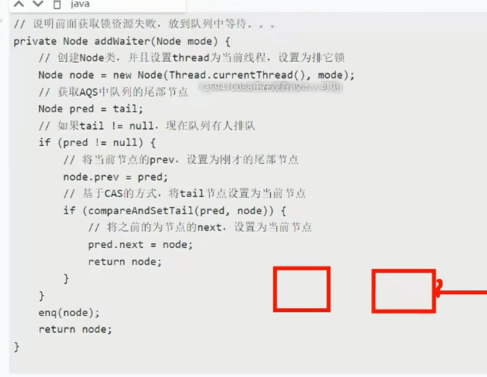


> 锁重入


> 参考资料

https://zhuanlan.zhihu.com/p/45305463

https://zhuanlan.zhihu.com/p/540999126


## redis

> 数据类型


> zset数据结构

压缩链表和跳表

> 压缩列表

压缩列表本质上就是一个数组，只不过增加了一些节点


如上图所示，黄色是增加的部分

在压缩列表中，如果我们要查找定位第一个元素和最后一个元素，可以通过表头三个字段的长度直接定位，复杂度是 O(1)。而**查找其他元素时，就没有这么高效了，只能逐个查找，此时的复杂度就是 O(N) 了，因此压缩列表不适合保存过多的元素**。

> 跳表

之前只能从头一个一个遍历，时间复杂度为 O(N) 

跳表是增加了多级索引

例如每隔一个数据就建立一层索引，建立多层就类似于二分查找了，时间复杂度 O(logN) 

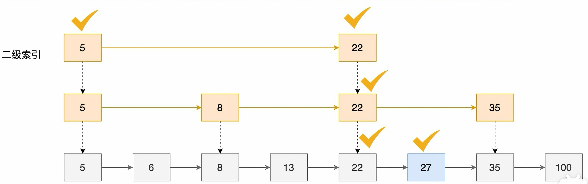

> 什么时候用压缩列表，什么时候用跳表？

有序集合保证元素数量小于128个时，用压缩列表

> 红黑树的时间复杂度也是O（logn），为啥 不用它，而选择跳表

首先，跳表可以查范围数据，比如上述查22-27，这样可以找到22后直接遍历即可

其次，跳表是通过多层索引，结构比较简单，更加容易实现。红黑树还要调节点

> 参考资料

https://www.bilibili.com/video/BV1kh411x7Jc/?spm_id_from=333.337.search-card.all.click&vd_source=c2eaa7091973b76eb57f77f9dfc9eecc

> Redis为什么不用b+树？MySQL为什么不用跳表？

1. 这个问题在于 **Redis是直接操作内存的并不需要磁盘io而MySQL需要去读取io**，所以mysql要使用b+树的方式减少磁盘io，B+树的原理是 叶子节点存储数据，非叶子节点存储索引，每次读取磁盘页时就会读取一整个节点,每个叶子节点还有指向前后节点的指针，为的是最大限度的降低磁盘的IO;因为数据在内存中读取耗费的时间是从磁盘的IO读取的百万分之一
2. 而Redis是 内存中读取数据，不涉及IO，因此使用了跳表，跳表明显是更**快更简单**的方式。

## 什么是布隆过滤器

> 原理

布隆过滤器的原理是，当一个元素被加入集合时，通过 K 个散列函数将这个元素映射成一个位数组中的 K 个点（offset），把它们置为 1。检索时，我们只要看看这些点是不是都是 1 就（大约）知道集合中有没有它了：如果这些点有任何一个 0，则被检元素一定不在；如果都是 1，则被检元素很可能在。这就是布隆过滤器的基本思想。

简单来说就是准备一个长度为 m 的位数组并初始化所有元素为 0，用 k 个散列函数对元素进行 k 次散列运算跟 len(m)取余得到 k 个位置并将 m 中对应位置设置为 1。
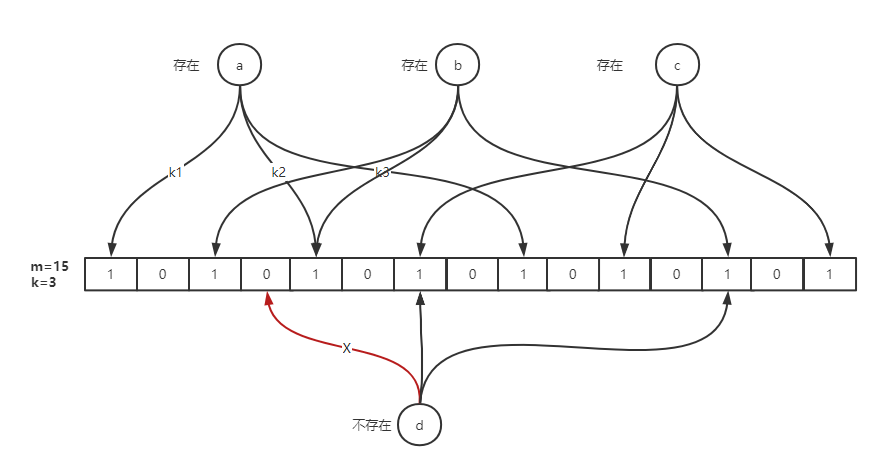

> 优点

1. 空间占用极小，因为本身不存储数据而是用比特位表示数据是否存在，某种程度有保密的效果。
2. 插入与查询时间复杂度均为 O(k)，常数级别，k 表示散列函数执行次数。
3. 散列函数之间可以相互独立，可以在硬件指令层加速计算。

> 缺点

可能存在误判

## redis为啥快

1.在内存

2.数据结构多，找到对应的

3.单线程，没有啥切换