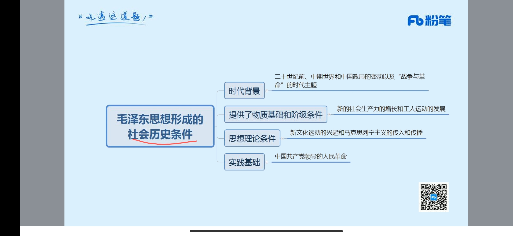

## 第一天

**立德树人**是教育之本

民主党派成员最多的是**民盟**

新民主革命的动力包括：**工人、农民、小资产阶级、民族阶级**

马克思主义哲学是**无产阶级世界观**

我党把马列主义和中国实际相结合的最初成果：**《中国社会各阶级的分析》、《湖南农民运动考察报告》**

1956年4月，毛泽东同志提出**“百花齐放，百家争鸣”**是我国发展科学、繁荣文学艺术的方针

习近平外交思想始终坚持**实践第一**的观点

**古田会议**决议了中心思想是要用**无产阶级思想进行军队和党的建设**（第九次党代表大会）

**八七会议**结束了**陈独秀右倾投降主义**在中央的统治，确立了**土地革命和武装反抗国民党反动派**的总方针，并发动了农民进行**秋收起义**（大革命失败后）

**洛川会议**为了动员一切力量抗日，并具体指定、建立党领导抗战的纲领和政府。

**遵义会议**是中国共产党**第一次独立自主地运用马克思列宁主义解决自己路线**、方针和政策的会议。**挽救党、挽救红军、挽救新中国**，是**生死攸关转折点**，提出红军应该采取**积极防御**的战略方针

**邓小平**提出了**一国两制**

**陈独秀**上海创办**《青年杂志》**，后改名**《新青年》**<u>（它也是中国共产党第一个公开性机关刊物</u>），迁往**北京成为新文化运动的主要阵**地，标志着**新文化运动的兴起**，口号为**民主**和**科学**，没有参加中共一大

**董必武**参加了上海兴业路一大会址**纪念馆**。为纪念馆写下了“**作始也简，将毕也钜**”。他**出席了中共一大**

**李大钊**是中国传播马克思主义**最早**的革命先驱，被称为**“引来天火的人”**，没有参加中共一大 	

**《中国革命和中国共产党》**一文中，毛泽东指出现阶段的敌人是**帝国主义和封建地主阶级**，主要任务也是干这两个，但**最主要**的是干帝国主义

党员开除党籍，**五年内**不得重新入党

生产实践、社会实践、科学实践，最基础的最重要的是**生产实践**

**两个务必**是毛泽东提出来的，在**七届二中**全会（务必使同志们继续地保持谦虚、谨慎、不骄、不躁的作风，务必使同志们继续地保持艰苦奋斗的作风）

**三湾改编**首次提出官兵平等

**毛泽东思想**初步形成的标志是**农村包围城市**

1927年8月1号，八一**南昌起义**，让南昌获得了**英雄城市**的美誉

## 第二天

**十三大**概况“**一个中心、两个基本点**”基本路线（一个中心，指以经济建设为中心；两*个基本点*，指坚持四项基本原则，坚持改革开放。），**第一次**比较系统地概述了**社会主义初级阶段理论**。

十二大提中特

十五大邓小平指导

十六大三个代表

十七大科学发展观

十八大全面建成小康

一大建党，二大立岗

三大国共合作

一大立党二立纲，三大国共要合作。
四大领导工农忙，五大批评陈独秀。
六大苏联求帮忙，南昌打响第一枪。
八七枪杆出政权，三湾军队要听党。
古田军队建新军，遵义军事与组织。
瓦統洛后。
毛六六论马🐎，七大确定毛指导。
七届二中转城市，八大主矛和建设。
十一三中要开放，十二小平提中特。
十三阶段路线定，南方三猫论本质。
十四目标在市场，十五小平成指导。
十六提出三代表，十七科学发展观。
十八科学成指导，十九走进新时代。

党的一大在**莫斯科召开**

**陈独秀和李大钊**都未参加一大

我国**对资本主义工商业**进行社会改造的基本政策是**“和平赎买”**

科学发展观**第一要义**是发展，**核心**是以人为本，**基本要求**是全面协调可持续性，**根本方法**是统筹兼备

马克思主义中国化的**第一个重要理论**成果是毛泽东思想

我国经济已经由**高速增长**转向**高质量发展**

**红船精神**是敢为人先的首创精神

**长征精神**是把全国人民和中华民族的根本利益看得高于一切

意识反作用于物质的基本途径是**实践**

我国进行**土地改革**的基本原因是封建土地制度阻碍了农村经济和社会的发展

社会主义的根本方向是**消灭剥削、消灭两级分化**

《实践论》《矛盾论》标志着毛泽东哲学思想形成

邓小平邓小平**南方谈话**内容是**‘三个有利于标志’**（两力一平）（是否提高生产力、综合国力、生活水平）（黑猫白猫，能抓老鼠就好）

**一国两制**是邓小平提出来的

十五大将邓小平理论写入党章

《星星之火可以燎原》毛主席回复林彪的，林彪问毛主席红旗还需要打多久

《论联合政府》是**七大提出**的，主要弄了**三大作风**，（理论和实践相结合，与人民群众紧密联系在一起，自我批评）

实践决定意识，是因为实践具有**直接现实性**（通过实践，直接可以变成现实，比如盖一个房子，直接就有了）

实践具有**主观能动性**，因为它是有目的有意思的去实践，这是和动物区分的，比如动物也会盖房子，它们没有目的和意识

实践具有**社会历史性**，具有社会性受到历史条件的制约，比如你实践割麦子，有条件用机器，没条件用手

意识是对客观世界的主观反映，意识的内容是客观的，表现形式是主观的

所有的意识都要来源于客观存在

无产阶级领导的**中心问题**是农民问题（农民也是最多的，主力军）

外因要通过内因起作用（比如说你妈妈天天唠叨你好好学习，这是个外因，但如果你不听，也起不到作用）

党的性质是先进性和纯洁性

毛泽东最先提出马克思主义中国化（马66论马）

社会的基本矛盾是**社会发展的基本动力**（社会基本矛盾包括：生生经上。生产力和生产关系，经济基础和上层建筑）

生产力决定生产关系，生产关系反作用于生产力（反作用是两面的，好的促进，坏的抑制）

生产力是人类改造自然的能力（人与自然），生产关系是人们之间的关系（人与人）

马克思的两大发现：唯物史观、剩余价值学说

红船精神包括：开天辟地、敢为人先的**首创**精神，坚定理想、百折不挠的**奋斗**精神，立党为公、忠诚为民的**奉献**精神

## 第三天

神州十号载人飞船，男的有**聂海胜、张晓光**，女的有**王亚平**，其中，聂海胜担任指令长

**中华名族**由危亡走向振兴的转折点是**抗日战争的胜利**（党的是遵义会议）

主次矛盾与矛盾的主要方面（主次矛盾讲的是不同的事情，**至少是两件事**，比如发展面对经济、环境、人口问题等）（矛盾的主要方面是**讲的一件事情**，例如科技是把双刃剑）

群众路线的**核心**是一切为了群众，一切依靠群众

延安精神的**核心**是自力更生、艰苦奋斗

中共七大还没有建国，八大规模大

机械唯物主义（形而上学）（原子是事物的属性）

朴素唯物主义（看到的）

物质的唯一**特性**是客观实在性（不随人的意志改变），唯一**属性**是运动

实践是认识的来源，一切认识归根到底是从实践中获得（实践是认识的唯一源泉）（但实践不是认识的唯一途径，也可通过视频、图片等认识）

实践是认识的发展动力。实践中遇到的新问题需要新认识去解决，从而推动认识的发展

**（前两个实践：先有实践。后面两个是先有认识。这样来做题）**

实践是认识的目的，从实践中来，到实践中去，认识的目的是改造世界，到实践中去

实践是检验真理的唯一标志

毛泽东中国革命最后一个农村根据地是**西柏坡**（七届二中，提出了两个务必，进京赶考），像北平进发，进了北平**香山**，标志着中国革命重心从农村转向城市

意识具有目的性和计划性（比如想上岸，一天计划做多少题）

意识具有主动创造性（比如龙）

意识能指导实践改造世界（指导是中心词，包含正确和错误，考的时候要都说）

**意识对人体的生理活动具有调节和控制作用**（比如笑一笑十年少）（望梅止渴）

意识只有人有

意识没有客观实在性，物质才有

意识受到主题的影响（比如不同人看到同一个问题意识不同）

发展是**前进性和曲折性**的统一

发展有其**自身的客观规律**，不以人的意志为转移（种啥得啥）

毛泽东思想和中国特色社会主义的区别：**毛不改革，中特不革命**

建设现代化经济体系，**着力点**放在实体经济上

中华苏维埃第一次在**瑞金**召开

一国两制 ”**爱国者治港**“

毛泽东思想围绕的主题是**革命和建设**

邓小平理论主题是**什么是社会主义，怎样建设社会主义**

十九大报告：以**人民安全**为宗旨，以**政治安全**为根本

三大规律：对立统一；质量互变规律；否定之否定规律

辩证否定的实质是扬弃。矛盾是事物发展的源泉和动力。辩证否定是事物联系和发展的环节。

大革命失败后，中国共产党建立的**第一个农村根据地**是**井冈山**根据地

中国革命农村包围城市、武装夺取政权根本在于处理好**土地革命、武装斗争、农村革命**根据地之间的关系

新民主主义的三大法宝：**统一战线、武装斗争、党的建设**

人民统一战线：**工人阶级、农民阶级、名族资产阶级**三者之间的关系

抗战统一战线：**进步势力、中间势力、顽固势力**

**瓦窑堡会议**确定了建立抗日民族统一战线方针

1938年**《论持久战》**提出了**民兵是胜利之本**

**延安整风**：反对主观主义以整顿**学风**（中心任务）、反对宗派主义以整顿**党风**、反对党八股文以整顿**文风**

意识对于客观事物的反映是**主动的、有选择的**（每个人看同一件事物的意识不同，比如蛋糕，艺术家看到的和普通人不一样）

## 第四天

十八届三中全会提出**市场**在配置中发挥决定性作用（2013年习总书记主持）

十八届四中（2014）提出了依法治国

十八大（一选举，二宪法，三改革，四法律，五经济，六党建）

毛泽东思想灵魂包括：实事求是（根本点，出发点），群众路线（工作路线），独立自主（立足点）。

本本主义也是教条主义，就是做什么事情都不从实际出发，生搬硬套

在党的纪律中，**政治纪律**最重要、最根本、最关键

**画梅不能止渴反映了**观念东西不能代替物质东西

精神和物质的**同一性**，这个是你认为这个世界是否是可知的，如果你认为是可知的，就是同一的，这也是可知论

精神对物质的**相对独立性**：意识可能超前，也可能落后

精神可以转化成物质，通过实践

小康：邓小平提出放入国家。十二大提出，十六大建设，十八大建成

家庭是道德建设的**起点**，学校是道德建设的**阵地**

**经济特区：生下三头猪（深圳、厦门、汕头、珠海）去海南度假，结果去了新疆喀什（kā shí）霍尔果斯**

伟大载人航天精神：淡泊名利，默默奉献

实践高于理论认识，是因为实践具有直接现实性

## 第五天

**主要矛盾**对事物发展起决定性作用

**中国精神**包括民族精神（核心爱国主义）和时代精神（核心改革创新）

**爱国主义**始终是把中华民族坚强团结在一起的精神力量，**改革创新**始终是鞭策我们在改革开放中与时俱进的精神力量

**整体与部分关系**：1.整体居于**主导地位**              2.关键部分对整体起决定性作用         3.整体是各部分的有机构成，具有部分没有的功能（比如说钟表，有计时功能，但是拆开后每个指针没有该功能）

中国共产党主题就是为了实现中华民族伟大复兴

实事求是的“是”为规律性

