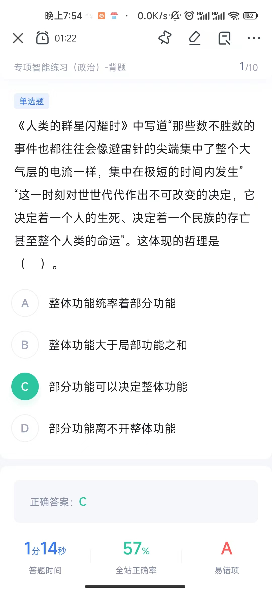
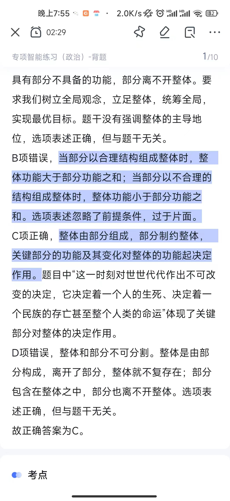
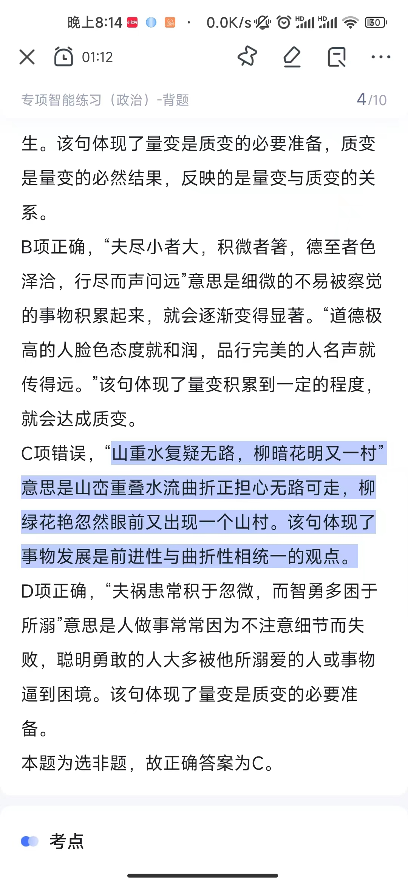

##   理论

马克思恩格斯的两大发现是《唯物史观》、《剩余价值学说》

杰出人物，这里体现了**必然性与偶然性**的统一

量积累到一定程度才会发生质变，量的积累不一定会有质的变化

> 时间的概念

> “贯彻新发展理念”没有体现否定之否定定律

否定之否定是三个阶段，贯彻新发展能够更好地指导我们实践，可以促进事物发展，没有三个阶段

## 实践

实践是认识发展的动力理解：强调实践中产生的新问题需要新的认识去解决问题，从而推动认识的发展。

## 整体部分

## 诗句判别

